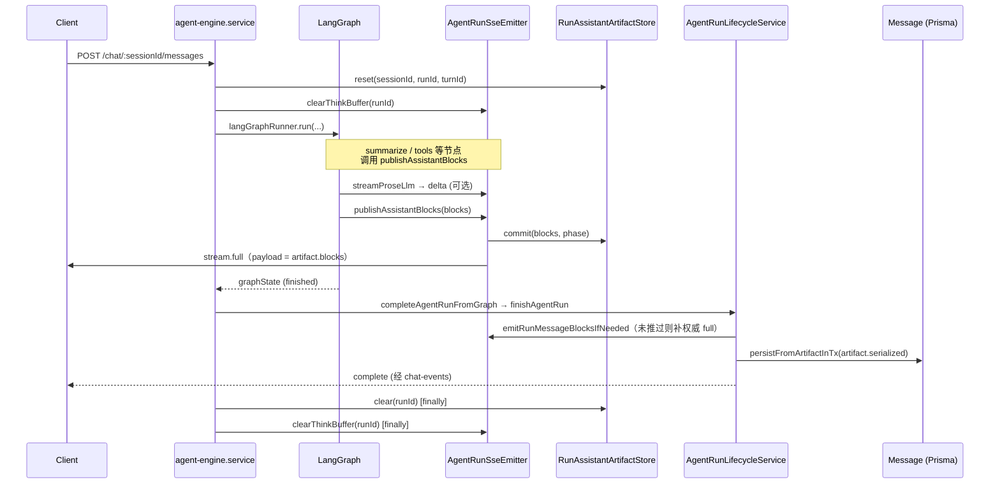

# Assistant 消息发布全流程（SSE ↔ Artifact ↔ 落库）

> 版本：与 agent-server 当前实现同步（2026-06）  
> 用途：**手动排查**「SSE 推了什么」与「DB 存了什么」是否一致。  
> 前端协议细节见 [chat-sse-message-blocks-frontend.md](./chat-sse-message-blocks-frontend.md)  
> LangGraph 节点总览见 [agent-graph.md](./agent-graph.md)

---

## 1. 核心不变量

后端保证以下等式（正常路径下）：

```text
RunAssistantArtifact.serialized
  === SSE 权威 stream.full 的 blocks 序列化结果
  === Message.content（finishAgentRun 落库）
```

| 概念 | 说明 |
|------|------|
| **Artifact** | 单 run 内存槽 `RunAssistantArtifactStore`，权威用户可见 blocks |
| **权威 full** | `stream.mode: 'full'` 且 payload 来自 **commit 后的 artifact** |
| **delta** | LLM 流式过程预览；**不以 delta 落库** |
| **draft / final** | artifact `phase`；draft（写确认预览）与 final **均可落库** |

**唯一发布出口**（用户可见 `message` 定稿）：

- `AgentRunSseEmitter.publishAssistantBlocks()` — commit + 权威 full  
- `AgentRunSseEmitter.commitAssistantArtifact()` — 仅 commit（plan 中间步）；SSE 由后续 publish 或 `finishAgentRun` 补推  

---

## 2. 关键模块与文件

| 模块 | 文件 | 职责 |
|------|------|------|
| 发布 / SSE | `src/core/agent-engine/engine/main/run/agent-run-sse.emitter.ts` | delta、patch、权威 full、replay |
| Artifact 槽 | `src/core/agent-engine/engine/main/run/run-assistant-artifact.store.ts` | commit / peek / reset / clear |
| Run 收尾 | `src/core/agent-engine/engine/main/run/agent-run-lifecycle.service.ts` | `finishAgentRun`、补 SSE、触发落库 |
| 落库 | `src/core/agent-engine/engine/main/run/run-assistant-message-persist.service.ts` | `Message` create/update |
| Summarize 编排 | `src/core/agent-engine/engine/main/agent-graph/summarize/stream.util.ts` | 各场景调 summarize + publish |
| Summarize 节点 | `src/core/agent-engine/engine/main/agent-graph/nodes/summarize.node.ts` | 图内终局分发 |
| Plan present | `src/core/agent-engine/engine/main/plan-present/plan-present-orchestrate.util.ts` | 写预览流式 + publish |
| Run 入口 | `src/core/agent-engine/engine/agent-engine.service.ts` | reset artifact、跑图、finally clear |
| Blocks 工具 | `src/core/agent-engine/engine/message/message-blocks.util.ts` | merge、sanitize、`extractStreamableProseFromBlocks` |
| 调试日志 | `src/core/agent-engine/engine/message/message-blocks-debug.util.ts` | SSE / 落库对照日志 |

---

## 3. 端到端时序（主路径）



### 3.1 Run 生命周期要点

```text
run 开始
  assistantArtifact.reset(sessionId, runId, turnId)   # 空槽，绑定 turnId
  sse.clearThinkBuffer(runId)                         # 清 seq / delta 标记 / 权威 full 去重

run 执行中
  各节点 → publishAssistantBlocks / streamProseLlm / patch / loading

run 结束（finishAgentRun）
  ① emitRunMessageBlocksIfNeeded   # 权威 full 未推则补推（与 artifact 一致）
  ② 事务：AgentRun 定稿 + persistFromArtifactInTx
  ③ syncPersistedMessage（会话上下文）

run finally（agent-engine.service）
  sse.clearThinkBuffer + assistantArtifact.clear   # 内存槽释放（落库已完成）
```

---

## 4. `publishAssistantBlocks` 内部流程

所有定稿用户可见内容应走此函数（或 `commitAssistantArtifact` + 后续 finish 补推）。

```text
publishAssistantBlocks(sessionId, runId, blocks, options)
  │
  ├─ 1. sanitizeMessageBlocks(blocks)
  │
  ├─ 2. assistantArtifact.commit(sanitized, phase)     ← 落库同源写入
  │
  └─ 3. emitAuthoritativeFullFromArtifact()
        │
        ├─ 若 runAuthoritativeFullSerialized 已等于 artifact.serialized → 跳过（去重）
        │
        ├─ 若本轮尚无 prose delta → replayStaticProseBeforeFull(artifact 正文)
        │     （按 extractStreamableProseFromBlocks 切片推 delta）
        │
        └─ emitMessageBlocks(artifact.blocks, mode=full)
              → 记录 runAuthoritativeFullSerialized = artifact.serialized
```

**`commitAssistantArtifact`**：只执行步骤 2，用于 `emitAuthoritativeFull: false` 的 plan 中间步；权威 full 留给 `finishAgentRun` 或下一次 `publishAssistantBlocks`。

---

## 5. Summarize 路径矩阵

`summarize.node.ts` 根据 `pendingRespond` / observation 类型分发 → `summarize/stream.util.ts`：

| 场景 | 函数 | LLM 流式 | 发布方式 |
|------|------|----------|----------|
| 工具结果（读/写） | `summarizeToolOutputForUser` | `summarizeMessageBlocks` → `streamProseLlm` | `finishSummarizeBlocks` → `publishAssistantBlocks` |
| 闲聊 / direct_user / off_domain | `summarizeDirectUserMessage` | 同上 | 同上 |
| 澄清缺参 | `summarizeClarificationRequest` | 同上 | 同上；**catch 也走 publishAssistantBlocks** |
| LLM 直出草稿 | `summarizeDirectLlmReply` | 同上 | 同上 |
| 写确认恢复 | `summarizeWriteConfirmResume` | 部分无 LLM | 规则块直接 `publishAssistantBlocks` 或 summarize |
| Plan present（写预览） | `runPlanPresentSummarize` | `streamProseLlm` | `finalizePlanPresentUserLayer` → `publishAssistantBlocks`（phase=draft） |
| 工具错误（规则） | `summarize.node` 内联 | 无 | `publishRuleBlocksOnly` 或直接 `publishAssistantBlocks` |
| summarize 返回空 | `summarize.node` fallback | 无 | `publishAssistantBlocks([textBlock(fallback)])` |

### 5.1 Summarize LLM 流式（prose_stream）

```text
streamSummarizeProseOnly
  ├─ emitRuleBlockPlaceholders(ruleBlocks)     # loading full（有 table/chart 时）
  ├─ streamProseLlm                            # 推 think + message delta
  ├─ 组装 llmBlocks（canonical = userMarkdown）
  ├─ emitBlockPatch（替换 loading → table 等）
  └─ finishSummarizeBlocks
        ├─ emitAuthoritativeFull=false → commitAssistantArtifact only
        └─ 默认 → publishAssistantBlocks
```

**定稿正文来源**：`userMarkdown`（`resolveUserMarkdown` 从流式 state 解析），不用增量 `sanitizedEmitted` 单独定稿。

---

## 6. 其他发布入口

| 触发位置 | 场景 | phase |
|----------|------|-------|
| `tools.node` | mutation gate 前补预览 markdown | `draft` |
| `run.helpers.publishMutationGateBlockedDraft` | gate 无预览 | `draft` |
| `agent-run-lifecycle.completeAgentRunFromGraph` | max steps fallback | `final` |
| `agent-engine.handleRunFailure` | 失败用户文案 | `final` |
| `summarize.node` | 只读工具错误 hint | `final` |

---

## 7. SSE `message` 事件形态

| action | stream.mode | 含义 | 是否权威 |
|--------|-------------|------|----------|
| `stream` | `delta` | text 片段增量 | 否（预览） |
| `stream` | `full` | 完整 blocks 快照 | **是**（来自 artifact） |
| `patch` | — | 替换 `loading` → 结构化 block | 否（过程） |

典型工具结果时序：

```text
message stream full   seq=1   [loading]           # 表格占位
message stream delta  seq=2..n Markdown 片段      # LLM 流式（可选）
message patch         seq=n+1 table 替换 loading
message stream full   seq=last  artifact 全量     # 权威定稿
complete 前（finish）  可能再推一条同内容 full      # 仅当上次未推（去重）
complete
```

`think` 事件与 `message` **分离**：决策环 LLM 输出只走 `think`，用户可见正文由 summarize 走 `message`。

---

## 8. 落库（`finishAgentRun`）

```text
finishAgentRun
  ├─ finalOutput = artifact.peekSerialized()     # AgentRun.output 同源
  ├─ sse.emitRunMessageBlocksIfNeeded()          # 补权威 full
  └─ 事务
        ├─ finalizeRunAndTurnInTx
        └─ persistFromArtifactInTx
              ├─ artifact 空 → 不落 Message（return null）
              ├─ turn.outputMessageId 已有 → UPDATE content = artifact.serialized
              └─ 否则 → CREATE Message + 写 turn/run.outputMessageId
```

**写确认暂停**：primary run 结束时 artifact 多为 `phase=draft`（预览文案），同样落库；用户确认后 worker run 再 summarize 终稿并 **UPDATE** 同一 `MessageTurn.outputMessageId`。

---

## 9. 开启调试日志

与 LLM prompt debug 共用开关（非 production 默认开；production 设 `AGENT_ENGINE_DEBUG=1`）：

```bash
# .env
AGENT_ENGINE_DEBUG=1
```

日志目录：

```text
logs/agent-engine/message-blocks/run-{runId}.log
```

每条记录含：

| tag 前缀 | 含义 |
|----------|------|
| `emitMessageBlocks:stream:delta` | SSE delta 推送 + artifact 快照 |
| `emitMessageBlocks:stream:full` | SSE 权威 full |
| `emitBlockPatch` | loading → 结构化块 |
| `PERSIST_CREATE` / `PERSIST_UPDATE` | DB 写入内容与 artifact 来源 |
| `PERSIST_*_MISMATCH` | 覆盖已有 Message 时与 artifact 不一致（debug 模式） |

Summarize LLM prompt 另见：`logs/agent-engine/llm-prompt/run-{runId}.log`

---

## 10. 手动排查清单

排查某次 `runId={id}` 时，建议按序执行：

### Step 1 — 确认 run 与 turn

```sql
SELECT id, turn_id, status, output_message_id, steps
FROM agent_run WHERE id = {runId};

SELECT id, output_message_id FROM message_turn WHERE id = {turnId};
```

### Step 2 — 看 artifact 是否曾 commit

在 `logs/agent-engine/message-blocks/run-{runId}.log` 搜索：

- `publishAssistantBlocks` / `emitRunMessageBlocksIfNeeded`
- `artifactSerialized` 字段
- 是否有 `stream:full` 且 `storageSerialized` 一致

**若没有 full、也没有 PERSIST_CREATE**：说明从未 `publishAssistantBlocks` 或 artifact 为空。

### Step 3 — 对照 DB

```sql
SELECT id, role, content FROM message WHERE id = {outputMessageId};
```

`content` 应等于日志里最后一次权威 full 的 `storageSerialized`（`{"blocks":[...]}`）。

### Step 4 — 按场景缩小范围

| 现象 | 优先查 |
|------|--------|
| 有 delta、无 full、DB 空 | summarize 是否抛错未进 catch publish；`emitAuthoritativeFull: false` 且 run 未 finish |
| 有 full、DB 空 | `isPersistableAssistantArtifact` 为 false；`persistFromArtifactInTx` 提前 return |
| DB 有、SSE 无 message | 客户端 SSE 断连；查服务端 log 是否有 emit |
| full 与 DB 不一致 | **不应出现**；查是否绕过 `publishAssistantBlocks` 直接改 DB；查 PERSIST_MISMATCH |
| 预览与终稿不同 | 正常：draft run → worker run UPDATE；查两次 runId |
| 只有 think 无 message | 图未进 summarize；`pendingRespond` 未设置；run failed 且无 fallback |

### Step 5 — 图内走到哪一步

```text
agent_run.steps 最后几步 type：
  intent → turnRoute → plan → readiness → llm → tool → result_check → summarize
```

`summarize` step 的 `name` 对应 observation 类型（工具名、`direct_user`、`clarification_request` 等）。

---

## 11. 写确认（primary / worker）简图

```text
Primary run（用户发写操作）
  llm → tools → summarize (plan present, phase=draft)
  publishAssistantBlocks → artifact draft + SSE full
  tools.node → confirmation_required SSE（非 message blocks）
  finishAgentRun → Message 落库 draft 预览
  awaitingWriteConfirmation = true，图暂停

用户 confirmWrite
  Worker run → summarize (write_confirm_resume)
  publishAssistantBlocks → artifact final
  finishAgentRun → UPDATE 同一 Message.content
```

---

## 12. 内存状态（单 run）

`AgentRunSseEmitter`  per `sessionId:runId`：

| Map | 用途 |
|-----|------|
| `streamSeq` | SSE `seq` 单调递增 |
| `runProseDeltaEmitted` | 是否已推过 prose delta（决定是否 replay） |
| `runAuthoritativeFullSerialized` | 已推权威 full 的 serialized（finish 去重） |

`RunAssistantArtifactStore` per `sessionId:runId`：

| 字段 | 用途 |
|------|------|
| `turnId` | 落库绑定的 MessageTurn |
| `artifact.blocks` | 权威 blocks |
| `artifact.serialized` | 落库 JSON 串 |
| `artifact.phase` | `draft` \| `final` |

run `finally` 会 `clear` 以上内存态；**排查完再跑新消息**，旧 run 槽已释放。

---

## 13. 相关文档

- [chat-sse-message-blocks-frontend.md](./chat-sse-message-blocks-frontend.md) — 前端事件协议与 UI 状态机  
- [agent-graph.md](./agent-graph.md) — LangGraph 节点与 `pendingRespond` 短路  
- [write-confirmation-frontend.md](./write-confirmation-frontend.md) — 写确认与 draft/worker  
- [agent-run-steps.md](./agent-run-steps.md) — Run 步骤时间线  
