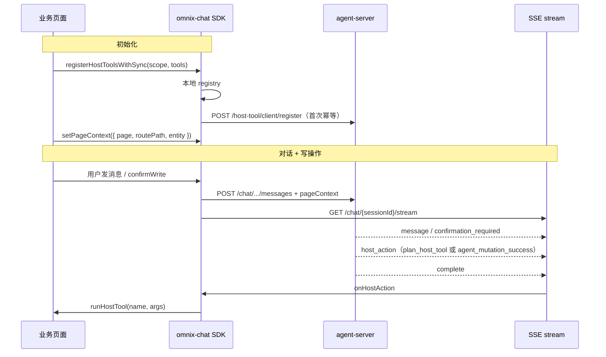

# 宿主桥接 SDK 对接指南（pageContext + Host Tool + host_action）

> **面向**：omnix-chat SDK 维护方 + 嵌入 Chat 的业务前端  
> 版本：与 agent-server 当前实现同步（2026-06）  
> **C 端迁移（去掉 `status`）**：[host-action-sdk-migration-frontend.md](./host-action-sdk-migration-frontend.md)  
> 深入参考：[页面上下文与 SSE](./host-page-context-host-action-frontend.md)、[C 端工具注册](./host-tool-client-register-frontend.md)、[B 端配置](./host-tool-admin-frontend.md)、[Chat SSE](./chat-sse-message-blocks-frontend.md)、[写确认](./write-confirmation-frontend.md)

---

## 1. 一句话

业务页通过 SDK **上报页面上下文**、**注册前端工具**；Agent 通过 SSE 推送 **`host_action`（`hostTools` 列表）**；SDK **路由到 scope 并执行本地 handler**。写 mutation 成功后可能再推一次 completion 类 `host_action`。

**执行永远在浏览器**；服务端只存工具元数据、解析参数模板，不操作 DOM。

---

## 2. 全链路



| 方向 | 机制 | SDK 职责 |
|------|------|----------|
| 页面 → Agent | `pageContext` 随用户消息 | `setPageContext`、发消息时附带 |
| 工具目录同步 | `POST /host-tool/client/register` | `registerHostToolsWithSync` |
| Agent → 页面 | SSE `host_action` | `useHostAction` / `on('hostAction')` |

---

## 3. 前置条件

### 3.1 鉴权 Header（与发消息一致）

| Header | 说明 |
|--------|------|
| `Authorization: Bearer <accessToken>` | `POST /app-client/auth` 换取 |
| `X-App-Dsn` | AppClient DSN |

详见 [app-client-auth-frontend.md](./app-client-auth-frontend.md)。

### 3.2 SSE

```http
GET /chat/{sessionId}/stream
```

监听：`think` | `message` | **`host_action`** | `complete` | `error`。

```ts
// 原生 EventSource 示例
es.addEventListener('host_action', (e) => {
  const payload = JSON.parse(e.data);
  sdk.dispatchHostAction(payload);
});
```

独立事件名 `host_action`（也接受 `host-action`）。详见 [chat-sse-message-blocks-frontend.md](./chat-sse-message-blocks-frontend.md)。

---

## 4. 入站：pageContext

### 4.1 何时设置

| 时机 | 做法 |
|------|------|
| 进入业务页 | `page` + `entity`（详情页带 `id`） |
| 路由变化 | 更新 `routePath`、`entity` |
| 发消息前 | SDK 自动并入 body（`attachPageContext`） |

### 4.2 字段

```ts
type PageContext = {
  /** 稳定页面标识，kebab-case；与 host_action.scope、工具 scope 对齐 */
  page?: string;
  /** 当前路由 pathname，建议默认带上 */
  routePath?: string;
  flowId?: number;
  programName?: string;
  entity?: {
    type?: string;
    id?: string;
    [key: string]: unknown; // 与 write tool businessFields 同名时可补齐写参数
  };
  metadata?: Record<string, unknown>;
};
```

| 字段 | 建议 |
|------|------|
| `page` | **强烈建议**；无则服务端**不发** `host_action` |
| `routePath` | 默认传当前路由 |
| `entity.id` | 详情页建议；handler 内防误处理 |

### 4.3 SDK API（建议）

```ts
chat.setPageContext(ctx: PageContext): void;
chat.getPageContext(): PageContext | null;

// React
<AgentChat attachPageContext pageContext={...} />
```

嵌套 `pageContext` 与平铺字段（`page`、`entity`…）服务端均支持，**嵌套优先**。

---

## 5. 前端工具：注册 + 服务端同步

### 5.1 两类工具

| 类型 | `generic` | 例子 |
|------|-----------|------|
| **通用** | `true` | `refreshEntity`（全 App 一条） |
| **页内** | 否，带 `scope` | `fillReplyDraft`（仅 review-detail） |

`name` 在 **App 内全局唯一**。

### 5.2 SDK 类型（建议导出）

```ts
export type HostToolExposure =
  | 'CATALOG'
  | 'ON_COMPLETE'
  | 'LLM'
  | 'BOTH';

export type HostToolDefinition = {
  name: string;
  description: string;
  argsSchema: Record<string, unknown>;
  handler: (args: Record<string, unknown>) => void | Promise<void>;
  generic?: boolean;
  exposure?: HostToolExposure;
  /** 服务端解析 hostTools.args 用，如 { entityId: '$entity.id' } */
  argsTemplate?: Record<string, unknown>;
  definitionKey?: string;
};

export type HostActionPayload = {
  action: 'host_action';
  scope?: string;
  entity?: Record<string, unknown>;
  metadata?: Record<string, unknown>;
  /** 必填：前端 registry 逐项执行 */
  hostTools: Array<{ name: string; args: Record<string, unknown> }>;
  /** Plan 步 id（mid-run 推送时有） */
  planStepId?: string;
  /** plan_host_tool | agent_mutation_success | 自定义 */
  reason?: string;
  runId?: number;
  turnId?: number;
};
```

### 5.3 核心 API（SDK 应实现）

```ts
/** 按 scope 注册本地 handler */
registerHostTool(
  scope: string,
  name: string,
  handler: HostToolDefinition['handler'],
): void;

/** 执行已注册工具；未注册则 no-op，返回 false */
runHostTool(
  scope: string,
  name: string,
  args: Record<string, unknown>,
): Promise<boolean>;

/** 本地注册 + 首次 POST 同步服务端（推荐业务入口） */
registerHostToolsWithSync(options: {
  scope?: string;
  pageLabel?: string;
  routePattern?: string;
  tools: HostToolDefinition[];
  syncToServer?: boolean; // 默认 true
}): Promise<void>;

/** 监听宿主动作（按 scope 过滤） */
onHostAction(scope: string, handler: (action: HostActionPayload) => void): () => void;

// React
useHostAction(scope: string, handler: (action: HostActionPayload) => void): void;
```

### 5.4 服务端同步接口

```http
POST /host-tool/client/register
```

- **幂等**：`appClientId + name` 已存在 → `skipped`，不覆盖
- **不传 handler**；只同步元数据
- 页内工具带 `scope` 时自动创建 `HostPage`

```json
{
  "scope": "review-detail",
  "tools": [{
    "name": "refreshEntity",
    "generic": true,
    "description": "...",
    "argsSchema": { "type": "object", "properties": { "entityId": { "type": "string" } } },
    "exposure": "ON_COMPLETE",
    "argsTemplate": { "entityId": "$entity.id", "entityType": "$entity.type" }
  }]
}
```

可选校验：`GET /host-tool/client/catalog?scope=&agentId=`。

> `register` **不会**自动绑定 Agent；B 端配置 `AgentHostTool` 后，`host_action` 才会带对应 `hostTools`。见 [host-tool-admin-frontend.md](./host-tool-admin-frontend.md)。

---

## 6. 出站：host_action

### 6.1 语义

`host_action` 携带 **`hostTools[]`**，由浏览器 registry 执行。用 **`reason`** 区分场景：

| `reason` | 时机 | 说明 |
|----------|------|------|
| `plan_host_tool` | run 进行中 | Plan `host_tool` 步，Decision LLM 产参后推送；常带 `planStepId` |
| `agent_mutation_success` | run 成功结束前 | HTTP mutation 成功后，按 `argsTemplate` 解析参数 |

**不是**刷新指令；具体 UI（refetch / toast / 忽略）由宿主决定。

### 6.2 何时收到

**路径 A — Plan mid-run（`plan_host_tool`）**

- 当前 pending 步为 `kind: host_tool`
- 入站有 `pageContext.page`
- Decision LLM 产出合法 host tool `tool_calls`

**路径 B — Run 结束（`agent_mutation_success`）**

同时满足：

- run `success`
- 非写确认门闩暂停
- 存在 mutation 且 HTTP `SUCCESS`
- 入站有 `pageContext.page`
- Agent 绑定了 `ON_COMPLETE` / `BOTH` 的 Host Tool

同一次 run 可能 **先** `plan_host_tool` **再** `agent_mutation_success`；前端按 `reason` 分别处理或去重。

### 6.3 Payload

**Plan 步推送示例：**

```json
{
  "action": "host_action",
  "scope": "review-detail",
  "entity": { "type": "review", "id": "123" },
  "hostTools": [
    { "name": "fillReplyDraft", "args": { "text": "感谢您的反馈…" } }
  ],
  "planStepId": "ui_fill_draft",
  "reason": "plan_host_tool",
  "runId": 42,
  "turnId": 7
}
```

**Mutation 完成示例：**

```json
{
  "action": "host_action",
  "scope": "review-detail",
  "entity": { "type": "review", "id": "123" },
  "hostTools": [
    { "name": "refreshEntity", "args": { "entityType": "review", "entityId": "123" } }
  ],
  "reason": "agent_mutation_success",
  "runId": 42,
  "turnId": 7
}
```

| 字段 | SDK 处理 |
|------|----------|
| `action` | 必须为 `host_action` |
| `scope` | 路由到 `registerHostTool` / `useHostAction` |
| `entity` | 与当前页 `id` 校验，防串页 |
| `hostTools` | **必填**；逐项 `runHostTool(scope, name, args)` |
| `planStepId` | 可选；Plan 步对账 |
| `reason` | 区分 mid-run / completion |

在 `complete` **之前**到达（两条路径均如此）。

### 6.4 SDK 默认分发逻辑（建议）

```ts
function dispatchHostAction(payload: HostActionPayload) {
  if (payload.action !== 'host_action') return;
  if (!payload.hostTools?.length) return;
  const scope = payload.scope?.trim();
  if (!scope) return;

  const handlers = registry.get(scope) ?? [];
  for (const h of handlers) {
    void h(payload);
  }
}

// useHostAction 内置模板
async function defaultHostActionHandler(
  action: HostActionPayload,
  ctx: { currentEntityId?: string },
) {
  if (action.entity?.id && ctx.currentEntityId && action.entity.id !== ctx.currentEntityId) {
    return;
  }
  for (const tool of action.hostTools) {
    await runHostTool(action.scope!, tool.name, tool.args);
  }
}
```

---

## 7. 写确认时序（mutation）

```text
message（草稿）→ confirmation_required + complete   ← 尚未写 HTTP
用户 confirmWrite → message（续跑）→ host_action    ← 写成功
→ complete
```

- 步骤门闩：**无** `host_action`
- 续跑可附带最新 `pageContext`

详见 [write-confirmation-frontend.md](./write-confirmation-frontend.md)。

---

## 8. 完整示例：评论详情页

```tsx
import {
  AgentChat,
  useAgentChat,
  useHostAction,
  registerHostToolsWithSync,
} from 'omnix-chat/react';

const GENERIC_TOOLS = [
  {
    name: 'refreshEntity',
    generic: true,
    description: 'mutation 成功后按 entity 刷新页面数据',
    argsSchema: {
      type: 'object',
      properties: {
        entityType: { type: 'string' },
        entityId: { type: 'string' },
      },
      required: ['entityId'],
    },
    exposure: 'ON_COMPLETE' as const,
    argsTemplate: { entityType: '$entity.type', entityId: '$entity.id' },
    handler: async ({ entityType, entityId }: Record<string, unknown>) => {
      await refetchByEntity(String(entityType), String(entityId));
    },
  },
];

function ReviewDetailPage({ reviewId }: { reviewId: string }) {
  const { instance } = useAgentChat();

  // 1. 通用工具（layout 或 App 入口调一次即可）
  useEffect(() => {
    void registerHostToolsWithSync(instance, { tools: GENERIC_TOOLS });
  }, [instance]);

  // 2. 页面上下文
  useEffect(() => {
    instance.setPageContext({
      page: 'review-detail',
      routePath: location.pathname,
      entity: { type: 'review', id: reviewId },
    });
  }, [reviewId, instance]);

  // 3. 页内工具（可选）
  useEffect(() => {
    void registerHostToolsWithSync(instance, {
      scope: 'review-detail',
      pageLabel: '评论详情',
      tools: [
        {
          name: 'fillReplyDraft',
          description: '填入回复草稿',
          argsSchema: {
            type: 'object',
            properties: { text: { type: 'string' } },
            required: ['text'],
          },
          exposure: 'LLM',
          handler: ({ text }) => setReplyDraft(String(text)),
        },
      ],
    });
  }, [instance]);

  // 4. 监听操作完成
  useHostAction('review-detail', async (action) => {
    if (action.entity?.id && action.entity.id !== reviewId) return;

    for (const tool of action.hostTools) {
      await instance.runHostTool('review-detail', tool.name, tool.args);
    }
  });

  return <AgentChat attachPageContext skillId={REVIEW_REPLY_SKILL_ID} />;
}
```

---

## 9. SDK 实现检查清单

### 传输层

- [ ] 发消息 body 支持嵌套 + 平铺 `pageContext`
- [ ] SSE 解析 `host_action` 事件
- [ ] `host_action` 在 `complete` 之前交给业务

### Host Tool

- [ ] `registerHostTool` / `runHostTool`（scope + name）
- [ ] `registerHostToolsWithSync` → `POST /host-tool/client/register`
- [ ] 进程内按 `appClientId:name` 去重同步请求
- [ ] 不上传 `handler` 到服务端

### 宿主动作

- [ ] `onHostAction` / `useHostAction(scope)`
- [ ] 校验 `action === 'host_action'` 且 `hostTools.length > 0`
- [ ] 按 `reason` 区分 `plan_host_tool` / `agent_mutation_success`
- [ ] 支持 `hostTools` 循环 `runHostTool`

### 类型

- [ ] 导出 `PageContext`、`HostToolDefinition`、`HostActionPayload`

---

## 10. 常见问题

| 问题 | 排查 |
|------|------|
| 从未收到 `host_action` | 是否只有读、未 mutation？是否停在写确认？是否缺少 `page`？Plan 步是否配置了 `host_tool`？ |
| 有 `host_action` 但页面没执行 | `hostTools` 是否为空？Agent 是否绑定 HostTool？ |
| `hostTools` 有但页面没反应 | 是否 `registerHostTool`？`name` 是否与 payload 一致？ |
| 同 scope 多实例误触发 | handler 内比较 `entity.id` |
| register 后 B 端看不到 | 看 `created` / `skipped`；`skipped` 表示早已入库 |
| 想用刷新但不想配 DB | 不配 `hostTools` 时，在 handler 里写默认 invalidate 即可 |

---

## 11. 相关文档

| 文档 | 读者 |
|------|------|
| [host-page-context-host-action-frontend.md](./host-page-context-host-action-frontend.md) | pageContext / SSE 细节 |
| [host-tool-prepare-frontend.md](./host-tool-prepare-frontend.md) | **按页 Host Tool 预热** `POST .../prepare` |
| [host-tool-client-register-frontend.md](./host-tool-client-register-frontend.md) | register API、argsTemplate |
| [host-tool-admin-frontend.md](./host-tool-admin-frontend.md) | B 端 Agent/Skill 绑定 |
| [host-tool-data-model.md](./host-tool-data-model.md) | 表结构 |
| [write-confirmation-frontend.md](./write-confirmation-frontend.md) | 写确认 |

---

## 12. 废弃字段

勿依赖：`host_action.status`、`host_action.type`（如 `refresh`）、`targets`。以 **`hostTools` + `reason`** 为准。
