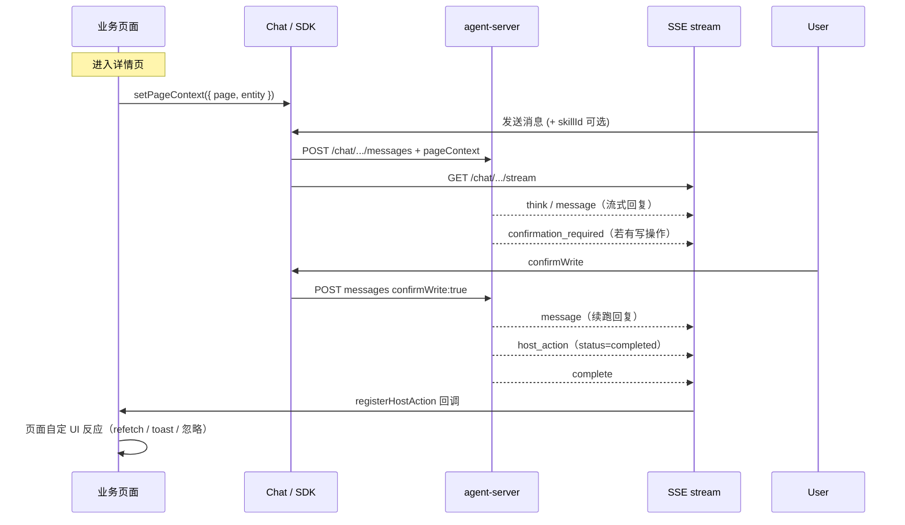

# 页面上下文与宿主动作 · 前端对接指南

> 版本：与 agent-server 当前实现同步（2026-06）  
> 适用：业务页内嵌 Chat（omnix-chat SDK 或自研 UI）  
> 后端契约摘要：[host-bridge-frontend.md](./host-bridge-frontend.md)  
> SDK 细节（含 `routeContext` / 勾选附带）：agent-chat `docs/host-page-context-and-actions.md`  
> 相关：[Chat SSE](./chat-sse-message-blocks-frontend.md)、[写确认](./write-confirmation-frontend.md)

---

## 1. 你要对接的两条链路

| 方向 | 机制 | 谁负责 |
|------|------|--------|
| **页面 → Agent** | 用户发消息时附带 `pageContext` | 宿主页面 + Chat SDK |
| **Agent → 页面** | SSE `host_action`（mutation 成功后，`status: completed`） | 宿主注册 handler，**自行决定** refetch / toast / 忽略 |



**原则**：后端只通知「本轮写操作已成功」；**具体 UI 反应（是否刷新、刷哪块）完全由前端决定**。

---

## 2. 前置条件

### 2.1 鉴权与 Header

与发消息、SSE 保持一致（见 [app-client-auth-frontend.md](./app-client-auth-frontend.md)）：

| Header | 说明 |
|--------|------|
| `Authorization: Bearer <accessToken>` | C 端登录后 token |
| `X-App-Dsn` | AppClient DSN |

### 2.2 SSE 长连接

在用户发消息前或同时建立：

```text
GET /chat/{sessionId}/stream
```

监听事件：`think` | `message` | `host_action` | `complete` | `error`。

详见 [chat-sse-message-blocks-frontend.md](./chat-sse-message-blocks-frontend.md)。

---

## 3. 入站：pageContext

### 3.1 何时设置

| 时机 | 做法 |
|------|------|
| 进入业务页 | 设置 `page` + `entity`（详情页强烈建议带 `id`） |
| 路由 / Tab 变化 | 再次 `setPageContext` |
| 用户发消息 | SDK 自动并入 POST body（自研 UI 需手动带） |

**不要**在 `pageContext` 里塞整页 API 响应；只传标识与小 metadata（Tab、筛选等）。

### 3.2 推荐字段

```ts
type PageContext = {
  /** 与 host_action.scope 对齐，kebab-case，全站稳定 */
  page?: string;
  routePath?: string;
  flowId?: number;
  programName?: string;
  entity?: {
    type?: string;
    id?: string;
    [key: string]: unknown; // 与 write tool businessFields 同名的业务字段
  };
  metadata?: {
    [key: string]: unknown; // Tab、筛选等；服务端原样镜像到 host_action.metadata
  };
};
```

| 字段 | 建议 | 说明 |
|------|------|------|
| `page` | **强烈建议** | 无 `page` 时服务端**不发** `host_action`（无 `scope`） |
| `entity.id` | 详情页建议 | handler 内校验，避免同 scope 多实例误处理 |
| `entity.{businessField}` | 写场景建议 | 与 Tool `businessFields` 同名，供写参数补齐 |

### 3.3 HTTP 请求体

**新建会话** `POST /chat`  
**已有会话** `POST /chat/{sessionId}/messages`

```json
{
  "role": "user",
  "content": "帮我分析并回复这条评论",
  "agentId": 1,
  "skillId": 12,
  "pageContext": {
    "page": "review-detail",
    "routePath": "/reviews/123",
    "entity": { "type": "review", "id": "123" },
    "metadata": { "tab": "content" }
  },
  "page": "review-detail",
  "routePath": "/reviews/123",
  "entity": { "type": "review", "id": "123" },
  "metadata": { "tab": "content" }
}
```

- **推荐**：嵌套 `pageContext` + 平铺兼容字段（与 omnix-chat SDK 一致）。
- 服务端合并时 **嵌套优先**。
- `POST /chat/{sessionId}/prepare` **不**带 pageContext（仅预热）。

### 3.4 使用 omnix-chat SDK

```tsx
import { AgentChat, useHostAction, useAgentChat } from 'omnix-chat/react';

function ReviewDetailPage({ reviewId }: { reviewId: string }) {
  const { instance } = useAgentChat();

  useEffect(() => {
    instance.setPageContext({
      page: 'review-detail',
      routePath: location.pathname,
      entity: { type: 'review', id: reviewId },
      metadata: { tab: 'content' },
    });
  }, [reviewId, instance]);

  useHostAction('review-detail', async (action) => {
    if (action.status !== 'completed') return;
    if (action.entity?.id && action.entity.id !== reviewId) return;
    // 操作完成后的 UI 由页面自定：示例为 refetch
    await refetchReview(reviewId);
    await refetchReplies(reviewId);
  });

  return <AgentChat skillId={REVIEW_REPLY_SKILL_ID} attachPageContext />;
}
```

SDK 能力对照：

| 能力 | API |
|------|-----|
| 设置扩展上下文 | `setPageContext` / `<AgentChat pageContext={...} />` |
| 路由信息 | `setRouteContext` / `syncRouteContextFromWindow`（见 SDK 文档） |
| 是否附带扩展字段 | `attachPageContext` / `setAttachPageContext` |
| 监听宿主动作 | `on('hostAction')` 或 `useHostAction(scope, handler)` |
| 写确认 | `confirmWrite` / `cancelWrite` 见 [write-confirmation-frontend.md](./write-confirmation-frontend.md) |

### 3.5 会话回落（追问）

同一会话内，若用户追问时 **未再带** `pageContext`，服务端会用该会话最近一次有效上下文（`lastPageContext`）。  
**仍建议**：路由或实体变化后主动 `setPageContext`，不要依赖回落。

---

## 4. 出站：host_action（操作完成）

### 4.1 语义

`host_action` 表示：**本轮 run 中，用户意图相关的 mutation 已在业务 API 侧成功执行**。

这不是刷新指令。服务端**不会**指定 `refresh` / `invalidate` / 刷新哪些区域；前端收到 `status: 'completed'` 后自行决定 refetch、invalidate、toast 或忽略。

### 4.2 何时收到

**同时满足**时，在 `complete` **之前**推送：

| 条件 | 说明 |
|------|------|
| 本轮 run `status=success` | 失败不发 |
| 非写确认门闩暂停态 | 仅 `confirmation_required` 时尚未执行写 HTTP，**不发** |
| 存在 mutation Tool 且 HTTP `SUCCESS` | 只分析、只读不发 |
| 入站有效 `pageContext.page` | **无 page 不发**（无 `scope` 路由） |

### 4.3 SSE 格式

**推荐：独立事件**

```text
event: host_action
data: {"action":"host_action","status":"completed","scope":"review-detail",...}
```

也接受 `event: host-action`。SDK 亦支持在 `message` 事件内嵌相同 payload（见 SDK 文档）。

**Payload 示例**

```json
{
  "action": "host_action",
  "status": "completed",
  "scope": "review-detail",
  "entity": { "type": "review", "id": "123" },
  "metadata": { "tab": "content" },
  "reason": "review_reply_submitted",
  "runId": 42,
  "turnId": 7
}
```

| 字段 | 说明 |
|------|------|
| `status` | 固定 `completed`，表示 mutation 已成功 |
| `scope` | 对应入站 `pageContext.page`，用于 handler 路由 |
| `entity` | 镜像入站 `pageContext.entity`；handler 内可校验 `id` |
| `metadata` | 镜像入站 `pageContext.metadata`（透传，服务端不解释） |
| `reason` | 可选，日志/埋点；可被 Skill `hostBridge.reason` 覆盖 |
| `runId` / `turnId` | 关联本轮 run，便于去重与对账 |

> **已废弃（勿依赖）**：旧版可能带 `type: "refresh"`、`targets`。新实现不再推送；前端应以 `status === 'completed'` 为准。

### 4.4 页面 handler 写法

```ts
// 伪代码：不要用 location.reload()
async function onHostAction(action: HostAction) {
  if (action.status !== 'completed') return;
  if (action.scope !== 'review-detail') return;
  if (action.entity?.id && action.entity.id !== currentReviewId) return;

  // 操作完成后的默认策略由页面定义（示例：invalidate 相关 query）
  await queryClient.invalidateQueries({ queryKey: ['review', currentReviewId] });
  await queryClient.invalidateQueries({ queryKey: ['review-replies', currentReviewId] });
  // 或 toast('回复已提交')、或什么都不做（用户已离页）
}
```

---

## 5. 与写确认的时序（mutation 场景）

典型「分析 → 草稿 → 确认 → 写入 → 刷新」：

```text
1. 用户发消息（带 pageContext）
2. SSE message：流式展示分析 / 回复草稿
3. SSE confirmation_required + complete   ← primary run 结束，尚未写 HTTP
4. 用户点确认 → POST { confirmWrite: true }（可不带 content，可附带最新 pageContext）
5. SSE message：续跑收尾文案
6. SSE host_action（status=completed）       ← 写成功，通知操作完成
7. SSE complete                             ← worker run 结束
```

| 阶段 | 是否 host_action |
|------|------------------|
| 步骤 3 仅门闩 | 否 |
| 步骤 6 写 HTTP 成功 | 是 |

取消：`POST { cancelWrite: true }` → `write_confirmation_cancelled`，**无** host_action。

写确认对接：[write-confirmation-frontend.md](./write-confirmation-frontend.md)。

---

## 6. Skill 侧配置（可选）

后端可在 Skill `config.hostBridge` 声明可选 `reason`（埋点/日志），**不驱动 UI**：

```json
{
  "config": {
    "deliverable": "mutation",
    "hostBridge": {
      "reason": "review_reply_submitted"
    }
  }
}
```

未来若引入前端工具库，可在 `hostBridge` 扩展 `onSuccess.hostTool`（工具名 + 参数）；当前阶段由页面在 `status === 'completed'` 时自行处理。示例 Skill：[skill-templates/review-reply-skill.example.md](./skill-templates/review-reply-skill.example.md)。

---

## 7. 端到端检查清单

### 入站 pageContext

- [ ] 每个嵌入 Chat 的业务页定义稳定 `page`（kebab-case）
- [ ] 详情页 `entity.id` 与当前路由一致
- [ ] 路由/实体变化时更新 `setPageContext`
- [ ] 写场景在 `entity` 中提供与 Tool `businessFields` 对齐的字段（若不止一个标识位）
- [ ] 不在 metadata 里塞大 JSON

### 出站 host_action

- [ ] SSE 已监听 `host_action`（或 SDK `useHostAction`）
- [ ] 已按 `scope === page` 注册 handler
- [ ] handler 校验 `status === 'completed'` 与 `entity.id`
- [ ] 页面自定完成后的 UI（refetch / invalidate / toast），**不用** `location.reload()`
- [ ] 理解 `host_action` 在 `complete` 之前到达

### 写确认

- [ ] 处理 `confirmation_required` 与 `confirmWrite`
- [ ] 不在门闩阶段期待 host_action
- [ ] 确认后在 complete 前处理 host_action

### 联调

- [ ] 仅分析：无 host_action
- [ ] 写确认通过：有 host_action，`scope` 与 `page` 一致
- [ ] 追问未带 pageContext：Agent 仍能用会话回落；host_action 仍依赖有效 `page`

---

## 8. 常见问题

**Q：发了消息但从未收到 host_action？**  
- 本轮是否只有读、没有 mutation 成功？  
- 是否停在写确认、用户未 confirm？  
- 入站是否缺少 `pageContext.page`？  

**Q：`scope` 和 `page` 不一致？**  
- 应保持一致；`scope` 由服务端镜像入站 `page`，检查发消息时 `page` 是否正确。  

**Q：同 scope 多 Tab 误处理？**  
- handler 内比较 `action.entity.id` 与当前实例 id。  

**Q：收到 completed 后一定要刷新吗？**  
- 不必须。由页面决定；用户已离页可忽略。  

**Q：自研 UI 不用 omnix-chat？**  
- 自行实现 POST body 双写、`EventSource` + `host_action` 监听即可；字段以本文 §3.3、§4.2 为准。

---

## 9. 相关文档

| 文档 | 内容 |
|------|------|
| [host-bridge-frontend.md](./host-bridge-frontend.md) | 服务端行为摘要 |
| [host-tool-data-model.md](./host-tool-data-model.md) | Host Tool 表结构与管理端建模 |
| [chat-sse-message-blocks-frontend.md](./chat-sse-message-blocks-frontend.md) | SSE 全事件 |
| [write-confirmation-frontend.md](./write-confirmation-frontend.md) | 写确认 |
| agent-chat `host-page-context-and-actions.md` | SDK 类型与 Registry |
