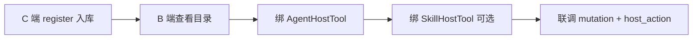

# Host Tool · B 端管理后台对接指南

> 适用：运营 / 配置后台（管理端 UI）  
> **C 端 / SDK**：[host-bridge-sdk-frontend.md](./host-bridge-sdk-frontend.md)  
> 数据模型：[host-tool-data-model.md](./host-tool-data-model.md)

---

## 1. 职责划分

| 角色 | 做什么 | 不做什么 |
|------|--------|----------|
| **B 端后台** | 查看 / 编辑目录、绑 Agent / Skill、启停工具 | 不执行页面 DOM 操作 |
| **C 端业务页** | `registerHostTool` 实现 + 可选首次同步入库 | 不替代 Agent 白名单配置 |
| **agent-server** | 存元数据、`host_action.hostTools` 解析参数 | 不调用浏览器 API |

推荐：**C 端首次注册自动入库**（见 C 端文档），B 端主要负责 **绑定 Agent / Skill** 与运营查看。

---

## 2. 鉴权

所有 B 端接口前缀：**`/admin`**（全局 `Authorization: Bearer <adminJwt>`）。

与现有 Tool / Agent / Skill 管理一致，无单独 HostTool 鉴权。

---

## 3. 推荐配置流程



1. 业务页通过 C 端 `POST /host-tool/client/register` 首次同步工具元数据（或 B 端手工创建）。
2. B 端在 **Agent 详情** 勾选可用 Host Tool（`AgentHostTool`）。
3. 可选：在 **Skill 详情** 配置 mutation 完成时引用哪些工具（`SkillHostTool`）。
4. 联调：写操作成功 → SSE `host_action.hostTools`。

---

## 4. HostPage（页面登记）

### 4.1 列表

```http
GET /admin/host-page/by-app-client/:appClientId?page=1&pageSize=20&scope=review
```

| Query | 说明 |
|-------|------|
| `keyword` | 搜 scope / label / description |
| `scope` | 模糊匹配 scope |
| `isActive` | 是否启用 |

### 4.2 创建

```http
POST /admin/host-page
Content-Type: application/json

{
  "appClientId": 1,
  "scope": "review-detail",
  "label": "评论详情",
  "routePattern": "/reviews/:id",
  "description": "嵌入 Chat 的详情页"
}
```

> C 端 `register` 带 `scope` 时也会 **自动创建** HostPage（`label` 默认 = scope）。B 端可事后补全 `label` / `routePattern`。

### 4.3 更新 / 删除

```http
PATCH /admin/host-page/:id
DELETE /admin/host-page/:id
```

删除 HostPage 会 **级联删除** 其下页内 HostTool。

---

## 5. HostTool（工具元数据）

### 5.1 列表

```http
GET /admin/host-tool/by-app-client/:appClientId?page=1&pageSize=20
```

| Query | 说明 |
|-------|------|
| `scope` | 某页 scope 下的页内工具 |
| `genericOnly=true` | 仅 App 通用工具（`hostPageId` 为空） |
| `exposure` | `CATALOG` / `ON_COMPLETE` / `LLM` / `BOTH` |
| `keyword` | name / definitionKey / description |

### 5.2 手工创建

**通用工具（全 App 一条刷新）：**

```json
{
  "appClientId": 1,
  "definitionKey": "refreshEntity",
  "name": "refreshEntity",
  "description": "mutation 成功后按 entity 刷新嵌入页数据",
  "argsSchema": {
    "type": "object",
    "properties": {
      "entityType": { "type": "string" },
      "entityId": { "type": "string" }
    },
    "required": ["entityId"]
  },
  "exposure": "ON_COMPLETE",
  "argsTemplate": {
    "entityType": "$entity.type",
    "entityId": "$entity.id"
  }
}
```

**页内工具：**

```json
{
  "appClientId": 1,
  "hostPageId": 12,
  "definitionKey": "review-detail.fillReplyDraft",
  "name": "fillReplyDraft",
  "description": "将回复草稿填入评论详情回复框",
  "argsSchema": {
    "type": "object",
    "properties": { "text": { "type": "string" } },
    "required": ["text"]
  },
  "exposure": "LLM"
}
```

| 字段 | 说明 |
|------|------|
| `hostPageId` | 省略 / `null` = 通用工具 |
| `name` | **App 内唯一**，SSE / registry 使用 |
| `exposure` | `ON_COMPLETE` 才会进 `host_action.hostTools` |
| `argsTemplate` | 支持 `$entity.id`、`$entity.type`、`$page` 等 |

### 5.3 更新 / 删除

```http
PATCH /admin/host-tool/:id
DELETE /admin/host-tool/:id
```

---

## 6. Agent 绑定（白名单，必做）

Agent 只能使用已绑定的 Host Tool。

**Agent 详情** `GET /admin/agent/:id` 已内嵌 `hostTools` / `agentHostTools` / `hostToolCount`。**列表** `GET /admin/agent` 仅返回 `hostToolCount`（`hostTools` 为空数组）。详见 [host-tool-agent-skill-api-frontend.md](./host-tool-agent-skill-api-frontend.md)。

### 6.1 查询（含是否已绑）

```http
GET /admin/agent/:agentId/app-client/:appClientId/host-tools?page=1&pageSize=50
```

响应 `items[].bound`：`true` 表示已在 `AgentHostTool`。

### 6.2 绑定 / 解绑

```http
POST /admin/agent/:agentId/app-client/:appClientId/host-tools
{ "hostToolIds": [1, 2] }

DELETE /admin/agent/:agentId/app-client/:appClientId/host-tools
{ "hostToolIds": [2] }
```

**UI 建议**：Agent 配置页增加「前端工具」Tab，多选 HostTool；通用工具绑一次即可。

---

## 7. Skill 绑定（可选，场景级）

控制某 Skill 在 Plan LLM 或 mutation 完成时引用哪些 Host Tool。

**Skill 详情与 B 端完整配置流程**见 [skill-admin-frontend.md](./skill-admin-frontend.md)、[host-tool-agent-skill-api-frontend.md](./host-tool-agent-skill-api-frontend.md)。

### 7.1 查询

```http
GET /admin/skill/:skillId/host-tools
```

### 7.2 全量替换

```http
PUT /admin/skill/:skillId/host-tools
{
  "tools": [
    {
      "hostToolId": 1,
      "trigger": "ON_MUTATION_SUCCESS",
      "priority": 0,
      "isRequired": false,
      "argsTemplate": { "entityId": "$entity.id", "entityType": "$entity.type" }
    }
  ]
}
```

| 字段 | 说明 |
|------|------|
| `trigger` | `ON_MUTATION_SUCCESS`（completion）、`LLM_SCOPED` / `ON_PLAN_STEP`（Plan host_tool） |
| `priority` | 越小越优先 |
| `isRequired` | Plan `host_tool` 步是否必须 dispatch；`true` 时 LLM 未调用则不推进 plan |
| `argsTemplate` | 可覆盖 HostTool 默认模板 |

> `hostToolId` 必须已出现在该 Skill 所属 Agent 的 `AgentHostTool` 中。

若 Skill **从未配置**任何 `SkillHostTool`：服务端 **回退** 到该 Agent 的 `AgentHostTool` 白名单。

若 Skill **已配置** Host Tool 但 **无当前 trigger**（例如只配了 `ON_PLAN_STEP`、completion 要 `ON_MUTATION_SUCCESS`）：**不回退**，该场景无工具。

`PUT` 传 `"tools": []` 表示显式清空 Skill 绑定，同样不回退。

---

## 8. B 端 UI 信息架构建议

```text
AppClient
  └─ 前端工具
       ├─ 通用工具（genericOnly）
       ├─ 页面列表（HostPage）
       │    └─ 页内工具
       └─ （入口）Agent → 前端工具白名单
       └─ （入口）Skill → 前端工具场景绑定
```

列表页展示：`name`、`pageScope`（通用显示「全 App」）、`exposure`、`isActive`、来源（`client_register` / 手工，可用 `config.source` 扩展）。

---

## 9. 与 `host_action` 的关系

mutation 成功且满足条件时，SSE 示例：

```json
{
  "action": "host_action",
  "scope": "review-detail",
  "hostTools": [
    { "name": "refreshEntity", "args": { "entityId": "123", "entityType": "review" } }
  ],
  "reason": "agent_mutation_success"
}
```

`hostTools` 解析链：

```text
HostTool(exposure ∈ ON_COMPLETE, BOTH)
  ∩ 当前 scope（通用 或 页内匹配）
  ∩ AgentHostTool
  ∩ SkillHostTool（若 Skill 有配置）
  → argsTemplate 解析为 args
```

B 端不配 `AgentHostTool` → C 端注册了也不会出现在 `hostTools`。

---

## 10. 检查清单

- [ ] 迁移已执行：`npx prisma migrate deploy`
- [ ] C 端或 B 端已存在 `refreshEntity`（`ON_COMPLETE`）
- [ ] Agent 已绑定对应 HostTool
- [ ] 评论回复类 Skill 已绑 `SkillHostTool`（可选）
- [ ] 联调：写确认通过 → SSE 含 `hostTools`

---

## 11. 相关文档

| 文档 | 内容 |
|------|------|
| [host-tool-client-register-frontend.md](./host-tool-client-register-frontend.md) | C 端注册 + SDK 包装 |
| [host-tool-data-model.md](./host-tool-data-model.md) | 表结构 |
| [host-page-context-host-action-frontend.md](./host-page-context-host-action-frontend.md) | pageContext、handler |
