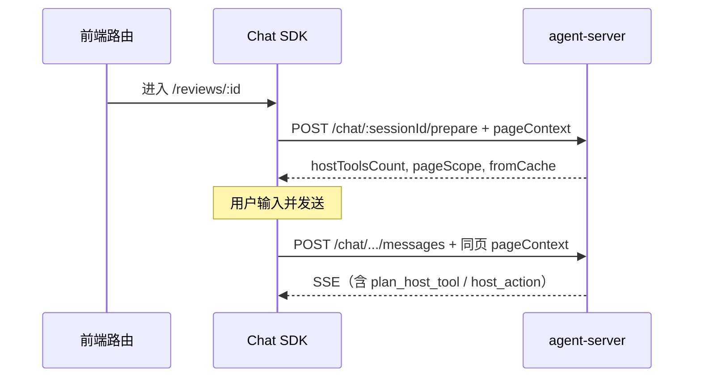

# Host Tool 预热 · C 端前端对接说明

> 版本：与 agent-server 当前实现同步（2026-06）  
> 关联：[pageContext 与 host_action](./host-page-context-host-action-frontend.md)、[宿主桥接 SDK](./host-bridge-sdk-frontend.md)、[运行时缓存方案](./runtime-cache-unified.md)

---

## 1. 为什么要预热

Agent Run 的 Plan / LLM 阶段需要解析当前页面可用的 **Host Tool**（`exposure` 为 `LLM` / `BOTH`）。若在用户发消息时才首次解析，会多一次 DB + 绑定目录查询，拉长首 token 延迟。

**预热目标**：在用户进入业务页、或路由切换后，提前把「当前 `page` 下可用的 Host Tool 列表」写入服务端会话快照（Redis L1），后续 Run 直接命中缓存。

| 不预热 | 预热后 |
|--------|--------|
| 首条消息冷启动解析 Host Tool | Plan 阶段复用 L1 `hostToolsByPage[page]` |
| 仅 SSE 连接时 warm 不含 page | 显式 `prepare` + `pageContext.page` 写入 page 维度缓存 |

**重要**：预热只加速服务端解析，**不替代**发消息时的 `pageContext`（Run 内 host_action 仍依赖入站 `pageContext.page`）。

---

## 2. 何时调用



| 时机 | 是否带 `pageContext.page` | 说明 |
|------|---------------------------|------|
| **进入/切换到业务页** | **必须** | 调用 `prepare`，写入该页 Host Tool 缓存 |
| 打开 SSE `GET /chat/:sessionId/stream` | 否（服务端内部 warm） | 仅预热 HTTP tools / skills / session context；**不含** host_tool |
| `POST /chat` 建会话后 | 可选 | 若已知当前页，可立即 prepare；否则等进页再 prepare |
| 用户发消息前 | 推荐已完成 prepare | 同页且 revision 未变时可跳过重复 prepare |
| 后台改 Agent/Skill/HostTool 绑定后 | 再次 prepare | 服务端 revision 变化会自动 miss 并重 warm |

**路由切换**：每次 `page` 变化（含同组件不同 entity）都应 **重新** `POST .../prepare`，带新的 `pageContext`。

---

## 3. API

### 3.1 请求

```
POST /chat/{sessionId}/prepare
```

| 项 | 说明 |
|----|------|
| `sessionId` | 32 位小写 hex，与建会话返回一致 |
| Headers | 与发消息相同：`Authorization: Bearer <JWT>`、`X-App-Dsn: <dsn>` |
| Body | JSON，**推荐带 `pageContext`**（见 §4） |
| Body 可为空 | 合法；等价于只 warm tools/skills/context，`hostToolsCount` 为 0 |

### 3.2 响应 `200`

```json
{
  "sessionId": "a1b2c3d4e5f6789012345678abcdef01",
  "prepared": true,
  "agentReady": true,
  "toolsCount": 12,
  "skillsCount": 5,
  "hostToolsCount": 3,
  "pageScope": "review-detail",
  "sessionContextWarmed": true,
  "warmedAt": "2026-06-22T12:00:00.000Z",
  "fromCache": false,
  "revision": {
    "tools": "1:2026-06-01T00:00:00.000Z,2:...",
    "skills": "10:2026-06-01T00:00:00.000Z",
    "hostTools": "h:...|s:...|b:...",
    "integrations": "3:2026-06-01T00:00:00.000Z"
  }
}
```

| 字段 | 含义 |
|------|------|
| `prepared` | 预热流程是否完成 |
| `agentReady` | Agent runtime（L3）是否可用 |
| `toolsCount` | 当前用户权限 ∩ Agent 绑定后的 HTTP Tool 数 |
| `skillsCount` | 角色可见且可运行的 Skill 数 |
| **`hostToolsCount`** | **本次 `page` 预热的 LLM Host Tool 数**；无 `page` 时为 `0` |
| **`pageScope`** | 本次预热使用的 `pageContext.page`；无 page 时为 `null` |
| `fromCache` | L1 快照 revision 命中，跳过了 tools/skills 重算；若仅缺 page 条目仍会补 warm host_tool |
| `revision` | 可选，调试配置变更是否导致 cache miss |

### 3.3 错误

| HTTP | 原因 |
|------|------|
| `400` | `sessionId` 格式非法 |
| `401` | JWT / DSN 无效 |
| `404` | 会话不存在或不属于当前用户 / AppClient |

---

## 4. 请求体：pageContext

与 `POST /chat/.../messages` **共用**字段定义（嵌套 + 平铺兼容）。

### 4.1 推荐写法（嵌套）

```json
{
  "pageContext": {
    "page": "review-detail",
    "routePath": "/reviews/43689",
    "routeParams": { "reviewId": "43689" },
    "entity": { "type": "review", "id": "43689" },
    "metadata": { "tab": "basic" }
  }
}
```

### 4.2 平铺兼容（与 omnix-chat SDK 一致）

```json
{
  "page": "review-detail",
  "routePath": "/reviews/43689",
  "routeParams": { "reviewId": "43689" }
}
```

### 4.3 字段说明

| 字段 | 预热是否必需 | 说明 |
|------|-------------|------|
| **`page` / `pageContext.page`** | **是**（要 warm host_tool 时） | 必须与 B 端 `HostPage.scope` 一致，如 `review-detail` |
| `routePath` | 否 | 写入快照供后续模板/调试；**不参与** host_tool 筛选 |
| `routeParams` | 否 | 同上 |
| `entity` / `metadata` | 否 | 发消息 / host_action 用；prepare 阶段可一并传入便于快照留档 |

**筛选 host_tool 只看 `page`**，与 `routePath`、`entity.id` 无关。

### 4.4 `page` 对齐规则

前端路由 → `pageContext.page` → B 端 `HostPage.scope` → Host Tool 的 `hostPageScope`（或 `hostPageId = null` 表示全页面通用）。

示例：

| 前端路由 | `pageContext.page` | B 端 HostPage.scope |
|----------|-------------------|---------------------|
| `/reviews/:reviewId` | `review-detail` | `review-detail` |
| `/campaigns/:id/edit` | `campaign-edit` | `campaign-edit` |

若 `hostToolsCount === 0` 但预期有工具，先核对三处 `scope` 字符串是否完全一致（大小写敏感）。

---

## 5. 服务端预热规则（前端需知的语义）

prepare 阶段从 Agent Host Tool 目录中筛选，等价于运行时 Plan LLM 步（**外层** `skillId = null`）：

1. `HostTool.isActive === true`
2. `exposure` ∈ `LLM` / `BOTH`（**不含** `ON_COMPLETE` — 完成态工具不在 prepare 阶段预热）
3. `hostPageScope === pageContext.page` **或** `hostPageScope === null`（全页面通用）
4. `hostToolId` 在 Agent 绑定白名单内

**不会**使用 GOA `lastPageContext` 推断 page；page 必须由本次 prepare 请求显式传入。

同一会话可缓存 **多个 page** 的条目（`hostToolsByPage`），TTL 内切换回已 prepare 过的页面可命中 `fromCache: true`。

---

## 6. 前端集成示例

### 6.1 原生 fetch

```ts
async function prepareHostToolsForPage(
  sessionId: string,
  token: string,
  dsn: string,
  pageContext: {
    page: string;
    routePath?: string;
    routeParams?: Record<string, unknown>;
  },
) {
  const res = await fetch(`/chat/${sessionId}/prepare`, {
    method: 'POST',
    headers: {
      'Content-Type': 'application/json',
      Authorization: `Bearer ${token}`,
      'X-App-Dsn': dsn,
    },
    body: JSON.stringify({ pageContext }),
  });
  if (!res.ok) {
    throw new Error(`prepare failed: ${res.status}`);
  }
  const data = await res.json();
  // 可选：调试 hostToolsCount
  console.debug('[prepare]', data.pageScope, data.hostToolsCount, data.fromCache);
  return data;
}
```

### 6.2 React Router 联动

```tsx
useEffect(() => {
  if (!sessionId || !pageScope) return;
  void prepareHostToolsForPage(sessionId, token, dsn, {
    page: pageScope,
    routePath: location.pathname,
    routeParams: params as Record<string, unknown>,
  });
}, [sessionId, pageScope, location.pathname, params]);
```

### 6.3 与发消息配合

```ts
// 1. 进页 prepare
await prepareHostToolsForPage(sessionId, token, dsn, pageContext);

// 2. 发消息 — pageContext 必须与 prepare 同页（或更新后的页）
await sendMessage(sessionId, {
  content: userInput,
  pageContext, // 同一对象结构
});
```

prepare **不能**代替消息里的 `pageContext`：Run 内 host_action、写确认续跑仍读取**入站消息**的 page。

---

## 7. 联调检查清单

- [ ] 进入业务页后调用 `POST .../prepare`，body 含 `pageContext.page`
- [ ] `pageScope` 响应与传入 `page` 一致
- [ ] 预期有 LLM Host Tool 时 `hostToolsCount > 0`
- [ ] 路由切换后再次 prepare，新 `page` 有独立计数
- [ ] 发消息 body 带**相同** `pageContext.page`
- [ ] B 端 Agent 已绑定 Host Tool，且 `exposure` 为 `LLM` / `BOTH`
- [ ] Host Tool 的 `hostPageScope` 等于当前 `page`，或为全页面（null）
- [ ] 改绑定后重新 prepare，`fromCache` 应为 `false`（或 revision 变化）

---

## 8. 常见问题

| 现象 | 排查 |
|------|------|
| `hostToolsCount` 始终为 0 | 是否传了 `page`？Agent 是否绑定工具？`exposure` 是否 LLM/BOTH？`hostPageScope` 是否匹配？ |
| prepare 有工具，Run 仍无 `host_action` | 发消息是否带 `pageContext.page`？Plan 是否含 `host_tool` 步？ |
| 换页后仍用旧页工具 | 换页后是否重新 prepare + 发消息带新 page？ |
| `fromCache: true` 但配置刚改 | 等待 TTL（默认约 5–10min）或触发后台保存使 revision 失效；前端可主动再 prepare |
| 仅连 SSE 未 prepare | 正常：SSE 触发的 background warm **不含** host_tool |

---

## 9. 相关文档

| 文档 | 内容 |
|------|------|
| [host-page-context-host-action-frontend.md](./host-page-context-host-action-frontend.md) | 发消息 pageContext、SSE `host_action` |
| [host-bridge-sdk-frontend.md](./host-bridge-sdk-frontend.md) | SDK 总览与 register |
| [host-tool-agent-skill-api-frontend.md](./host-tool-agent-skill-api-frontend.md) | B 端绑定与 exposure |
| [runtime-cache-unified.md](./runtime-cache-unified.md) | L1/L2 缓存与 revision |
| [chat-sse-message-blocks-frontend.md](./chat-sse-message-blocks-frontend.md) | SSE 与鉴权 Header |
