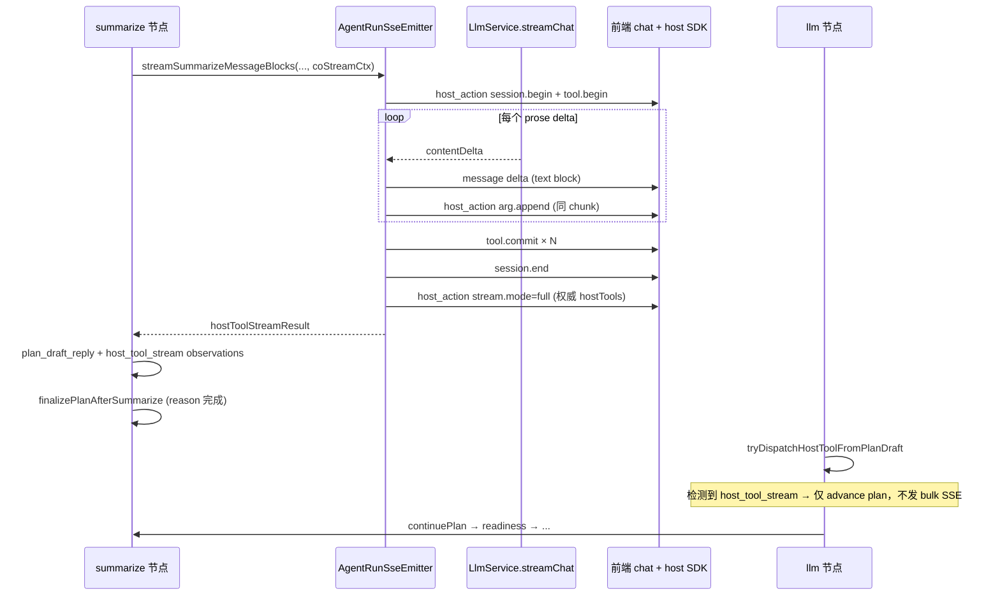

# Host Tool 真流式（S2 Summarize 共流）— 后端方案与规范

> **状态**：规范定稿，待实现  
> **版本**：v1  
> **关联**：[host-tool-stream-dsl-frontend.md](./host-tool-stream-dsl-frontend.md) · [host-tool-stream-sdk-frontend.md](./host-tool-stream-sdk-frontend.md) · [plan-node.md](./plan-node.md)

---

## 1. 背景与目标

### 1.1 问题

Plan 路径 `reason → host_tool`（典型：`fillReplyDraft`）当前行为：

1. **summarize** 节点：LLM 流式产出用户可见草稿（`message` SSE delta）
2. **llm** 节点：从 `plan_draft_reply` 取完整正文，一次性发 **v0 批量** `host_action`

用户在聊天区已看到逐字输出，但宿主页面表单仍等到 llm 步才整段填入 — **体验不同步**。

### 1.2 目标（真流式）

**S2 Summarize 共流**：`host_action` DSL 的 `arg.append` 与 summarize LLM 的 **同一 prose delta** 同源、同序发出。

| 要求 | 说明 |
|------|------|
| 真流式 | chunk 来自 LLM stream callback，禁止对完整 args 做 post-hoc 切块（**不做 S1 伪流式**） |
| 双通道并行 | `message` delta 与 `host_action` delta 独立 SSE 事件，内容对齐 |
| 权威终态 | 流结束必须发 `stream.mode=full`，与 v0 批量语义等价 |
| 图路由不变 | summarize 仍只负责文本；llm 仍负责 plan 步推进，但 **跳过重复 bulk dispatch** |
| 可降级 | 开关关闭 / 条件不满足 / 流失败 → 回退现有 v0 批量 |

### 1.3 明确不做（本阶段）

- **S1** 完整 args 按 `chunkSize` 切块
- **S3** decision LLM 流式 partial JSON → `arg.append`
- 修改前端 reducer 协议（沿用 v1 DSL）
- `HostTool.streamConfig` DB 字段（Phase 2；本阶段用 argsSchema 推断 + env）

---

## 2. 适用场景

### 2.1 主路径（必须支持）

```text
plan.pending[0] = reason
plan.pending[1] = host_tool   ← 共流目标步
pageContext.page 存在
scopedHostTools 非空
HOST_TOOL_STREAM=1
```

**典型 Skill**：评论回复 — `reason` 生成回复正文 → `host_tool(fillReplyDraft)` 填入宿主表单。

### 2.2 触发 summarize 入口

共流挂在 **`streamSummarizeMessageBlocks`** 的 LLM `onDelta` 路径上，因此凡经该函数且满足 §2.1 的 summarize 均可触发，包括但不限于：

- `summarizeToolOutputForUser`（plan answer / merged observation）
- `summarizeDirectUserMessage`（`direct_user` + plan context）
- `summarizeClarificationRequest`（若后续步为 host_tool，理论可行，优先级低）

**不触发**：

- `artifactPhase !== 'draft'` 的终稿 summarize（`emitAuthoritativeFull: true` 的最终用户回复）
- `compose_write / present` 写确认预览路径（下一步是 HTTP write，不是 host_tool）
- 无 `pageContext.page` 或无 scoped host tools
- pending 下一步不是 `kind: host_tool`

### 2.3 判定函数（normative）

```typescript
/** reason 中间步且队列下一项为 host_tool 时可共流。 */
function resolveHostToolCoStreamTarget(input: {
  taskPlan: TaskPlanSnapshot;
  pageContext: AgentChatPageContext | null | undefined;
  scopedHostTools: HostToolDecisionDefinition[];
  publishMode?: PlanSummarizePublishMode;
}): HostToolCoStreamTarget | null;
```

| 条件 | 规则 |
|------|------|
| 总开关 | `process.env.HOST_TOOL_STREAM === '1'` |
| Plan | `isIntermediatePlanTextGenerationStep(taskPlan)` 为 true |
| 下一步 | `getStepById(taskPlan, taskPlan.pendingStepIds[1])?.kind === 'host_tool'` |
| 页面 | `pageContext.page?.trim()` 非空 |
| 工具 | 下一步 `hostToolNames` 与 `scopedHostTools` 交集非空 |
| 发布模式 | `publishMode.artifactPhase === 'draft'`（中间步） |

返回：

```typescript
type HostToolCoStreamTarget = {
  /** 即将执行的 host_tool plan 步 id（pending[1]） */
  planStepId: string;
  hostToolNames: string[];
  /** JSON 点路径，如 text */
  streamablePath: string;
  reason: 'plan_host_tool_costream';
};
```

`streamablePath` 解析顺序（本阶段无 DB `streamConfig`）：

1. 取 host tool `argsSchema.properties` 中第一个 `type: string` 的 key
2. 若多个常见 key 存在，优先级：`text` > `content` > `value` > `draft` > `body`
3. 无法推断 → **不共流**，走 v0 降级

---

## 3. 端到端时序



### 3.1 与现有图路由对齐

| 阶段 | 节点 | 行为变化 |
|------|------|----------|
| T0 | resultCheck | `plan_advance_summarize` → summarize（不变） |
| T1 | summarize | 共流 + 写 `plan_draft_reply` + **`host_tool_stream`**（新增） |
| T2 | readiness | 放行（不变） |
| T3 | llm | `tryDispatchHostToolFromPlanDraft`：**见 §5 去重** |
| T4 | resultCheck | host_tool 步完成 → 后续步（不变） |

---

## 4. 协议与帧序列（S2 专用）

遵循 [host-tool-stream-dsl-frontend.md §3](./host-tool-stream-dsl-frontend.md)。单轮共流帧序：

```text
1. session.begin     (stream.mode=begin,  seq++)
2. tool.begin × N    (stream.mode=delta,  seq++)   // N = 匹配的 host tool 数
   [可选] arg.set     (非流式参数，本阶段通常无)
3. arg.append × M    (stream.mode=delta,  seq++)   // M = LLM prose delta 次数；多 tool 时同一 chunk 广播到每个 callId
4. tool.commit × N   (stream.mode=commit, seq++)
5. session.end       (stream.mode=end,    seq++)
6. full 快照         (stream.mode=full,   seq++)   // hostTools 权威 args
```

### 4.1 streamId 格式

```text
hs-{runId}-{turnId}-{planStepId}
```

示例：`hs-42-7-step_fill_reply`

### 4.1 callId 格式

```text
{streamId}:{index}
```

`index` 与 `tool.begin` 一致，从 0 递增。

### 4.2 full 快照 args 规则

`full.hostTools[].args[streamablePath]` 必须使用 **`resolveHostToolFillTextFromPlanDraft`** 处理后的正文（与 v0 bulk 一致），**不是** prose delta 的简单拼接。

原因：summarize 输出可能含说明性包裹、fence、元信息行；chat 展示用完整 prose，host 表单只需 submit 正文。

| 字段 | 来源 |
|------|------|
| 流式 append | sanitize 后的 **prose delta**（与 message 对齐，表单渐进预览） |
| full 权威 args | `resolveHostToolFillTextFromPlanDraft(accumulatedProse)` |

若二者不一致，**以 full 为准**（与 DSL 规范 §10 一致）。

### 4.3 reason 字段

| 帧 | reason |
|----|--------|
| 共流 DSL / full | `plan_host_tool_costream` |
| v0 降级 bulk | `plan_host_tool`（不变） |

---

## 5. Observation 与 llm 去重

### 5.1 新增 observation

```typescript
export const HOST_TOOL_STREAM_OBSERVATION_NAME = 'host_tool_stream';

// output 形状
{
  outcome: 'dispatched';
  planStepId: string;
  streamId: string;
  hostTools: Array<{ name: string; args: Record<string, unknown> }>;
  streamablePath: string;
}
```

写入时机：**summarize 流结束**、`full` 帧发出后，与 `plan_draft_reply` 一并进入 `toolObservations`。

### 5.2 llm 节点去重规则

`tryDispatchHostToolFromPlanDraft` / `processHostToolAfterLlmDecision` 在 `finalizeHostToolPlanStep` 前检查：

```typescript
function findHostToolStreamObservation(
  observations: ToolObservation[],
  planStepId: string,
): HostToolStreamObservation | null;
```

若命中且 `outcome === 'dispatched'`：

1. **禁止**再发 v0 bulk / 任意 DSL 帧
2. 用 observation 中的 `hostTools` 构造 `GraphToolCall[]`
3. 调用 `advanceHostToolPlanStep` 推进 plan（与 dispatch 成功等价）
4. **不再**追加 `host_tool_invoke` observation（summarize 阶段已写）
5. 仍写 llm run step（`reason: plan_host_tool_from_draft_stream_reconciled`）便于审计

若 observation 存在但流失败（`outcome: 'failed'`）→ 回退 v0 bulk。

### 5.3 host_tool_invoke 时机

共流成功路径：**仅在 summarize 结束时**写 `host_tool_invoke / outcome: dispatched`（与现 bulk 一致），llm 步不重复。

---

## 6. 模块设计

### 6.1 新增文件

| 文件 | 职责 |
|------|------|
| `src/core/host-bridge/host-tool-costream.util.ts` | 触发判定、`streamablePath` 推断、`findHostToolStreamObservation` |
| `src/core/host-bridge/host-tool-stream-session.util.ts` | `HostToolStreamSession`：begin / append / commit / end / full |
| `src/core/host-bridge/host-tool-stream-observation.util.ts` | 构建 `host_tool_stream` / 查询 helper |

### 6.2 修改文件

| 文件 | 变更 |
|------|------|
| `host-action.types.ts` | 合并为 `HostActionSsePayload` 联合类型（re-export from stream types） |
| `host-action-dispatch.util.ts` | `dispatchHostActionStream()`；`dispatchHostActionSse` 支持 stream 帧（无 `hostTools` 必填） |
| `agent-run-sse.emitter.ts` | `streamSummarizeMessageBlocks` 增加 `hostToolCoStream?`；`onDelta` 双发；返回 `hostToolStreamResult` |
| `agent-graph/summarize/stream.util.ts` | 传入 `hostToolCoStream` 上下文 |
| `agent-graph/nodes/summarize.node.ts` | 组装 coStream ctx；消费 `hostToolStreamResult` 写 observation |
| `host-tool-llm.util.ts` | `finalizeHostToolPlanStepAfterStream()` 或 `streamAlreadyDispatched` 分支 |
| `agent-graph/runtime/host-tool.handle.ts` | llm 去重逻辑 |
| `chat-events.service.ts` | `shouldReplayOnConnect`：仅 `host_action` 的 `stream.mode=full` 或 v0 批量入缓冲 |
| `host-bridge/index.ts` | 导出新符号 |

### 6.3 HostToolStreamSession API

```typescript
class HostToolStreamSession {
  constructor(input: {
    publish: HostActionEventPublisher;
    sessionId: string;
    pageContext: AgentChatPageContext;
    runId: number;
    turnId: number;
    planStepId: string;
    reason: string;
  });

  /** session.begin + tool.begin×N */
  begin(target: HostToolCoStreamTarget): void;

  /** 每个 prose delta 调用；内部 seq++ */
  appendProseDelta(chunk: string): void;

  /**
   * tool.commit×N → session.end → full
   * @param fillText 经 resolveHostToolFillTextFromPlanDraft 的正文
   */
  finalize(input: {
    fillText: string;
    hostToolNames: string[];
    streamablePath: string;
  }): HostToolStreamFinalizeResult;

  abort(): void; // 流异常：不发 full，由上层降级 v0
}
```

### 6.4 streamSummarizeMessageBlocks 扩展

```typescript
async streamSummarizeMessageBlocks(
  messages: LlmChatMessage[],
  sessionId: string,
  runId: number,
  ruleBlocks: MessageBlock[],
  fallbackPlainText: string,
  publishMode?: PlanSummarizePublishMode,
  hostToolCoStream?: {
    pageContext: AgentChatPageContext;
    taskPlan: TaskPlanSnapshot;
    scopedHostTools: HostToolDecisionDefinition[];
    turnId: number;
  },
): Promise<{
  blocks: MessageBlock[];
  rawOutput: string;
  hostToolStreamResult?: HostToolStreamFinalizeResult | null;
}>;
```

**共流挂载点**（唯一真流式入口）：

```typescript
const emitSummarizeProseProgress = (state) => {
  const next = nextSanitizedSummarizeStreamDelta(...);
  if (!next.delta) return;
  this.emitMessageBlocks(..., textBlock(next.delta), { mode: 'delta' });
  hostToolSession?.appendProseDelta(next.delta);  // ← 同源 delta
};
```

Replay 路径（invoke fallback 补 delta）也必须调用 `appendProseDelta`，保证与 message 一致。

---

## 7. SSE 重放（实现必须修改）

现网 `ChatEventsService` 对所有 `host_action` 入 replay buffer，与 DSL 规范 §9 冲突。

**规范**：

| payload | 重放缓冲 |
|---------|----------|
| v0 批量（无 `stream`） | ✅ 是 |
| `stream.mode=full` | ✅ 是 |
| `stream.mode=delta/begin/commit/end` | ❌ 否 |

```typescript
function shouldReplayHostAction(payload: HostActionSsePayload): boolean {
  if (!isHostActionStreamPayload(payload)) return true;
  return payload.stream.mode === 'full';
}
```

晚连接：丢失 append 动画，**full 恢复最终表单状态**。

---

## 8. 降级与错误处理

| 场景 | 行为 |
|------|------|
| `HOST_TOOL_STREAM` 未开启 | 完全现网 v0 |
| 判定不满足 §2.3 | 不创建 session，现网 v0 |
| LLM stream 中途失败 | `session.abort()`；summarize fallback；**不写** `host_tool_stream`；llm 步 v0 bulk |
| invoke fallback 无 delta | 若最终有 prose：replay 补 append；否则 v0 |
| full 构建失败 | 不发 DSL full；v0 bulk |
| 共流成功但 llm 仍调 bulk | **禁止**（§5.2） |

日志关键字：`host_tool_costream_begin` / `_append` / `_finalize` / `_abort` / `_skip_duplicate`。

---

## 9. 配置

### 9.1 环境变量

```bash
# .env.example
# Host Tool DSL 真流式（S2 summarize 共流）；0=仅 v0 批量
HOST_TOOL_STREAM=0
```

### 9.2 Phase 2（后续）

- Prisma `HostTool.streamConfig` JSON
- Admin / client register 读写
- `resolveHostToolCoStreamTarget` 读取 DB policy（`instant` / `stream` / `auto`）

---

## 10. 实现任务清单

### Phase A — 基础设施

- [ ] A1 统一 `HostActionSsePayload` 类型导出
- [ ] A2 `HostToolStreamSession` + `dispatchHostActionStream`
- [ ] A3 `host-tool-costream.util` 判定 + path 推断
- [ ] A4 `host_tool_stream` observation helper
- [ ] A5 replay buffer 过滤（§7）

### Phase B — 共流接入

- [ ] B1 `streamSummarizeMessageBlocks` 共流挂载（§6.4）
- [ ] B2 summarize.node 传入 ctx + 写 observation
- [ ] B3 llm 去重：`tryDispatchHostToolFromPlanDraft` / `processHostToolAfterLlmDecision`

### Phase C — 文档与联调

- [ ] C1 更新 [host-tool-stream-dsl-frontend.md §8](./host-tool-stream-dsl-frontend.md) 勾选 S2
- [ ] C2 更新 [plan-node.md](./plan-node.md) reason→host_tool 时序
- [ ] C3 前端 SDK：确认 `invokeOnAppend: false` + full 覆盖（已有规范，联调验证）

### Phase D — 非本需求

- S1 伪流式、`chunkSize` 切块
- S3 LLM tool call 流式解析
- mutation completion 路径共流

---

## 11. 测试计划

### 11.1 手动 / 集成

1. Plan：`reason → host_tool(fillReplyDraft)`，开 `HOST_TOOL_STREAM=1`
2. 观察：每个 `message` delta 后紧跟同内容 `host_action` `arg.append`
3. 流结束：`tool.commit` → `session.end` → `full`
4. llm 步：**无**第二次 v0 bulk
5. plan 正确 advance 到 host_tool 之后
6. 关开关：仅 v0 bulk，行为与现网一致

### 11.2 边界

- 多 host tool 同名广播 append
- prose 含 markdown fence → full args 为 strip 后正文
- SSE 晚连接：仅收到 full，表单状态正确
- stream 失败 → v0 降级

### 11.3 单元测试

按仓库策略：**不在本 PR 主动加 spec**；实现后若现有测试失败再按需更新。

---

## 12. 验收标准

- [ ] `arg.append` chunk 与 summarize `message` delta **字节级一致**（同一 sanitize 管道）
- [ ] 无双份 bulk dispatch
- [ ] `full.hostTools` 与 v0 路径 `resolveHostToolCallsWithPlanDraft` 结果一致
- [ ] `HOST_TOOL_STREAM=0` 零行为变化
- [ ] `npx tsc --noEmit` 通过

---

## 13. 版本记录

| 版本 | 日期 | 说明 |
|------|------|------|
| v1 | 2026-06 | S2 真流式共流后端规范初稿 |
