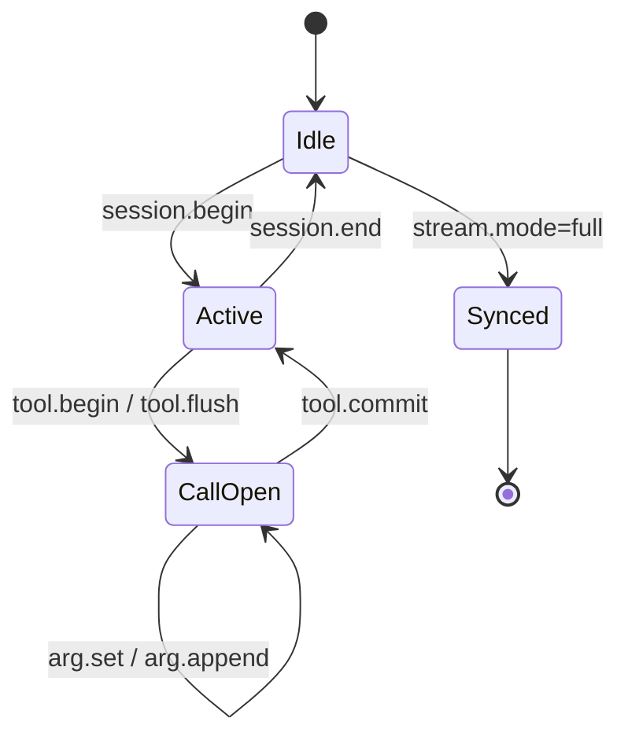

# Host Tool 流式 DSL 规范 v1

> **状态**：协议定稿；agent-server dispatch 与 omnix-chat SDK 消费**待实现**  
> **版本**：`v: 1`（`HOST_TOOL_STREAM_PROTOCOL_VERSION`）  
> **关联**：[host-page-context-host-action-frontend.md](./host-page-context-host-action-frontend.md)、[host-action-sdk-migration-frontend.md](./host-action-sdk-migration-frontend.md)、[chat-sse-message-blocks-frontend.md](./chat-sse-message-blocks-frontend.md)、[host-tool-client-register-frontend.md](./host-tool-client-register-frontend.md)  
> **类型**：`src/core/host-bridge/host-tool-stream.types.ts`

---

## 1. 背景与目标

### 1.1 现状（v0）

`host_action` 一次性推送完整 `hostTools[]`：

```json
{
  "action": "host_action",
  "hostTools": [{ "name": "fillReplyDraft", "args": { "text": "整段正文…" } }],
  "reason": "plan_host_tool"
}
```

适合 `refreshEntity` 等瞬时操作，**不适合**长文本渐进填入、多步 UI 编排、与模型输出同步的页面副作用。

### 1.2 目标（v1）

| 目标 | 说明 |
|------|------|
| 渐进式 UI | 长字符串参数通过 `arg.append` 流式追加 |
| 多 tool 有序 | `tool.begin` → … → `tool.commit` 按 `index` 编排 |
| 向后兼容 | 无 `stream` 字段 = v0；有流时末尾必发 `stream.mode=full` 快照 |
| 与 Chat 分离 | 页面副作用走 `host_action`，不走 `message` blocks |
| 可配置 | `HostTool.streamConfig` 声明可流式路径，引擎不硬编码字段名 |

### 1.3 非目标（v1 不做）

- Host Tool 执行结果回传服务端
- 将 Host Tool 渲染进 Chat 气泡
- 替代 `message` 流式正文

---

## 2. 传输层

### 2.1 事件名

仍使用现有 SSE 事件 **`host_action`**（不新增 `host_tool_stream` 事件）。

```text
GET /chat/{sessionId}/stream
event: host_action
data: { ... }
```

也接受 `event: host-action`（与 v0 一致）。SDK 亦可在 `message` 事件内嵌相同 payload（兼容路径，**不推荐**新接入使用）。

### 2.2 一轮流式 session 的典型顺序

```text
stream.mode=begin    + dsl.session.begin
stream.mode=delta    + dsl.tool.begin | arg.set | arg.append | tool.flush
stream.mode=commit   + dsl.tool.commit        （每个需 commit 的 call）
stream.mode=end      + dsl.session.end
stream.mode=full     + hostTools[] 权威快照
```

**时序约束**

- 仍在 run **`complete` 之前**到达（与 v0 相同）
- 写确认 `confirmation_required` 挂起期间**不发**
- 入站无有效 `pageContext.page` 时**不发**（与 v0 相同）

### 2.3 `stream` 流控字段

与 `message` SSE 对齐：

| 字段 | 类型 | 说明 |
|------|------|------|
| `stream.mode` | `begin \| delta \| commit \| end \| full` | 帧语义 |
| `stream.seq` | `number` | 单轮 `streamId` 内单调递增，从 1 起 |

**`seq` 规则**

- 前端用 `seq` 去重：已处理过的 `seq` 忽略
- `stream.mode=full` 的 `seq` 为该轮最大值
- 以 **`full` 中 `hostTools` 为权威**；若与本地 DSL 累积不一致，用 `full` 覆盖

### 2.4 Payload 顶栏

所有帧 `action` 必须为 **`host_action`**。

可选版本字段：

```json
{ "v": 1, "action": "host_action", "stream": { "mode": "delta", "seq": 3 }, "dsl": { ... } }
```

未带 `v` 且含 `stream` 时，按 v1 解析。无 `stream` 时按 **v0 批量**解析。

---

## 3. DSL 操作（`dsl.op`）

### 3.1 总览

| `op` | `stream.mode` | 含义 |
|------|---------------|------|
| `session.begin` | `begin` | 开启一轮 host 流 |
| `session.end` | `end` | 结束一轮 host 流 |
| `tool.begin` | `delta` | 声明流式 tool（参数分帧到达） |
| `arg.set` | `delta` | 设置非流式参数（瞬时） |
| `arg.append` | `delta` | 流式追加字符串参数 |
| `tool.commit` | `commit` | 该 call 参数完整，可最终 apply |
| `tool.flush` | `delta` | 短参数 tool 一次性下发（跳过 begin/append/commit） |

### 3.2 `session.begin`

```json
{
  "v": 1,
  "action": "host_action",
  "stream": { "mode": "begin", "seq": 1 },
  "dsl": {
    "op": "session.begin",
    "streamId": "hs-42-7-ui_fill",
    "scope": "review-detail",
    "entity": { "type": "review", "id": "123" },
    "metadata": { "tab": "content" },
    "reason": "plan_host_tool",
    "planStepId": "ui_fill_draft",
    "runId": 42,
    "turnId": 7
  }
}
```

| 字段 | 必填 | 说明 |
|------|------|------|
| `streamId` | 是 | 全局唯一建议：`hs-{runId}-{turnId}-{planStepId\|reason}` |
| `scope` | 建议 | 与 `pageContext.page` 对齐 |
| `entity` / `metadata` | 否 | 镜像入站 pageContext |
| `reason` | 建议 | 见 §6 |
| `planStepId` | 否 | Plan `host_tool` 步 id |
| `runId` / `turnId` | 建议 | 对账 |

### 3.3 `tool.begin`

```json
{
  "dsl": {
    "op": "tool.begin",
    "streamId": "hs-42-7-ui_fill",
    "callId": "c0",
    "index": 0,
    "name": "fillReplyDraft"
  }
}
```

- 同一 `streamId` 内 `callId` 唯一
- `index` 从 0 递增，决定执行顺序

### 3.4 `arg.set`

用于非流式、或流式开始前一次性设置的参数：

```json
{
  "dsl": {
    "op": "arg.set",
    "streamId": "hs-42-7-ui_fill",
    "callId": "c0",
    "path": "entityId",
    "value": "123"
  }
}
```

`path`：JSON Pointer 风格点路径（不含前导 `/`），如 `text`、`payload.body`。

### 3.5 `arg.append`

**仅 `chunk` 为 string**。用于长文本渐进 UI：

```json
{
  "dsl": {
    "op": "arg.append",
    "streamId": "hs-42-7-ui_fill",
    "callId": "c0",
    "path": "text",
    "chunk": "感谢您的反馈"
  }
}
```

**默认语义（规范强制推荐）**：`arg.append` **不调用** registry handler，只更新 SDK 内 args 累积器与 UI preview。见 §5。

### 3.6 `tool.commit`

```json
{
  "stream": { "mode": "commit", "seq": 8 },
  "dsl": {
    "op": "tool.commit",
    "streamId": "hs-42-7-ui_fill",
    "callId": "c0"
  }
}
```

表示该 `callId` 参数流结束。SDK 应：

1. 用累积器组装最终 `args`
2. 若 `invokeOnAppend` 为 false（默认），在 **commit** 时首次调用 `runHostTool`

### 3.7 `tool.flush`

瞬时 tool，单帧完成：

```json
{
  "dsl": {
    "op": "tool.flush",
    "streamId": "hs-42-7-completion",
    "callId": "c0",
    "name": "refreshEntity",
    "args": { "entityType": "review", "entityId": "123" }
  }
}
```

收到后 SDK **立即** `runHostTool`（仍受 `scope` / `entity` 门闩约束）。无需 `tool.commit`。

### 3.8 `session.end`

```json
{
  "stream": { "mode": "end", "seq": 12 },
  "dsl": { "op": "session.end", "streamId": "hs-42-7-ui_fill" }
}
```

### 3.9 `stream.mode=full`（权威快照）

```json
{
  "v": 1,
  "action": "host_action",
  "stream": { "mode": "full", "seq": 13 },
  "scope": "review-detail",
  "entity": { "type": "review", "id": "123" },
  "hostTools": [
    { "name": "fillReplyDraft", "args": { "text": "感谢您的反馈，我们已记录。" } }
  ],
  "reason": "plan_host_tool",
  "planStepId": "ui_fill_draft",
  "runId": 42,
  "turnId": 7
}
```

- **`hostTools` 必填**（与 v0 一致）
- 必须与 DSL 累积结果**字节级一致**（同名字段同值）
- **v0 兼容**：老 SDK 仅处理此帧（或仅处理无 `stream` 的批量帧）

---

## 4. 完整示例

### 4.1 流式 `fillReplyDraft`（Plan mid-run）

```text
seq=1  begin   session.begin
seq=2  delta   tool.begin     name=fillReplyDraft callId=c0
seq=3  delta   arg.append     path=text chunk="您好，"
seq=4  delta   arg.append     path=text chunk="感谢反馈。"
seq=5  commit  tool.commit    callId=c0
seq=6  end     session.end
seq=7  full    hostTools=[{ name: fillReplyDraft, args: { text: "您好，感谢反馈。" } }]
```

### 4.2 瞬时 `refreshEntity`（mutation 完成）

```text
seq=1  begin   session.begin   reason=agent_mutation_success
seq=2  delta   tool.flush      name=refreshEntity
seq=3  end     session.end
seq=4  full    hostTools=[...]
```

### 4.3 多 tool 有序

```text
tool.begin  index=0  fillReplyDraft  → append… → commit
tool.begin  index=1  highlightRow    → arg.set → commit
tool.flush  index=2  scrollToEntity  （或 begin + set + commit）
full
```

---

## 5. 前端 SDK 行为规范

### 5.1 状态机



### 5.2 累积器

每个 `callId` 维护：

```ts
type CallAccumulator = {
  name: string;
  index: number;
  args: Record<string, unknown>;
};
```

- `arg.set`：按 `path` 写入（点路径展开为嵌套对象）
- `arg.append`：对 `path` 指向的 string 做拼接；路径不存在则视为 `""`
- `tool.flush`：直接得到完整 `args`，不经过累积器

### 5.3 Handler 调用时机

| 配置 | `arg.append` | `tool.commit` | `tool.flush` | `full` |
|------|--------------|---------------|--------------|--------|
| `invokeOnAppend: false`（**默认**） | 只更新 UI | `runHostTool` | `runHostTool` | 对齐 / 兜底执行 |
| `invokeOnAppend: true` | `runHostTool` | 对齐 | `runHostTool` | 对齐 |

**推荐**：`fillReplyDraft` 用 `invokeOnAppend: false`，在 append 阶段只 `setDraftPreview(accumulated)`，commit/full 时 `setDraft(final)`。

### 5.4 门闩（与 v0 相同）

处理任意帧前：

1. `action === 'host_action'`
2. `scope` 与当前页 `pageContext.page` 一致（若双方都有）
3. `entity.id` 与当前实例一致（若双方都有）
4. `hostTools` 非空**仅对 full 帧强制**；delta 帧可无 `hostTools`

### 5.5 v0 兼容路径

```ts
function onHostAction(payload: HostActionSsePayload) {
  if (!('stream' in payload) || !payload.stream) {
    // v0：直接执行 hostTools
    dispatchBatch(payload);
    return;
  }
  if (payload.stream.mode === 'full') {
    dispatchBatch(payload); // 权威对齐
    return;
  }
  // v1：交给流式状态机
  hostToolStreamReducer(payload);
}
```

---

## 6. `reason` 取值

与 v0 一致，扩展语义：

| `reason` | 触发 | 典型 DSL 形态 |
|----------|------|----------------|
| `plan_host_tool` | Plan `host_tool` 步 Decision LLM | `tool.begin` + `arg.append` + `commit` |
| `agent_mutation_success` | HTTP mutation SUCCESS | 多为 `tool.flush` |
| `host_tool_dispatch` | 默认 / Skill `hostBridge.reason` | 视工具而定 |
| 自定义 | Skill 配置 | 前端可分支，不阻断执行 |

---

## 7. Host Tool 元数据：`streamConfig`

B 端 `HostTool` / C 端 `register` 可选字段（存入 `argsSchema` 旁或 tool 扩展 JSON）：

```ts
type HostToolStreamConfig = {
  enabled?: boolean;           // 默认 false
  policy?: 'instant' | 'stream' | 'auto';
  streamablePaths?: string[];  // 如 ['text', 'content']
  autoStreamMinChars?: number; // policy=auto，默认 48
  chunkSize?: number;          // 伪流式切块，默认 16
  invokeOnAppend?: boolean;    // 默认 false
};
```

| 工具示例 | 建议 |
|----------|------|
| `fillReplyDraft` | `enabled: true`, `policy: 'stream'`, `streamablePaths: ['text']` |
| `refreshEntity` | `policy: 'instant'` → 服务端发 `tool.flush` |
| `highlightRow` | `policy: 'instant'` |

服务端**不得**硬编码 `text` / `content` 等字段名；以 `streamConfig` 为准。

---

## 8. 服务端内容来源（实现分期）

协议与内容来源解耦。实现顺序建议：

| 阶段 | 来源 | 说明 |
|------|------|------|
| **S1** | 伪流式切块 | LLM 已产出完整 args，服务端按 `chunkSize` 发 `arg.append`（**非首选**） |
| **S2** | Summarize 共流 | 草稿与 `message` delta 同源（评论回复主路径；**当前实现目标**） |
| **S3** | LLM tool call 增量 | Decision 流式解析 partial JSON → `arg.append` |
| **降级** | 仅 `full` | 流式失败或未启用 `streamConfig` 时与 v0 相同 |

**S2 后端规范**（触发条件、时序、observation 去重、模块拆分）：[host-tool-stream-costream-backend.md](./host-tool-stream-costream-backend.md)

无论哪一阶段，**每轮必须发 `stream.mode=full`**（启用流式时）。

---

## 9. SSE 重放与缓冲

`host_action` 可进入连接重放缓冲（见 [chat-sse-message-blocks-frontend.md](./chat-sse-message-blocks-frontend.md)）。

**v1 约定（实现时必须遵守）**：

| 帧类型 | 是否进入重放缓冲 |
|--------|------------------|
| `stream.mode=delta` | **否**（仅 live 消费） |
| `begin` / `commit` / `end` | 可选；建议 **否** |
| `stream.mode=full` | **是** |
| v0 无 `stream` 批量帧 | **是**（与现网一致） |

晚连接重放：至少保证 **`full` 或 v0 批量**可恢复最终 UI；流式动画可丢失，不影响正确性。

---

## 10. 错误与降级

| 情况 | 行为 |
|------|------|
| 收到 `full` 与累积器不一致 | **以 `full` 为准**，覆盖本地状态 |
| `session.end` 后仍收 delta | 忽略并 log warn |
| 缺少 `session.begin` 收到 delta | 忽略或隐式 begin（SDK 可配置，**推荐忽略**） |
| DSL 解析失败 | 等待 `full`；超时后若收到 `full` 仍执行 |
| 服务端流式失败 | 只发 v0 批量帧（无 `stream`） |

---

## 11. TypeScript 类型（ normative ）

见 `src/core/host-bridge/host-tool-stream.types.ts`：

- `HostToolDslOp`
- `HostActionStreamPayload` / `HostActionBatchPayload`
- `HostActionSsePayload`（联合类型）
- `HostToolStreamConfig`
- `isHostActionStreamPayload()` / `isHostActionBatchPayload()`

当前 `host-action.types.ts` 仍为 v0 批量类型；实现落地时合并为 `host-tool-stream.types.ts` 导出。

---

## 12. 实现检查清单

### agent-server

- [ ] S2：`streamSummarizeMessageBlocks` 共流（见 [host-tool-stream-costream-backend.md](./host-tool-stream-costream-backend.md)）
- [ ] `dispatchHostActionStream()` / `HostToolStreamSession`：按 DSL 发帧 + 末尾 `full`
- [ ] 读取 `HostTool.streamConfig`（Phase 2；S2 先用 argsSchema 推断 path）
- [ ] env：`HOST_TOOL_STREAM=1` 总开关
- [ ] 重放：仅 `full` 入 buffer
- [ ] Plan `host_tool` llm 去重；mutation completion 仍 v0

### omnix-chat SDK

- [ ] `HostToolStreamReducer` / `useHostToolStream` — **参考实现**：[host-tool-stream-sdk-frontend.md](./host-tool-stream-sdk-frontend.md)
- [ ] v0 兼容分支
- [ ] `register` 支持 `streamConfig`
- [ ] 文档与 Storybook 示例

### 业务宿主

- [ ] `fillReplyDraft` handler 区分 preview / final
- [ ] 多 Tab `entity.id` 校验

---

## 13. 相关文档

| 文档 | 内容 |
|------|------|
| [host-page-context-host-action-frontend.md](./host-page-context-host-action-frontend.md) | pageContext + v0 host_action |
| [host-action-sdk-migration-frontend.md](./host-action-sdk-migration-frontend.md) | 去掉 `status` 迁移 |
| [host-tool-client-register-frontend.md](./host-tool-client-register-frontend.md) | C 端注册 |
| [chat-sse-message-blocks-frontend.md](./chat-sse-message-blocks-frontend.md) | SSE 全事件 |

---

## 14. 变更记录

| 版本 | 日期 | 说明 |
|------|------|------|
| v1 | 2026-06 | 初版：DSL ops、`stream.mode`、权威 `full`、streamConfig |
