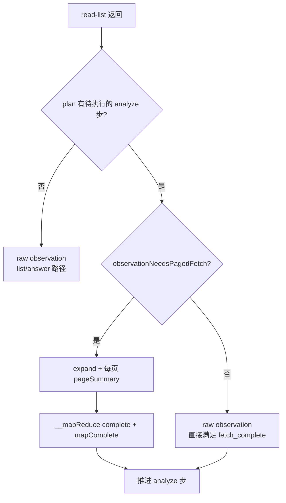

# 分页 Gather 与 `__mapReduce`

Plan 含 **analyze** 步且列表 observation **仍需分页**时，引擎在 gather 阶段自动拉取剩余页、生成页内摘要并合并为 `__mapReduce`，再推进 analyze。数据一页即可分析时保留 raw observation，直接推进 Plan。

## 架构一览

```text
llm → tools (HTTP + expandPagedListGather) → resultCheck → summarize
         ↑                                        │
         └──────── resumeIncompletePagedGather ───┘
              （phase=resumable 时）
```

| 模块 | 职责 |
|------|------|
| `plan-paged-gather.util` | Plan 驱动：是否 expand / 续拉 / 页摘要 objective |
| `@mcp-utils/pagination` | 解析 `page/size/total/hasMore`，构建下一页参数 |
| `paged-list-gather.util` | expand / resume 循环、观测合并、续拉路由判定 |
| `list-map-reduce.util` | `__mapReduce` 状态、生命周期 phase |
| `list-page-summary.util` | 每页 LLM 结构化摘要 |
| `task-plan.util` | `observation_fetch_complete` 与 phase 对齐 |
| `tool-result-check.util` | pre/post_tools 路由到 `paged_gather_resume` |

## Plan 驱动判定



| API | 含义 |
|-----|------|
| `planHasPendingAnalyzeStep` | pending 队列中仍有 `phase=analyze` 步 |
| `shouldExpandPlanPagedGather` | analyze 在前 + gather read-list + `hasMore` |
| `planAwaitingPagedGatherCompletion` | gather 步应优先完成分页/摘要，搁置新 tool_calls |

**不再使用** skill `fetchPolicy` 或 `deliverable=analysis` 静态绑定；是否分页完全由 Plan 结构 + 列表 meta 运行时决定。

## 续拉路由

**唯一判定入口**：`shouldResumePagedGather()` → `findIncompletePagedGatherTarget()`。

| 条件 | 行为 |
|------|------|
| `pendingToolCalls` 非空 + 可续拉 + gather 步待完成 | `paged_gather_resume`，搁置新 calls |
| `pendingToolCalls` 为空 + 可续拉 | `resumeIncompletePagedGather` |
| 图边 `shouldRouteGraphToTools` | `pendingToolCalls.length > 0` OR `shouldResumePagedGather` |

## `__mapReduce` 生命周期

**单一判定 API**：`resolveMapReduceGatherPhase(output)`

| Phase | 含义 | `observation_fetch_complete` | 引擎动作 |
|-------|------|------------------------------|----------|
| `none` | 无 `__mapReduce`（单页 analyze 等） | `!observationNeedsPagedFetch` 即满足 | raw 列表 |
| `complete` | 分页与页摘要均完成 | ✅ | 进入 analyze |
| `partial` | 触顶 / 预算 / stall | ✅（partial 分析） | 停止 HTTP |
| `resumable` | 未拉完或可重试摘要 | ❌ | expand 或 resume |

### observation 形状（analyze Reduce 输入）

```json
{
  "__mapReduce": {
    "complete": true,
    "mapComplete": true,
    "fetchedCount": 181,
    "total": 181,
    "pageCount": 2,
    "pageSummaries": [{ "page": 1, "rowCount": 100, "summary": { "keyFindings": [] } }]
  },
  "pageSummaries": [],
  "data": [],
  "matchedCount": 181
}
```

Summarize / analyze 步读 `pageSummaries` 与 `pageFindings`（decision 侧精简 payload）。

## 环境变量

| 变量 | 默认 | 说明 |
|------|------|------|
| `TOOL_LIST_MAX_ROWS` | 1000 | 单次 gather 最多行数 |
| `TOOL_LIST_MAX_PAGES` | 10 | 页数下限（与 maxRows 取较大值） |
| `TOOL_LIST_MAX_HTTP_PER_TURN` | 60 | 本 turn 分页 HTTP 上限 |
| `TOOL_LIST_MAP_LLM_MAX_CONCURRENT` | 3 | 页摘要 LLM 并发 |

## 相关源码

- `src/core/agent-engine/engine/gather/plan-paged-gather.util.ts`
- `src/core/agent-engine/engine/gather/paged-list-gather.util.ts`
- `src/core/mcp-utils/pagination/`
