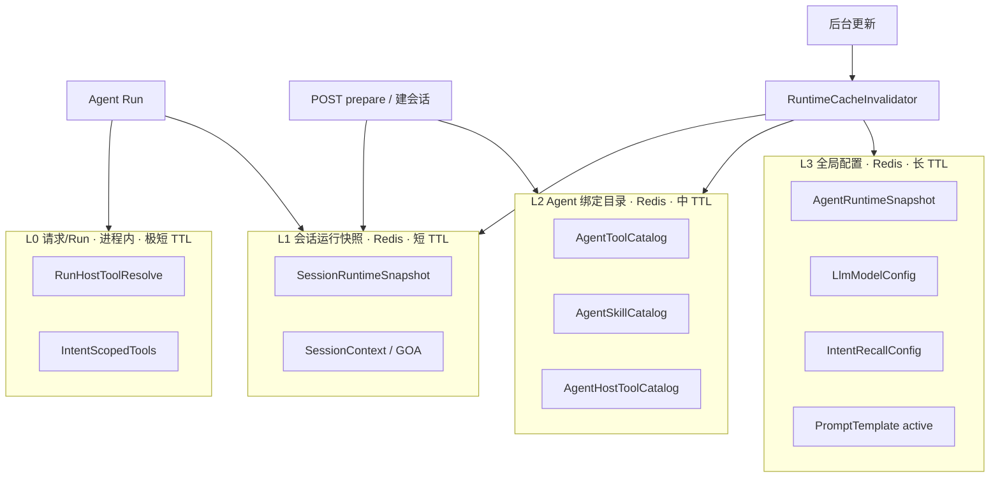
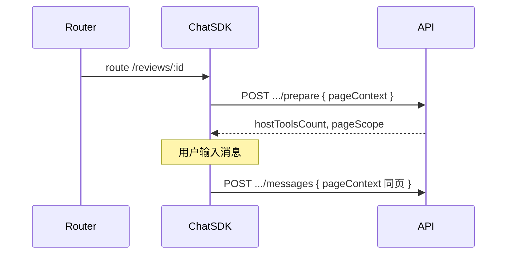

# 运行时缓存统一方案

> 目标：收敛当前分散的 Redis / 进程内缓存，明确分层、Key、失效与预热边界；在**不牺牲配置即时性**的前提下加速 Agent Run 冷启动与 Plan 阶段。
>
> 状态：**Phase 1–4 已落地**（含 L2 Tool/Skill/HostTool catalog + 观测日志）。

### 已确认决策

| 项 | 结论 |
|----|------|
| **HostTool 预热** | 前端传**用户当前路由页面**（`pageContext`）；仅预热与该 `page`（`HostPage.scope`）相关的 host_tool |
| **预热来源** | **不以** GOA `lastPageContext` 自动推断；page 由 prepare 请求显式传入 |
| **路由切换** | 前端路由变化时**再次调用** `POST /chat/:sessionId/prepare`，带新 `pageContext` |
| **L2 HostTool catalog** | Phase 3 **不按 Role** 分叉（与现运行时一致）；`RoleHostTool` 后续单列 |
| **实施顺序** | Phase 1（revision + 失效）可单独合 PR，再 Phase 2–3 |

---

## 1. 为什么要统一

### 1.1 现状问题

| 问题 | 表现 |
|------|------|
| **职责重叠** | `SessionPrepareStore`（Redis）与 `AgentSessionScopeService`（进程内 Map）都缓存 HTTP Tool 列表，校验逻辑重复、只比 **tool id** |
| **失效入口分散** | `SessionToolPrepareCacheService`、`AgentService`、`ToolService` 各自调部分清理；`agent.update(toolIds)`、`integration.update`、`host-tool` 绑定变更**未全覆盖** |
| **HostTool 无预热** | 每次 `plan` / `skill frame` 都 `resolveLlmHostToolsForDecision` 打 DB（同 run 内可重复 2+ 次） |
| **命名与 TTL 不统一** | Agent 24h、Session prepare 5min、进程内 10min、Intent 10min、LLM config 1h……无统一分层说明 |
| **快照版本语义弱** | `toolIdsFingerprint` / `skillIdsFingerprint` 仅 id 集合，**内容变更**（path、integration、host_tool exposure）可能仍命中旧快照 |

### 1.2 设计原则

1. **单一权威快照**：会话级「可运行上下文」尽量合并为一个 `SessionRuntimeSnapshot`（Redis），进程内只做 L0 请求级透传。
2. **写时失效、读时校验**：后台 CRUD 必须走统一 `RuntimeCacheInvalidator`；读路径用 **revision fingerprint** 做二次校验，避免漏失效。
3. **分层清晰**：配置类长 TTL + 显式 delete；运行态短 TTL + fingerprint；Run 内不重复查库。
4. **Redis 可选**：Redis 不可用则降级 DB，行为正确优先于命中率。

---

## 2. 缓存分层（L0–L3）



| 层级 | 存储 | 默认 TTL | 作用域 | 典型内容 |
|------|------|----------|--------|----------|
| **L3** | Redis | 1h–24h | App / Agent / 全局 | Agent `systemPrompt`、LLM 配置、Prompt 模板、Intent 召回配置 |
| **L2** | Redis | 10–30min | `appClientId + agentId`（+ user role） | Agent 可用 HTTP Tool 行、Skill 目录、**HostTool 绑定目录** |
| **L1** | Redis | 5–10min | `sessionId + userId + agentId` | 上述 L2 在**当前用户权限下**的交集快照 + **按 page 预热的 host_tool** + fingerprint |
| **L0** | 进程内 Map | 单次 Run / 10min | `runId` 或 `sessionId+message` | 同 run 内 HostTool 解析结果、Intent bind 收窄结果 |

**不属于「运行时预热」、保持独立：**

- `SessionGoaStore` / `SessionContextStore`：会话记忆与 GOA，DB 权威 + Redis 加速（已有 `updatedAt` 校验）。
- `PendingWriteConfirmationStore`：写确认 gate 状态，短生命周期。

---

## 3. 现状盘点 → 收敛映射

| 现有实现 | 层级 | 收敛后归属 | 备注 |
|----------|------|------------|------|
| `AgentCacheStore` | L3 | **保留**，纳入 Invalidator | `runtime:agent:{appClientId}:{agentId}` |
| `SessionPrepareStore` | L1 | **升级为** `SessionRuntimeStore` | 扩展 snapshot，见 §5 |
| `AgentSessionScopeService` 内 `sessionAllowedToolsCache` | L1 重复 | **删除**，只读 L1 Redis；可选 L0 单请求透传 | 消除双写 |
| `AgentSessionScopeService` 内 `sessionIntentScopedToolsCache` | L0 | **保留**，迁到 `RunScopeCache` | key 含 tool revision |
| `AgentSessionScopeService` 内 `toolCategoryRowsCache` | L2 | 合并到 **App 级 ToolCategory 缓存** 或 L0 | 与 `IntentScopeService.toolCategoryRowsCache` **重复** |
| `IntentScopeService.toolCategoryRowsCache` | L2 | 同上，只保留一处 | |
| `SessionPrepareService.warm` | 预热入口 | **扩展**为 `SessionRuntimePrepareService` | 一并预热 host_tool |
| `SessionToolPrepareCacheService` | 失效 | **升级为** `RuntimeCacheInvalidator` | 统一所有失效 |
| `HostToolService.resolveLlmHostToolsForDecision` | 无缓存 | **L2 目录 + L0 run 缓存** | 本次新增重点 |
| `SkillService` 各类 list | 无缓存 | L2 `AgentSkillCatalog` | 按 agent+role 缓存目录 |
| `getAllowedTools` 每次 DB | 无缓存 | L2 + L1 交集 | warm 时就算好写入 L1 |
| `PromptTemplateStore` | L3 | 保留 | |
| `LlmModelConfigCacheStore` | L3 | 保留 | |
| `IntentRecallConfigCacheStore` | L3 | 保留 | |

---

## 4. Redis Key 规范（统一前缀）

现有前缀：`REDIS_KEY_PREFIX`（见 `memory.constants`）。建议新增子命名空间：

```
{prefix}runtime:agent:{appClientId}:{agentId}          # L3 Agent 配置（已有）
{prefix}runtime:agent-tools:{appClientId}:{agentId}     # L2 HTTP Tool 目录（含 revision）
{prefix}runtime:agent-skills:{appClientId}:{agentId}:{roleId}  # L2 Skill 目录
{prefix}runtime:agent-host-tools:{appClientId}:{agentId}       # L2 HostTool 绑定目录（新增）
{prefix}runtime:session:{sessionId}                     # L1 会话快照（替代 prepare:session）
{prefix}config:llm:{kind}:active                        # L3（已有）
{prefix}config:intent-recall:1                          # L3（已有）
{prefix}context:session:{sessionId}                     # 会话上下文（已有）
{prefix}goa:session:{sessionId}                         # GOA（已有）
```

**迁移**：`prepare:session:{id}` → `runtime:session:{id}`，snapshot schema 升版；旧 key 可并行读一版后废弃。

---

## 5. 核心数据结构

### 5.1 Revision Fingerprint（一致性基础）

所有「目录类」缓存必须带 `revision`，读时与 DB 轻量校验对比（或相信写时失效）。

```ts
/** 单实体修订号：优先 updatedAt ISO，无则 id */
type EntityRevision = { id: number; updatedAt: string };

type RuntimeRevision = {
  /** 排序后拼接，如 "12:2025-01-01T00:00:00.000Z,34:..." */
  tools: string;
  skills: string;
  hostTools: string;
  agent: string; // agent.updatedAt
  integrations: string; // tool 关联的 integration updatedAt
};
```

**命中条件**：`snapshot.revision === computeRevisionFromDb()`，而非仅 id 集合相等。

### 5.2 L2 `AgentHostToolCatalog`（新增）

按 Agent 预热，**不按 page**（page 过滤在 L0/L1 使用时做）：

```ts
type AgentHostToolCatalogSnapshot = {
  appClientId: number;
  agentId: number;
  revision: string; // hostTool + agentHostTool + skillHostTool 相关 updatedAt
  agentBoundTools: Array<{
    hostToolId: number;
    definitionKey: string;
    name: string;
    description: string;
    exposure: HostToolExposure;
    hostPageScope: string | null; // null = 全页面
    argsSchema: Record<string, unknown>;
    argsTemplate: unknown;
    isActive: boolean;
    updatedAt: string;
  }>;
  skillBindings: Array<{
    skillId: number;
    hostToolId: number;
    trigger: HostToolSkillTrigger;
    isRequired: boolean;
    priority: number;
    argsTemplate: unknown;
    updatedAt: string;
  }>;
  warmedAt: string;
};
```

**Plan / LLM 解析时**：内存中执行现有 `resolvePreferredHostToolIds` + `pageScope` + `exposure` 过滤，**不再每次打 DB**。

### 5.3 L1 `SessionRuntimeSnapshot`（升级 SessionPrepareSnapshot）

```ts
type SessionRuntimeSnapshot = {
  schemaVersion: 2;
  sessionId: string;
  userId: number;
  appClientId: number;
  agentId: number;
  revision: RuntimeRevision;

  /** 用户权限 ∩ Agent 绑定后的 HTTP Tool 完整行（含 integration） */
  tools: SessionAllowedToolsRow[];
  /** 可运行 Skill 摘要 */
  skills: Array<{ id: number; name: string; updatedAt: string }>;
  /**
   * 按路由页面预热的 HostTool（LLM / Plan 用 exposure）。
   * key = pageContext.page（HostPage.scope）；value = 该页解析结果。
   * 每次 prepare 带 page 时 merge 对应条目；不带 page 时不写此项。
   */
  hostToolsByPage?: Record<
    string,
    {
      pageScope: string;
      routePath?: string;
      routeParams?: Record<string, unknown>;
      /** 外层 Plan 用：skillId=null */
      llmTools: HostToolDecisionDefinition[];
      warmedAt: string;
    }
  >;
  /** 最近一次 prepare 传入的 page，便于 run 时优先命中 */
  lastPreparedPage?: string;

  warmedAt: string;
};
```

---

## 6. 预热流程（含 Host Tool · 按路由页面）

### 6.1 触发点

| 触发 | 行为 |
|------|------|
| 前端**进入/切换**业务路由 | `POST /chat/:sessionId/prepare`，body 带当前 `pageContext` |
| `POST /chat` 建会话后 | `warmInBackground`（**可无 page**，仅预热 tool/skill；host_tool 等进页后再 prepare） |
| 用户发消息前 | 若当前页已 prepare 且 revision 未变，可跳过 |

**前端约定**：`pageContext.page` 与后台 `HostPage.scope` 对齐（如 `review-detail`）；可选带 `routePath` / `routeParams` 供后续模板，但**筛选 host_tool 以 `page` 为准**。

### 6.2 页面相关 HostTool 筛选规则（与现运行时一致）

从 L2 `AgentHostToolCatalog` 内存过滤，等价于现 `findScopedHostToolRows`：

1. `HostTool.isActive === true`
2. `exposure` ∈ `{ LLM, BOTH }`（Plan/LLM 预热；completion 类 `ON_COMPLETE` 不在 prepare 阶段预热）
3. `hostPage.scope === pageContext.page` **或** `hostPageId === null`（全页面通用 tool）
4. `hostToolId` ∈ `AgentHostTool` 白名单
5. 外层 Plan 预热时 `skillId = null` → 使用 Agent 白名单；若 Skill 已绑 host_tool 且仅有 Skill 绑定、无 Agent 绑定时，仍依赖 Agent 白名单（与现网一致）

**不按 GOA**：warm 不使用 `lastPageContext`；避免用户已离开页面仍预热旧页工具。

### 6.3 `SessionRuntimePrepareService.warm` 步骤

```
输入: sessionId, userId, appClientId, pageContext?: AgentChatPageContext

1. 读 session → agentId
2. 并行：
   a. getRuntimeAgent (L3)
   b. loadOrWarmAgentToolCatalog (L2)
   c. loadOrWarmAgentSkillCatalog (L2, roleId)
   d. loadOrWarmAgentHostToolCatalog (L2)
   e. promptComposer.warmSessionContext
3. 计算用户交集：
   tools = role ∩ agentTools
   skills = listRunnableAgentSkillsForUser
4. 若 pageContext.page 非空：
   pageScope = trim(pageContext.page)
   llmTools = resolveLlmToolsFromCatalog(L2, pageScope, skillId=null)
   合并写入 snapshot.hostToolsByPage[pageScope] = { llmTools, routePath, routeParams, warmedAt }
   snapshot.lastPreparedPage = pageScope
   否则：不更新 hostToolsByPage（保留该 session 已预热过的其他页条目）
5. revision = computeRevision(...)
6. 写入 L1 SessionRuntimeSnapshot
7. 返回 { toolsCount, skillsCount, hostToolsCount, pageScope, fromCache, warmedAt }
```

### 6.4 Run 启动时（`AgentEngineService.run`）

```
1. getRuntimeAgent (L3)
2. getSessionRuntimeTools(sessionId)
   → 读 L1；revision 不匹配则 refresh（tools/skills）；host_tool 段按 run 的 pageContext 取用
3. buildEngineToolsFromAllowed
4. Graph 内 loadScopedHostTools(page, skillId)：
   a. L1 hostToolsByPage[page] 命中且 revision 一致 → 直接用（skillId=null 用 llmTools；进 skill 后按 skillId 再滤 trigger）
   b. miss → L2 catalog 内存过滤（不打 DB）
   c. L0 run cache（runId+page+skillId）避免 plan / skill-frame 重复计算
```

**发消息时的 page**：以 `POST /chat` / `POST messages` body 的 `pageContext` 为准；若与 `lastPreparedPage` 不一致，run 仍正确（走 b），仅失去 L1 命中，可提示前端补一次 prepare。

---

## 7. 统一失效中心 `RuntimeCacheInvalidator`

单一入口，各模块 write 后调用（禁止散落 `sessionPrepareStore.delete`）。

| 事件 | 失效范围 |
|------|----------|
| `Agent` update/delete | L3 agent；L2 agent-tools/skills/host-tools；L1 该 agent 所有 session |
| `AgentTool` bind/unbind | L2 agent-tools；L1 该 agent 所有 session |
| `Tool` update/delete/isActive | L2 含该 tool 的 agent-tools；L1 含该 tool 的 session；L0 intent cache |
| `Integration` update | 查出关联 toolIds → 同上 |
| `Skill` update/delete | L2 agent-skills；L1 该 agent 所有 session |
| `SkillTool` / `SkillHostTool` replace | L2 skills + host-tools catalog；L1 |
| `HostTool` update/delete | L2 host-tools（按 appClientId/agent 绑定反查）；L1 |
| `AgentHostTool` bind/unbind | L2 host-tools；L1 |
| `RoleTool` / `RoleSkill` 变更 | L1 该 app 下相关用户 session（或按 role 标记 revision） |
| `HostPage` scope 变更 | L2 host-tools |

**实现要点**：

- 保留 `SCAN` 清理 L1（按 `agentId` / `toolId`），与现 `SessionPrepareStore` 相同。
- L2 用 **精确 key delete**（`agentId` 已知），无需 SCAN。
- 进程内 L0：`RunScopeCache.clearForAgent(agentId)` / `clearForSession(sessionId)`。

---

## 8. L0 Run 内缓存（减重复计算）

| Key | 内容 | 生命周期 |
|-----|------|----------|
| `run:{runId}:host-tools:{page}:{skillId}` | `HostToolDecisionDefinition[]` | run 结束清除 |
| `session:{sessionId}:intent:{categoryFp}:{msgFp}:{toolRevision}` | scoped tools bundle | 10min 或 revision 变 |

`plan.node` 与 `skill-frame.util` 当前各调一次 `loadScopedHostTools` → 合并为 **同一 L0 key**，第二次直接命中。

---

## 9. 与「正在执行的 Run」的边界

| 场景 | 策略 |
|------|------|
| 后台更新后**新消息** | 读 L1/L2 时 revision 校验失败 → 自动 refresh |
| **同一 Run 进行中** | 不刷新已注入的 `scopedTools` / plan frame（与现网一致） |
| 写确认续跑 | 继续用 pending 内 `scopedToolIds`；Agent L3 可重新 load |

---

## 10. 环境变量（统一收口）

| 变量 | 默认 | 说明 |
|------|------|------|
| `AGENT_RUNTIME_CACHE_TTL_SECONDS` | 86400 | L3 Agent |
| `RUNTIME_AGENT_CATALOG_TTL_SECONDS` | 600 | L2 tool/skill/host-tool 目录 |
| `SESSION_RUNTIME_CACHE_TTL_SECONDS` | 300 | L1 会话快照（替代 `SESSION_PREPARE_CACHE_TTL_SECONDS`） |
| `RUN_SCOPE_CACHE_TTL_MS` | 600000 | L0 进程内 |

---

## 11. 实施分期（建议）

### Phase 1 — 一致性修复（小改，可先做）

- [x] `tool.update` **任意字段**变更 → `invalidateForTools`
- [x] `integration.update` → 关联 tool invalidate
- [x] `agent.update` → `invalidateForAgent`（含 `toolIds` 与配置变更）
- [x] fingerprint 从 **id-only** 改为 **revision**（`SessionRuntimeSnapshot` v2）

### Phase 2 — 失效与结构统一

- [x] 新建 `RuntimeCacheInvalidator`，迁移各模块调用
- [x] 删除 `AgentSessionScopeService.sessionAllowedToolsCache` 双写
- [x] 合并两处 `toolCategoryRowsCache` 为 `ToolCategoryCacheService`

### Phase 3 — Host Tool 预热

- [x] `AgentHostToolCatalogStore`（L2 Redis）
- [x] `SessionPrepareService` 扩展 warm + `hostToolsByPage`
- [x] `HostToolService.resolveLlmHostToolsForDecision` 改为 catalog-first
- [x] L0 `RunScopeCache` 避免同 run 重复解析；run 结束 `clearRunScope`

### Phase 4 — Key 迁移与观测

- [x] Redis key `prepare:session` → `runtime:session`（双读单写兼容）
- [x] 日志字段：`cacheLayer` / `cacheHit` / `revisionMismatch`（`runtime-cache-observability.util.ts`）
- [ ] （可选）`GET /chat/:sessionId/prepare` 返回 `revision` 供前端调试
- [x] L2 `AgentToolCatalog` / `AgentSkillCatalog`

---

## 12. API 变更预览（Phase 3 后）

### 请求：`POST /chat/:sessionId/prepare`

与 `POST /chat` 共用 `pageContext` 字段（嵌套或平铺均可）：

```json
{
  "pageContext": {
    "page": "review-detail",
    "routePath": "/reviews/43689",
    "routeParams": { "reviewId": "43689" }
  }
}
```

- **有 `page`**：预热该页相关 host_tool，写入 `hostToolsByPage[page]`
- **无 `page`**：仅预热 HTTP tools + skills + session context；`hostToolsCount: 0`

### 响应

```json
{
  "sessionId": "...",
  "prepared": true,
  "agentReady": true,
  "toolsCount": 12,
  "skillsCount": 5,
  "hostToolsCount": 3,
  "pageScope": "review-detail",
  "fromCache": true,
  "revision": {
    "tools": "1:...,2:...",
    "hostTools": "10:...,11:..."
  },
  "warmedAt": "2026-06-22T12:00:00.000Z"
}
```

### 前端路由集成（建议）



路由变化 → 再次 `prepare`（带新 `pageContext`）；同一 session 可保留多 `page` 的 `hostToolsByPage` 条目直至 TTL。

**前端对接**：[host-tool-prepare-frontend.md](./host-tool-prepare-frontend.md)

---

## 13. 风险与取舍

| 取舍 | 说明 |
|------|------|
| L2 catalog 略大于按需查询 | 换 run 内多次 DB 查询；Agent 绑定 host_tool 数量通常 < 50 |
| revision 轻量校验 vs 强一致 | 写时失效为主；revision 为兜底，允许极少数漏失效在下次 prepare 修复 |
| Redis SCAN 清理 L1 | 绑定变更频率低可接受；后续可按 `agentId` 维护 session 索引 set |

---

## 14. 相关文件（现状）

| 文件 | 角色 |
|------|------|
| `core/runtime-cache/` | L0/L2 模块（Tool/Skill/HostTool catalog、Invalidator、观测） |
| `modules/chat/session-prepare.store.ts` | L1 Redis |
| `modules/chat/session-prepare.service.ts` | 预热入口 |
| `core/agent-engine/.../agent-session-scope.service.ts` | 读 L1 + L0 intent scope |
| `modules/agent/cache/agent-cache.store.ts` | L3 Agent |
| `modules/host-tool/host-tool.service.ts` | L2 catalog-first + 失效挂钩 |
| `modules/skill/skill.service.ts` | skill CRUD → `invalidateForSkillAgent` |

---

## 15. 开放问题（剩余）

1. ~~HostTool 预热是否按 page~~ → **已确认**：前端传当前路由 `pageContext`，只预热页面相关 host_tool；路由切换重新 prepare。
2. ~~L2 HostTool 是否按 Role~~ → **暂定不做**（Phase 3）；与现 `resolveLlmHostToolsForDecision` 一致。
3. ~~Phase 1 是否单独合 PR~~ → **已全部合入**；后续可选：Role CRUD 失效 hook、agent-scoped session 索引替代 SCAN。
