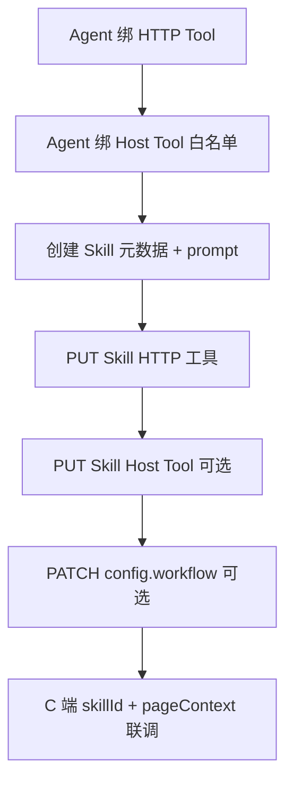

# Skill · B 端管理后台对接指南

> 适用：运营 / 配置后台（管理端 UI）  
> 数据模型：[skill-data-model.md](./skill-data-model.md)  
> Host Tool 绑定字段：[host-tool-agent-skill-api-frontend.md](./host-tool-agent-skill-api-frontend.md)  
> C 端发消息带 `skillId`：[agent-skill-client-api-frontend.md](./agent-skill-client-api-frontend.md)  
> 场景模板：[skill-templates/](./skill-templates/)

---

## 1. Skill 在系统里的位置

```text
AppClient
  └── Agent
        ├── AgentTool        → HTTP Tool 白名单（Skill 只能绑这里面的 Tool）
        ├── AgentHostTool    → Host Tool 白名单（Skill Host Tool 只能绑这里面的）
        └── Skill
              ├── SkillTool       → HTTP 工具子集 + isRequired
              ├── SkillHostTool   → 前端工具场景绑定（trigger / priority / isRequired）
              ├── prompt          → 命中后注入 <active_skill>
              └── config          → 可选：固定 Plan workflow、deliverable、hostBridge
```

**运行时两条路径：**

| 路径 | 何时发生 | B 端要配什么 |
|------|----------|--------------|
| **外层 Plan 选 `kind=skill`** | 用户未传 `skillId`，Plan LLM 从 `availableSkills` 里挑 | `description` / `capabilityKey` / 工具角色要区分场景 |
| **请求显式 `skillId`** | C 端发消息带 `skillId` | Skill 直接进入执行；**推荐**用于填框、固定流程 |

---

## 2. 鉴权与路径前缀

所有 B 端接口前缀：**`/admin`**（`Authorization: Bearer <adminJwt>`）。

下文路径均省略 `/admin` 前缀。

---

## 3. 推荐配置流程



1. 在 **Agent** 上绑定本业务需要的 HTTP Tool / Host Tool（白名单）。
2. **创建 Skill**（`name`、`prompt`、`description`、`capabilityKey`）。
3. **`PUT /skill/:id/tools`** 勾选 HTTP 工具子集。
4. 若涉及页面填框 / 刷新：**`PUT /admin/skill/:id/host-tools`**。
5. 需要固定步序（如「先文案再填框」）：**`PATCH /skill/:id`** 写入 `config.workflow`。
6. C 端联调：`skillId` + `pageContext.page`。

---

## 4. API 一览

### 4.1 Skill CRUD

| 方法 | 路径 | 说明 |
|------|------|------|
| POST | `/agent/:agentId/app-client/:appClientId/skills` | 创建（可带初始 `tools`） |
| GET | `/agent/:agentId/app-client/:appClientId/skills` | Agent 下分页列表 |
| GET | `/skill/by-app-client/:appClientId?agentId=` | App 维度列表 |
| GET | `/skill/:skillId` | **详情**（含 `skillTools`、`skillHostTools`、`config`、`prompt`） |
| PATCH | `/skill/:skillId` | 更新元数据 / `config`（**不含**工具绑定） |
| PUT | `/skill/:skillId/tools` | 全量替换 HTTP 工具绑定 |
| DELETE | `/skill/:skillId` | 删除（级联 SkillTool / SkillHostTool） |

### 4.2 Skill Host Tool（独立控制器，仍在 `/admin` 下）

| 方法 | 路径 | 说明 |
|------|------|------|
| GET | `/skill/:skillId/host-tools` | 查询绑定（与详情内 `skillHostTools` 一致） |
| PUT | `/skill/:skillId/host-tools` | 全量替换 |

### 4.3 列表 vs 详情载荷

| 字段 | 列表 | 详情 |
|------|------|------|
| `toolCount` | ✅ | ✅ |
| `hostToolCount` | ✅ | ✅ |
| `skillTools` | ✅ | ✅ |
| `skillHostTools` / `hostTools` | `[]` | 完整嵌套 |
| `prompt` / `config` | ✅ | ✅ |

列表页用 `toolCount`、`hostToolCount` 做角标；编辑页调 **`GET /skill/:skillId`**。

---

## 5. 创建 / 更新请求体

### 5.1 创建 `POST .../skills`

```json
{
  "name": "Campaign 文案填框",
  "capabilityKey": "campaign.fill-draft",
  "description": "根据当前 campaign 上下文生成营销文案，并通过 fillNoteDraft 填入页面输入框；不提交表单。",
  "riskLevel": "L1",
  "isActive": true,
  "prompt": "你是 campaign 文案助手…（见场景模板）",
  "config": {
    "deliverable": "answer",
    "workflow": { "steps": [] }
  },
  "tools": [
    { "toolId": 1, "isRequired": false }
  ]
}
```

| 字段 | 必填 | 说明 |
|------|------|------|
| `name` | 是 | 同一 Agent 内唯一 |
| `prompt` | 是 | 命中后注入 LLM；**意图与工具纪律写在前 1200 字内** |
| `description` | 否 | 外层 Plan 选型、向量召回；写清「适用 / 不适用」 |
| `capabilityKey` | 否 | 同一 Agent 内唯一；C 端 / Role 授权用 |
| `riskLevel` | 否 | `L1`/`L2`/`L3`；未传则按绑定 Tool 最高档推断 |
| `isActive` | 否 | 默认 `true` |
| `config` | 否 | 见 §7；`null` 表示走规则 / Plan LLM 推断 |
| `tools` | 否 | 创建时初始 HTTP 绑定；也可创建后 `PUT .../tools` |

### 5.2 更新 `PATCH /skill/:skillId`

可更新：`name`、`prompt`、`description`、`capabilityKey`、`config`、`isActive`、`riskLevel`。  
**工具绑定请用专用 PUT 接口**，不要混在 PATCH 里。

### 5.3 HTTP 工具 `PUT /skill/:skillId/tools`

```json
{
  "tools": [
    { "toolId": 8, "isRequired": true },
    { "toolId": 15, "isRequired": false }
  ]
}
```

| 规则 | 说明 |
|------|------|
| `toolId` | 必须已在该 Agent 的 `AgentTool` 中 |
| `isRequired` | Skill 激活 gate：缺必选工具则 Skill 不可运行 |
| 全量替换 | 传 `[]` 清空绑定 |

响应 `skillTools[].requiresWriteConfirmation`：由 Tool `riskLevel` + `agentMetadata` 推导。

### 5.4 Host Tool `PUT /admin/skill/:skillId/host-tools`

```json
{
  "tools": [
    {
      "hostToolId": 12,
      "trigger": "ON_PLAN_STEP",
      "priority": 0,
      "isRequired": true,
      "argsTemplate": null
    }
  ]
}
```

| 字段 | 说明 |
|------|------|
| `hostToolId` | 须已在 **AgentHostTool** 白名单 |
| `trigger` | 见 §6.2 |
| `priority` | 越小越优先 |
| `isRequired` | Plan `host_tool` 步未 dispatch 时不推进 plan |
| `argsTemplate` | 覆盖 `HostTool.argsTemplate`；可含 `$entity.*`、`$page` 等 |

传 `"tools": []`：**显式清空** Skill 级 Host Tool（该场景下不回退 Agent 白名单）。

---

## 6. 详情响应（编辑页回显）

```json
{
  "id": 8,
  "agentId": 1,
  "appClientId": 1,
  "appClientName": "PMS",
  "agentName": "评论客服小助手",
  "name": "Campaign 文案填框",
  "capabilityKey": "campaign.fill-draft",
  "description": "…",
  "prompt": "…",
  "riskLevel": "L1",
  "requiresWriteConfirmation": false,
  "config": { "deliverable": "answer", "workflow": { "steps": [] } },
  "isActive": true,
  "toolCount": 0,
  "hostToolCount": 1,
  "roleSkillCount": 0,
  "skillTools": [],
  "skillHostTools": [
    {
      "id": 2,
      "skillId": 8,
      "hostToolId": 12,
      "trigger": "ON_PLAN_STEP",
      "priority": 0,
      "isRequired": true,
      "skillArgsTemplate": null,
      "hostTool": {
        "id": 12,
        "name": "fillNoteDraft",
        "exposure": "LLM",
        "pageScope": "campaign-detail",
        "argsSchema": { "type": "object", "properties": { "text": { "type": "string" } } },
        "isActive": true
      }
    }
  ],
  "hostTools": [{ "id": 12, "name": "fillNoteDraft" }]
}
```

### 6.1 `requiresWriteConfirmation`

Skill 级：`riskLevel` 为 `L2`/`L3` 时为 `true`（与 Tool 写确认规则一致）。

### 6.2 Host Tool `trigger`

| 值 | 使用场景 |
|----|----------|
| `ON_PLAN_STEP` | Plan 内 `kind=host_tool` 步（填框、打开面板等） |
| `LLM_SCOPED` | 同上，与 `ON_PLAN_STEP` 一并参与 Plan LLM 解析 |
| `ON_MUTATION_SUCCESS` | HTTP 写 mutation **成功后** SSE `agent_mutation_success` |

Plan 填框类 Skill **必须**配 `ON_PLAN_STEP` 或 `LLM_SCOPED`，不要只配 `ON_MUTATION_SUCCESS`。

---

## 7. `config` JSON 规范

存储在 `Skill.config`，通过 `PATCH /skill/:skillId` 写入。

### 7.1 顶层字段

```typescript
type SkillConfig = {
  /** 交付类型；与 workflow 一起决定内置模板 */
  deliverable?: 'analysis' | 'list' | 'detail' | 'mutation' | 'answer';
  /** mutation 成功后 host_action 的 reason（可选，Skill hostBridge） */
  hostBridge?: { reason?: string };
  /** 显式 Plan 步序；存在且合法时优先于规则推断 */
  workflow?: {
    deliverable?: TaskDeliverable; // 可与顶层 deliverable 二选一
    steps: WorkflowStep[];
  };
};
```

**优先级：** `config.workflow`（合法）> 规则模板（按 gated 工具 role 推断）> Plan LLM。

### 7.2 `workflow.steps[]` 单步结构

```typescript
type WorkflowStep = {
  id: string;           // 唯一，如 "generate_content"
  phase: 'gather' | 'analyze' | 'answer' | 'mutate';
  kind: 'tool' | 'host_tool' | 'summarize' | 'reason';
  toolRole?: string;    // kind=tool 时必填，须 ∈ Skill gated 工具的 decisionRole
  hostToolNames?: string[]; // kind=host_tool 时可选，须 ∈ Agent+Skill Host Tool 名
  objective: string;    // 英文短句，写入 current_objective
  stopWhen?: 'observation_non_empty' | 'observation_fetch_complete' | 'observation_has_fields' | 'always';
};
```

| `kind` | B 端 UI 说明 |
|--------|----------------|
| `tool` | HTTP 工具步；选 `toolRole`（下拉来自已绑 Tool 的 role） |
| `host_tool` | 浏览器 Host Tool；选 `hostToolNames`（来自 Skill Host Tool 列表） |
| `summarize` | 生成面向用户的文本，不调 HTTP |
| `reason` | 预留；行为类似 summarize |

外层 Plan 的 `kind=skill` **不要**写在 `workflow.steps` 里（那是外层编排）；Skill 内层 workflow 不含 `skill` kind。

### 7.3 无 `config` 时的自动推断（简表）

| Skill 绑定的 Tool 角色 | 常见 deliverable | 典型步序 |
|------------------------|------------------|----------|
| 仅 `read-list` | `analysis` / `list` | gather read-list → summarize |
| `read-detail` + write | `mutation` | read → compose/write 模板 → summarize |
| 无 HTTP 或仅元数据 | `answer` | 单步 summarize |

**仅有 Host Tool、无 HTTP 填框场景** 不会自动推断 `host_tool` 步 → 请用 §7.4 显式 workflow。

### 7.4 示例：Campaign 文案 + 填输入框（无提交）

完整模板：[skill-templates/campaign-fill-draft-skill.example.md](./skill-templates/campaign-fill-draft-skill.example.md)

```json
{
  "deliverable": "answer",
  "workflow": {
    "steps": [
      {
        "id": "generate_content",
        "phase": "answer",
        "kind": "summarize",
        "objective": "Generate campaign marketing copy from page context. Output text only; do NOT claim the UI input was updated.",
        "stopWhen": "always"
      },
      {
        "id": "fill_input",
        "phase": "answer",
        "kind": "host_tool",
        "hostToolNames": ["fillNoteDraft"],
        "objective": "Call fillNoteDraft with the generated copy as text. Fill the page input; do not submit the form.",
        "stopWhen": "always"
      }
    ]
  }
}
```

配套 Host Tool 绑定：

```json
{
  "tools": [
    {
      "hostToolId": 12,
      "trigger": "ON_PLAN_STEP",
      "priority": 0,
      "isRequired": true
    }
  ]
}
```

---

## 8. B 端 UI 信息架构建议

```text
Agent
  └── Skill 列表（toolCount / hostToolCount 角标）
        └── Skill 详情 / 编辑
              ├── 基础信息（name / capabilityKey / description / riskLevel / isActive）
              ├── Prompt 编辑器（大文本；提示前 1200 字重要性）
              ├── HTTP 工具 Tab
              │     ├── 可选列表：Agent 已绑 Tool（多选）
              │     └── isRequired 勾选
              ├── 前端工具 Tab
              │     ├── 可选列表：Agent 已绑 Host Tool
              │     ├── trigger 下拉（按场景给默认值）
              │     ├── priority / isRequired
              │     └── argsTemplate JSON 编辑器（高级）
              ├── Plan 工作流 Tab（高级，映射 config.workflow）
              │     ├── deliverable 下拉
              │     └── 步骤列表：拖拽排序；按 kind 显示 toolRole / hostToolNames
              └── Config JSON（高级用户 raw 编辑，与 Tab 二选一）
```

**校验（保存前）：**

- HTTP `toolId` / `hostToolId` 不在 Agent 白名单 → 禁止保存
- `workflow` 中 `toolRole` 不在当前 Skill 已绑 Tool 的 role 集合 → 提示
- `hostToolNames` 不在 Skill `skillHostTools` 对应名 → 提示
- `kind=host_tool` 但 Host Tool `exposure` 不是 `LLM`/`BOTH` → 警告

---

## 9. TypeScript 类型（前端）

```typescript
type SkillToolBinding = {
  id: number;
  toolId: number;
  isRequired: boolean;
  requiresWriteConfirmation: boolean;
  tool: { id: number; name: string; riskLevel: string; /* … */ };
};

type SkillHostToolBinding = {
  id: number;
  skillId: number;
  hostToolId: number;
  trigger: 'ON_MUTATION_SUCCESS' | 'LLM_SCOPED' | 'ON_PLAN_STEP';
  priority: number;
  isRequired: boolean;
  skillArgsTemplate: Record<string, unknown> | null;
  hostTool: {
    id: number;
    name: string;
    exposure: string;
    pageScope: string | null;
    argsSchema: unknown;
    isActive: boolean;
  };
};

type SkillDetail = {
  id: number;
  agentId: number;
  appClientId: number;
  appClientName: string;
  agentName: string;
  name: string;
  capabilityKey: string | null;
  description: string | null;
  prompt: string;
  riskLevel: 'L1' | 'L2' | 'L3';
  requiresWriteConfirmation: boolean;
  config: SkillConfig | null;
  isActive: boolean;
  toolCount: number;
  hostToolCount: number;
  skillTools: SkillToolBinding[];
  skillHostTools: SkillHostToolBinding[];
  hostTools: SkillHostToolBinding['hostTool'][];
};

type SkillListItem = Omit<SkillDetail, 'skillHostTools' | 'hostTools'> & {
  skillHostTools: [];
  hostTools: [];
};
```

---

## 10. 与 C 端 / 运行时的衔接

**统一 Skill 解析层**（`core/skill/skill-runnable.util.ts` + `core/skill/skill.service.ts` + `outer-plan-skill-resolve.util.ts`）：

| 方法 / 函数 | 用途 |
|------|------|
| `skillIsRunnableForUser` | C 端列表 / 发消息：HTTP 权限交集，或纯 Host Skill |
| `skillIsResolvableInScope` | Plan 候选：intent HTTP ∩ skill 绑定 **且/或** 当前页 host ∩ skill 绑定 |
| `skillMatchesPageHostTools` | 判断 Skill 是否覆盖当前页 scoped host |
| `resolveAutoOuterPlanSkill` | 页 host 与 Skill **唯一**对应时外层直选 `kind=skill` |
| `resolveOuterSkillPlanDeliverable` | 外层 skill 壳 deliverable：workflow 优先，不因 intent write 强行 mutation |
| `skillIsResolvableForRequested` | 用户显式 `skillId`：角色可见 + 有 HTTP 或 SkillHostTool 绑定 |
| `listRunnableAgentSkillsForUser` | 会话预热（与 `skills/client` 一致） |
| `listResolvableSkillsForScopedTools` | Plan 候选（HTTP / 纯 Host / host-bound both 三路查询合并） |
| `resolveSkillsForOuterPlan` | 外层 Plan 候选 + `requestedSkillId` 显式兜底 |
| `getRunnableSkillDetailById` | Skill 帧展开 |

| B 端配置 | C 端 / 运行时要求 |
|----------|-------------------|
| `isActive: true` | Skill 出现在可选列表 |
| **`PUT /skill/:id/host-tools` 必配** | C 端列表 / Plan **不认**「仅 Agent 白名单、Skill 未绑」；运行时无 SkillHostTool 时才会 fallback Agent 白名单 |
| `skillHostTools` 落在 Agent Host Tool 白名单 | `GET .../skills/client` 可见；显式 `skillId` 可 Plan |
| 显式 `skillId` 发消息 | 跳过外层 Plan 选 skill，直接展开该 Skill |
| Host Tool 填框 | `pageContext.page` = `hostTool.pageScope` |
| `config.workflow` | Plan `source=workflow`；步序固定 |
| 无 workflow | Plan LLM 可能只 summarize，**不保证**执行 Host Tool |

**Run 排错字段**（`GET /agent-run/:id`）：

| 字段 | 含义 |
|------|------|
| `plan.output.hostToolRunStatus` | `none` / `available_not_planned` / `planned` |
| `plan.output.plannedHostToolStepIds` | workflow 是否含 `host_tool` 步 |
| `plan.output.outerSkillSelectMethod` | `page_host_unique` / `requested` / `outer_plan_llm` / `template` / `minimal` |
| `plan.output.autoSelectedSkillId` | `page_host_unique` 时自动选中的 skill id |
| `steps[].type === 'host_tool'` | 是否真实 dispatch（`output.status=dispatched`） |

详见 [agent-run-steps.md §8](./agent-run-steps.md#8-host_tool-step)。

---

## 11. 场景模板索引

| 场景 | 文档 | HTTP | Host Tool |
|------|------|------|-----------|
| 评论分析 | [review-analyze-skill.example.md](./skill-templates/review-analyze-skill.example.md) | read-list | — |
| 评论回复 | [review-reply-skill.example.md](./skill-templates/review-reply-skill.example.md) | read-detail + write | 可选 completion |
| Campaign 文案填框 | [campaign-fill-draft-skill.example.md](./skill-templates/campaign-fill-draft-skill.example.md) | 通常无 | fillNoteDraft + workflow |

---

## 12. 常见错误

| 现象 | 检查 |
|------|------|
| `toolId must be bound to agent` | 先在 Agent 绑 HTTP Tool |
| `skill host tools must be bound to agent` | 先在 Agent 绑 Host Tool |
| C 端列表无此 Skill | `isActive`、RoleSkill、**Skill 级 `host-tools` 绑定**、或 `skillTools` 与用户工具交集 |
| `availableHostToolCount: 0` | `pageContext.page`、AgentHostTool、exposure |
| Plan 有工具但未填框 | `hostToolRunStatus=available_not_planned` → 补 `config.workflow` 或传 `skillId` |
| 文案说已填框但页面无变化 | 无 `host_tool` dispatched step → 配置或 workflow 问题，非 C 端 handler |

---

## 13. 相关文档

- [skill-data-model.md](./skill-data-model.md) — 表结构与运行时摘要  
- [plan-node.md](./plan-node.md) — Plan 节点原理  
- [host-tool-admin-frontend.md](./host-tool-admin-frontend.md) — Host Tool 目录与 Agent 白名单  
- [host-tool-agent-skill-api-frontend.md](./host-tool-agent-skill-api-frontend.md) — Skill Host Tool API 字段  
- [agent-skill-client-api-frontend.md](./agent-skill-client-api-frontend.md) — C 端 Skill 列表与 `skillId`
