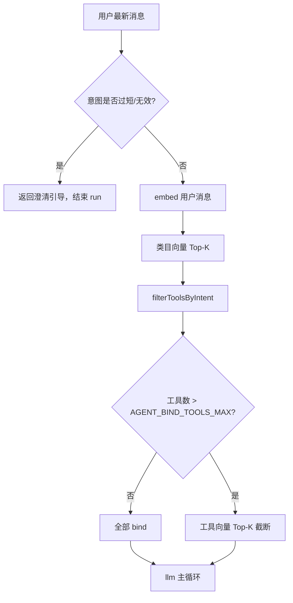

# 意图召回（Intent Recall）技术说明

Agent 在工具规模较大（约 30–40 个类目、~100 个工具）时，无法将全部类目/工具塞进 LLM 意图识别 prompt，也无法无限制 `bindTools`。本模块用 **向量 Top-K + 关键词降级** 替代全量 LLM 意图分类，并在主循环前截断 bind 工具数量。

调用方：`AgentEngineService` 的 LangGraph `intent` 节点（`src/core/agent-engine/agent-engine.service.ts`）。

---

## 背景与目标

| 问题 | 方案 |
|------|------|
| 30+ 类目 description 写入 prompt 导致 token 爆炸 | 类目向量召回 Top-K，不再调 LLM 做全量分类 |
| ~100 个工具无法全部 bindTools | 类目过滤后再做工具向量 Top-K，默认上限 25 |
| embedding 网关不稳定 | 关键词 overlap 降级，保证链路可继续 |
| 召回 id 不可信 | Agent 侧白名单校验（仅保留本轮可用类目/工具） |

---

## 整体流程

```
用户消息
   │
   ▼
┌─────────────────────────────────────┐
│ intent 节点（AgentEngineService）      │
│  1. isUserIntentClear（规则）         │
│  2. recallTopCategories（类目 Top-K） │
│  3. filterToolsByIntent（按类目过滤）  │
│  4. recallTopToolsForBind（工具 Top-K）│
└─────────────────────────────────────┘
   │
   ▼
scopedTools / scopedLangChainTools → llm 节点 bindTools
```



---

## 模块结构

```
src/core/intent/
├── intent.module.ts              # Nest 模块，导出 CategoryIntentRecallService
├── category-intent-recall.service.ts  # 类目/工具召回主逻辑 + 向量缓存
├── vector.util.ts                # 余弦相似度、embed 文本拼装、关键词打分
├── intent.types.ts               # 召回输入/输出类型
├── index.ts                      # 公共导出
└── intent.md                     # 本文档
```

### 依赖

- **LlmModule** → `LlmService.embedTexts()`：调用 OpenAI 兼容 `POST /v1/embeddings`
- **AgentEngineModule** → 注入 `CategoryIntentRecallService`

---

## 核心 API

### `recallTopCategories(categories, userMessage, topK?)`

**用途**：intent 节点第一步，从本轮可用 `ToolCategory` 中召回与用户消息最相关的类目。

**步骤**：

1. 对用户消息做一次 embedding
2. 对缺失/变更的类目文本批量 embedding（见缓存）
3. 计算余弦相似度，过滤 `score >= AGENT_INTENT_VECTOR_MIN_SCORE`
4. 按分数降序取 Top-K

**返回**：`CategoryRecallResult.matchedCategoryIds` → 传入 `filterToolsByIntent`。

### `recallTopToolsForBind(tools, userMessage, topK?, preferredCategoryIds?)`

**用途**：类目过滤后，若工具数仍超过 bind 上限，按相似度截断。

**加分规则**：`toolCategoryId ∈ preferredCategoryIds` 的工具额外 +0.05，避免跨类目误排。

**短路**：

- `tools.length <= topK` → 不 embedding，原样返回
- `userMessage` 为空 → 按原顺序截断

**返回**：`ToolBindRecallResult.tools` → 重建 `scopedLangChainTools`。

---

## 向量与文本

### Embedding 文本格式

| 对象 | 拼接规则 |
|------|----------|
| ToolCategory | `{label}\n{description}`（description 为空则仅 label） |
| Tool | `{name}\n{description}`（description 为空则仅 name） |

### 相似度

进程内 **余弦相似度**（`vector.util.ts`），不依赖 pgvector / Redis 向量索引。

### 缓存策略

| 缓存 | Key | 失效条件 |
|------|-----|----------|
| 类目向量 | `category.id` | `label` 或 `description` 变更（fingerprint 比对） |
| 工具向量 | `tool.id` | `name` 或 `description` 变更 |

缓存为 **进程内存 Map**，服务重启后重建；适合类目/工具变更不频繁的场景。

---

## 降级策略

embedding 请求失败（网络、4xx/5xx、空向量）时：

| 阶段 | 降级算法 |
|------|----------|
| 类目召回 | 对用户 query 分词（≥2 字符），统计在类目文本中的命中率 |
| 工具 bind | 同上，针对工具 name + description |

关键词分词分隔符：`空格 , ， 。 ！ ？ ! ? 、 ; ；`

类目降级仍应用 `AGENT_INTENT_VECTOR_MIN_SCORE` 阈值；工具 bind 降级无 minScore，直接取 Top-K。

---

## 环境变量

| 变量 | 默认 | 说明 |
|------|------|------|
| `AGENT_INTENT_VECTOR_TOP_K` | `10` | 类目召回数量上限 |
| `AGENT_INTENT_VECTOR_MIN_SCORE` | `0.25` | 类目召回最低相似度（向量/关键词均适用） |
| `AGENT_BIND_TOOLS_MAX` | `25` | 主循环 bindTools 数量上限 |
| DB `IntentRecallConfig.recallMode` | `auto` | 召回模式（优先于环境变量）：`auto` / `vector` / `keyword` |
| `AGENT_INTENT_RECALL_MODE` | `auto` | 环境变量降级（无 DB 行时） |
| `AGENT_EMBEDDING_BASE_URL` | 同 chat `baseUrl` | 独立 embedding 网关（chat 不支持 `/v1/embeddings` 时必填） |
| `AGENT_EMBEDDING_API_KEY` | 同 chat | embedding 专用 API Key |
| `AGENT_EMBEDDING_MODEL` | **未设置** | embedding 模型名；**勿填 chat 模型** |
| `AGENT_EMBEDDING_PATH` | `/v1/embeddings` | embedding API 路径 |

Embedding 与 Chat **分离配置**（`LlmModelConfig.kind`）：

| kind | 用途 |
|------|------|
| `chat` | 主对话模型 |
| `transformers_embedding` | 本地 @xenova/transformers（默认优先） |
| `api_embedding` | OpenAI 兼容 `/v1/embeddings` |

`recallMode=auto` 且存在启用的 `transformers_embedding` 时走向量；embedding 失败且 `fallbackToKeyword=true` 时降级关键词。

### 常见报错：`The model does not support Embeddings API`

原因：未配置 `AGENT_EMBEDDING_MODEL`，或 embedding 请求打到了 chat 网关 / 使用了 chat 模型名。

**方案 A（推荐，零 embedding 依赖）**：`.env` 中设置

```bash
AGENT_INTENT_RECALL_MODE=keyword
```

并删除或注释 `AGENT_EMBEDDING_MODEL`（若曾误配为 chat 模型名）。

**方案 B（向量召回）**：配置支持 `/v1/embeddings` 的服务，例如：

```bash
AGENT_INTENT_RECALL_MODE=auto
AGENT_EMBEDDING_BASE_URL=https://dashscope.aliyuncs.com/compatible-mode/v1
AGENT_EMBEDDING_API_KEY=sk-...
AGENT_EMBEDDING_MODEL=text-embedding-v3
```

---

## Agent 侧协作逻辑

以下逻辑在 `AgentEngineService`，不在本模块内，但影响召回结果如何被使用：

### 意图明确性（规则，非 LLM）

`isUserIntentClear`：消息长度 < 2 或无字母/数字 → 直接返回澄清语，不进入召回。

### 类目白名单

`recallTopCategories` 返回的 id 会与「本轮可用工具关联类目」求交集，防止越权类目。

### 工具过滤

`filterToolsByIntent`：

- `matchedCategoryIds` 为空且 `includeUncategorized=false` → **不 narrowing**，保留全部（闲聊/泛化场景）
- 有命中类目 → 只保留对应 `toolCategoryId` 的工具
- narrowing 结果为空 → fallback 回全部工具

### bind 截断

`scopeToolsForMainLoop` 包装 `recallTopToolsForBind`，重建 LangChain tools 与 `scopedAllowedToolIds`。

---

## 可观测性

Intent step 的 `output` 字段（持久化于 `AgentRun.steps`）示例：

```json
{
  "intentClear": true,
  "matchedCategoryIds": [3, 7],
  "recallSource": "vector",
  "recallMatches": [
    { "id": 3, "label": "订单", "score": 0.6123, "source": "vector" }
  ],
  "bindToolsCap": {
    "before": 68,
    "after": 25,
    "source": "vector",
    "matches": [
      { "id": 101, "name": "getOrder", "score": 0.5812, "source": "vector" }
    ]
  }
}
```

本地排查日志：`logs/agent-engine/*-steps.txt`（需开启 `AGENT_ENGINE_DEBUG` 或非生产默认）。

---

## 边界与限制

1. **无持久化向量库**：类目/工具量大且冷启动频繁时，首次 embed 批量耗时较高；后续同进程命中缓存。
2. **同轮两次 embed 用户消息**：类目召回与工具 bind 各 embed 一次 query（可后续合并优化）。
3. **bind 截断后不可调用未 bind 的工具**：LLM 只能看到 Top-K 工具；若真实所需工具未被召回，可能选错或纯文本回答。
4. **关键词降级精度有限**：仅作兜底，生产环境应保证 embedding 网关可用。
5. **进程缓存不跨实例**：多副本部署时各实例独立缓存，行为一致但 embed 次数略增。

---

## 扩展建议

- 合并同轮 query embedding，减少一次 API 调用
- 引入 Redis 持久化类目/工具向量，跨实例共享
- 对 `AGENT_BIND_TOOLS_MAX` 支持按 Agent / AppClient 配置覆盖
- 前端传入 `intent` hint 时，与向量分数加权融合（当前未实现）
