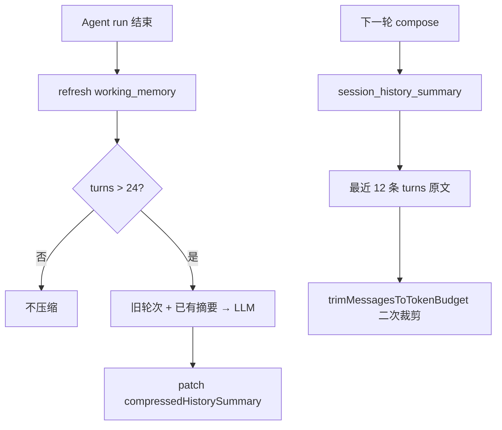

# 多轮会话历史压缩（Session History Compression）技术说明

长会话若把全部 `Message` 原文塞进 LLM，会导致 token 暴涨、成本上升、且易被冗长 tool 结果干扰。本模块在 **Redis 会话上下文** 中维护「较早轮次的 LLM 摘要」，送入模型时只带 **摘要 + 最近 N 条原文**；PostgreSQL `Message` 表仍保留完整审计数据。

与 **working_memory** 分工见下文；二者在每轮 Agent 成功后依次刷新。

调用方：

- `AgentEngineService.run()` → `SessionHistoryCompressionService.maybeCompressAfterTurn`
- `PromptComposerService.compose()` → `SessionHistoryCompressionService.buildPromptHistory`

---

## 背景与目标

| 问题 | 方案 |
|------|------|
| 80+ 条历史消息占满 context | 超过阈值后对「旧轮次」做 LLM 摘要，prompt 只带摘要 + 最近 12 条（可配置） |
| tool 消息体积极大 | 压缩前每条 turn 截断至 600 字符；超长 transcript 再按 token 预算从头部丢弃 |
| 与任务状态混淆 | **working_memory** 管当前任务；**session_history_summary** 管对话脉络，prompt 中分层标签 |
| Redis 不可用 | `compose` 回退 DB 加载 turns；无摘要时行为等同「仅最近 N 条」 |

---

## 记忆分层（与 working_memory 的关系）

```
┌─────────────────────────────────────────────────────────────┐
│ PromptComposer 送入 LLM 的顺序                                 │
├─────────────────────────────────────────────────────────────┤
│ 1. <agent_prompt>              Agent 系统提示                  │
│ 2. <user_memory>               用户级长期记忆（Redis，可选）    │
│ 3. <working_memory>            当前任务状态（goal/facts/实体）   │
│ 4. <session_history>         说明性 system 标签               │
│ 5. <session_history_summary>   较早多轮压缩摘要（可选）         │
│ 6. user / assistant / tool …   最近 N 条会话原文               │
│ 7. user                        本轮用户输入（若未在历史末尾）   │
└─────────────────────────────────────────────────────────────┘
```

| 字段 | 存储位置 | 更新时机 | 内容侧重 |
|------|----------|----------|----------|
| `workingMemory` | `SessionContextPayload` | 每轮 `WorkingMemoryService.refreshFromAgentRun` | 未完成任务、facts、实体 ID、最后一次工具结论 |
| `compressedHistorySummary` | 同上 | 轮次超阈值时 `maybeCompressAfterTurn` | 时间线式对话摘要：用户意图演变、已确认结论 |
| `turns[]` | 同上（与 Message 同步） | `MessageService` 写入消息时追加 | 完整轮次；**压缩不删 turns**，仅影响 compose 时取哪些进 prompt |

**原则**：模型优先看 `working_memory` 做决策；需要回忆「之前聊过什么」时参考 `session_history_summary` + 最近原文。

---

## 数据模型

Redis 键：`agent:context:session:{sessionId}`（见 `redis-keys.ts`）。

`SessionContextPayload` 在原有字段上扩展：

```typescript
type SessionContextPayload = {
  sessionId: string;
  turns: SessionContextTurn[];
  workingMemory?: WorkingMemoryState;
  /** 较早轮次的 LLM 压缩摘要 */
  compressedHistorySummary?: string;
  /** 已纳入摘要的最后一条 Message.id */
  compressedUpToMessageId?: number;
  updatedAt: string;
};
```

- `compressedUpToMessageId`：表示 `messageId <= 该值` 的轮次已并入摘要（逻辑上；`turns` 仍保留全量）。
- 增量压缩：若 `upToMessageId` 未变化则跳过，避免重复调用 LLM。

---

## 整体流程

### 压缩（写）

```
Agent run 成功结束
   │
   ├─► WorkingMemoryService.refreshFromAgentRun
   │
   └─► SessionHistoryCompressionService.maybeCompressAfterTurn
           │
           ├─ turns.length <= COMPRESS_AFTER_TURNS → 跳过
           ├─ oldTurns = turns[0 .. -KEEP_RECENT)
           ├─ upToMessageId 未推进 → 跳过
           ├─ LLM 合成摘要（可合并已有 compressedHistorySummary）
           └─ sessionContextStore.patch(summary, upToMessageId)
```

### 组装 prompt（读）

```
PromptComposer.loadRecentConversationMessages
   │
   ├─ Redis 命中 → buildPromptHistory(payload)
   └─ Redis miss → DB 加载 turns，合并 Redis 中的 summary 字段后 buildPromptHistory
```



---

## 模块结构

```
src/core/memory/
├── session-history-compression.service.ts  # 压缩与 buildPromptHistory
├── session-history-compression.md          # 本文档
├── working-memory.service.ts               # 任务态工作记忆
├── session-context.store.ts                # Redis 读写
├── session-context.types.ts                # Payload 类型
├── session-context.format.ts               # turn → LlmChatMessage
├── memory.constants.ts                     # 环境变量与默认值
└── memory.module.ts                        # 注册导出
```

### 依赖

- **LlmModule** → `LlmService.chat()`（非流式，专用压缩 prompt）
- **SessionContextStore** → `get` / `patch`
- **message-token-budget.util** → `estimateTextTokens`（压缩输入超长时裁切）

---

## 核心 API

### `maybeCompressAfterTurn(sessionId: string)`

**时机**：`AgentEngineService` 在 `refreshFromAgentRun` 之后调用。

**逻辑**：

1. `SESSION_HISTORY_COMPRESS=0` → 直接返回。
2. 读取 Redis `SessionContextPayload`；无效则跳过。
3. `turns.length <= SESSION_HISTORY_COMPRESS_AFTER_TURNS`（默认 24）→ 跳过。
4. `oldTurns = turns.slice(0, -KEEP_RECENT)`（默认保留最近 12 条不进入本次摘要源）。
5. `upToMessageId = oldTurns[last].messageId`；若 `<= compressedUpToMessageId` → 跳过（已压缩过）。
6. `synthesizeHistorySummary(previousSummary, oldTurns)` → 写回 `patch`。
7. 若 `SESSION_HISTORY_TRIM_TURNS_AFTER_COMPRESS` 开启（默认开）：`turns = turns.filter(t => t.messageId > upToMessageId)`，与摘要同一次 `patch` 写入。

**失败**：仅 `logger.warn`，不抛错、不影响 run 成功状态；**失败时不裁剪 turns**。

### `buildPromptHistory(payload, maxMessages)`

**时机**：`PromptComposerService` 从 Redis/DB 得到 `SessionContextPayload` 后。

**返回**：

1. 若有 `compressedHistorySummary` → 一条 `system` 消息，标签 `<session_history_summary>`。
2. `turns.slice(-keepRecent)` 转为 `LlmChatMessage[]`（`keepRecent = min(KEEP_RECENT, maxMessages)`）。

之后 `AgentEngineService` 仍会对整包 messages 执行 `trimMessagesToTokenBudget` 作为兜底。

### `synthesizeHistorySummary`（私有）

- 将 `oldTurns` 格式化为 `role: content` 多行文本（单条最长 600 字符）。
- 估算 token 超过 `SESSION_HISTORY_COMPRESS_MAX_INPUT_TOKENS`（默认 6000）时，**从最早行开始丢弃**。
- LLM 系统提示要求：保留目标/事实/实体 ID/工具结论/未决问题；丢弃寒暄与冗长 JSON。
- 若已有摘要，要求合并更新而非堆砌。

---

## 环境变量

| 变量 | 默认 | 说明 |
|------|------|------|
| `SESSION_HISTORY_COMPRESS` | 开启 | `0` / `false` / `off` 关闭压缩 |
| `SESSION_HISTORY_COMPRESS_AFTER_TURNS` | `24` | `turns` 条数超过此值才触发压缩 |
| `SESSION_HISTORY_KEEP_RECENT_TURNS` | `12` | 压缩后仍进入 prompt 的最近原文条数 |
| `SESSION_HISTORY_COMPRESS_MAX_SUMMARY_TOKENS` | `768` | 压缩 LLM 输出上限 |
| `SESSION_HISTORY_COMPRESS_MAX_INPUT_TOKENS` | `6000` | 送入压缩 LLM 的 transcript 估算 token 上限 |
| `SESSION_HISTORY_TRIM_TURNS_AFTER_COMPRESS` | 开启 | `0` 关闭；压缩成功后删除 Redis 中已摘要的 `turns` |

相关（同模块）：

| 变量 | 说明 |
|------|------|
| `MEMORY_SESSION_TTL_SECONDS` | 会话上下文 Redis TTL，默认 7 天 |
| `AGENT_WORKING_MEMORY_MODE` | `refresh`（LLM）或 `merge`（规则），见 working memory |

---

## 与 Message / DB 的一致性

- **权威持久化**：`Message` 表；每条用户/助手/tool 消息仍完整写入。
- **Redis**：工作集；`MessageService` 追加消息时同步 `turns`；压缩只 `patch` 摘要字段，**不删除** `turns`。
- **Cache miss**：`PromptComposer` 从 DB 重建 `turns`，并尝试合并 Redis 里已有的 `compressedHistorySummary`（若 key 仍存在）。
- **DB 重建 Redis**：`MessageService.rebuildSessionContextFromDb` 保留 `compressedHistorySummary` / `compressedUpToMessageId`，并按水位软裁剪 `turns`，避免全量写回撑大 Redis。

---

## 运维与调试

- 压缩成功：`SessionHistoryCompressionService` 打 `debug` 日志，含 `sessionId`、`upToMessageId`、`oldTurns` 数量。
- 查看送入模型的最终消息：`logs/agent-engine/prompt/.../run-*-prompt.json`（compose 之后、token trim 之前由 debug 写入，以实际代码为准）。
- 关闭压缩做对比：`SESSION_HISTORY_COMPRESS=0`，观察 prompt 体积与回答质量。

---

## 设计取舍

1. **为何不用纯滑动窗口**：仅截断最近 N 条会丢失更早的商品 ID、用户约束；摘要保留长线语义。
2. **为何与 working_memory 并存**：working_memory 偏「状态机」；history summary 偏「叙事」，避免单 JSON 过大难以维护。
3. **为何压缩失败静默**：压缩是优化路径；失败时仍可用最近 12 条原文 + working_memory 继续服务。
4. **后续可扩展**：按 session 显式触发压缩 API；将摘要同步写回 DB；与 `MessageTurn` 指标联动评估压缩率。

---

## 相关代码索引

| 文件 | 职责 |
|------|------|
| `session-history-compression.service.ts` | 压缩与 prompt 历史组装 |
| `session-context-trim.util.ts` | `trimTurnsByCompressedWatermark` 纯函数 |
| `working-memory.service.ts` | 任务态工作记忆 |
| `prompt-composer.service.ts` | 多源 memory 合并为 messages |
| `agent-engine.service.ts` | run 结束后的刷新调用链 |
| `message.service.ts` | Message 写入与 Redis turns 同步 |
| `message-token-budget.util.ts` | compose 之后的 token 硬裁剪 |
