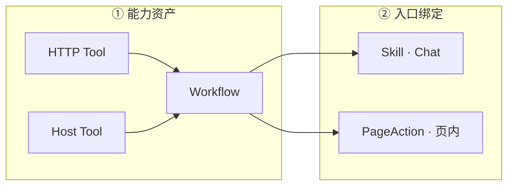

# B 端 Workflow / Skill / PageAction 配置指南

> **受众**：B 端产品、运营、实施、管理台开发。  
> **目标**：用 **场景 Preset** 低心智完成配置；需要时再展开原子节点微调。  
> **技术细节**：[workflow-action-kinds.md](../workflow-action-kinds.md)、[frontend-workflow-config-guide.md](./frontend-workflow-config-guide.md)  
> **状态识别（detect_clues + 多分支 edges）**：[b-end-workflow-detect-clues-edges.md](./b-end-workflow-detect-clues-edges.md)  
> **节点多 Tool / HostTool 绑定**：[b-end-workflow-node-multi-tool-binding.md](./b-end-workflow-node-multi-tool-binding.md)  
> **前端对接规格**：[frontend-b-end-workflow-integration-spec.md](./frontend-b-end-workflow-integration-spec.md)

---

## 1. 你要配什么？



| 层级 | 是什么 | 谁配 | 配什么 |
|------|--------|------|--------|
| Tool | 后端 HTTP 接口能力 | 研发 / 平台 | 读接口、写接口 |
| HostTool | 浏览器 DSL 推送 | 研发 / 平台 | fillText、fillReplyDraft 等 |
| **Workflow** | 固定执行流程 | **运营 / 实施** | 选场景 Preset，绑 Tool ID |
| Skill | Chat 技能包 | 运营 | 选 Workflow（workflow-only 可不绑 SkillTool） |
| PageAction | 页内一键动作 | 运营 | 选 Workflow（`hostToolId` 可省略） |

**原则**：Workflow 是「怎么跑」；Skill / PageAction 是「谁在什么入口跑」。

---

## 2. 推荐配置路径：场景 Preset（默认）

不必手拖 4～6 个原子节点。创建 Workflow 时传 **`preset` + `presetConfig`**，服务端**保存时展开**为原子 `nodes[]`，运行时与手配完全一致。

### 2.1 场景对照表

| 我要做什么 | 选哪个 Preset | profile | 必填 | 可选 |
|------------|---------------|---------|------|------|
| 页内：读上下文 →（可选）拉数 → 推送到表单 → 说明 | `page_auto_fill` | `page_action` | `hostToolId` | `readToolId` |
| 页内：只靠页上下文推送（不拉 HTTP） | `page_context_push` | `page_action` | `hostToolId` | — |
| 先 HTTP 拉数再 Host 推送 | `fetch_push_summarize` | 任意 | `readToolId`, `hostToolId` | — |
| Chat：拉数后文字作答 | `fetch_and_answer` | `chat_skill` | `readToolId` | — |
| Chat：改数据（含确认链） | `mutation_submit` | `chat_skill` | `writeToolId` | `readToolId` |
| Chat：页上下文 → 写确认 | `page_context_mutation_submit` | `chat_skill` | `writeToolId` | `readToolId` → [专文](./preset-page-context-mutation-submit-admin.md) |

### 2.2 展开后的节点（无需手配）

**页内自动回填 `page_auto_fill`**

```text
load_page_context → [fetch_data] → generate_and_push → summarize
```

**变更提交 `mutation_submit`**

```text
[fetch_data] → compose_mutation → present_mutation → await_user_confirm → write_data → summarize
```

**页内写确认 `page_context_mutation_submit`**

```text
load_page_context → [fetch_data] → compose_mutation → present_mutation → await_user_confirm → write_data → summarize
```

（节点展示名：加载页上下文 → 生成参数 → 草稿说明 → 确认读写 → 执行读写 → 总结说明）

详细配置步骤见 **[preset-page-context-mutation-submit-admin.md](./preset-page-context-mutation-submit-admin.md)**。

写确认已内置在上述 Preset 中，**不要**再单独加 `await_user_confirm` 节点。

### 2.3 API 速查

| 操作 | 方法 | 路径 |
|------|------|------|
| Preset 目录 | GET | `/admin/workflow/presets/catalog?profile=page_action` |
| 创建 Workflow | POST | `/admin/workflow` |
| 更新 Workflow | PATCH | `/admin/workflow/:id` |
| 详情（含展开 nodes） | GET | `/admin/workflow/:id` |

全局前缀为 `admin`；以上路径完整形如 `/admin/workflow/...`。

---

## 3. 分场景配置步骤

### 3.1 PageAction：评论自动回填

**① 创建 Workflow**

```json
POST /admin/workflow
{
  "appClientId": 2,
  "workflowKey": "page.review.autofill",
  "name": "评论自动回填",
  "profile": "page_action",
  "preset": "page_auto_fill",
  "presetConfig": {
    "hostToolId": 12,
    "readToolId": 205,
    "objectives": {
      "push": "根据评论详情生成回复草稿并填入表单",
      "summarize": "告知用户草稿已填入"
    }
  }
}
```

**② 创建 PageAction**

| 字段 | 值 |
|------|-----|
| `actionKey` | C 端 invoke 用，如 `review.autofill` |
| `workflowId` | 上一步返回的 id |
| `hostToolId` | **可省略**；若填写，必须是同 AppClient 下已有 HostTool |
| `systemPrompt` | 页内角色说明 |
| `pageScope` | 与 C 端 `pageContext.page` 一致 |

**③ 校验**

保存 PageAction 时：只校验 Workflow 引用有效；若填写 `hostToolId`，校验 HostTool 属于同 AppClient。分析类 Workflow 可不含 push 节点。

---

### 3.2 Skill：订单只读查询

```json
POST /admin/workflow
{
  "appClientId": 2,
  "workflowKey": "skill.order.inquiry",
  "name": "订单查询",
  "profile": "chat_skill",
  "preset": "fetch_and_answer",
  "presetConfig": {
    "readToolId": 101,
    "objectives": {
      "fetch": "根据用户提供的订单号查询详情",
      "summarize": "用简洁中文列出订单号、状态、金额"
    }
  }
}
```

**绑定 Skill**

| 字段 | 说明 |
|------|------|
| `workflowId` | 上面创建的 Workflow |
| SkillTool | **可选**；workflow-only 可不绑；若配置须包含 `readToolId=101` |

---

### 3.3 Skill：更新活动（写操作）

```json
POST /admin/workflow
{
  "appClientId": 2,
  "workflowKey": "skill.campaign.update",
  "name": "更新活动",
  "profile": "chat_skill",
  "deliverable": "mutation",
  "preset": "mutation_submit",
  "presetConfig": {
    "readToolId": 101,
    "writeToolId": 102,
    "objectives": {
      "compose": "根据详情组装更新参数",
      "present": "展示即将提交的变更字段"
    }
  }
}
```

**绑定 Skill**

- 若配置 SkillTool 叠加层，须同时包含 `101`（读）和 `102`（写）。
- 运行时：组参 → 展示草稿 → **用户确认** → 执行写 → 总结。

---

## 4. presetConfig 字段说明

| 字段 | 类型 | 说明 |
|------|------|------|
| `readToolId` | number | HTTP 读 Tool id |
| `writeToolId` | number | HTTP 写 Tool id |
| `hostToolId` | number | Host Tool id（推送） |
| `fetchCompleteWhen` | enum | `first_success`（默认）\| `fetch_all_pages` |
| `summarizeMode` | enum | `brief` \| `detailed` \| `final`（默认 final） |
| `presentMode` | enum | mutation 展示：`brief` \| `detailed` |
| `confirmKind` | enum | `mutation`（默认）\| `generic` |
| `materializePageContext` | boolean | 默认 true |
| `objectives` | object | 覆盖各步 objective，见下表 |

**objectives 键**

| 键 | 对应步骤 |
|----|----------|
| `loadPage` | load_page_context |
| `fetch` | fetch_data |
| `push` | generate_and_push |
| `compose` | compose_mutation |
| `present` | present_mutation |
| `write` | write_data |
| `summarize` | summarize |

---

## 5. 高级：原子节点编辑

Preset 适合 80% 场景。需要改单步 objective、调整顺序时：

1. `GET /admin/workflow/:id` 拿到展开后的 `nodes[]`
2. `PATCH /admin/workflow/:id` 只改 `nodes`（**不要**与 `preset` 同传）
3. 或用 `workflowOverrides`（Skill / PageAction 级按 nodeId 覆盖 objective）

**注意**：DB **不保存**创建时用的 `preset` 名称；再次「从 Preset 重建」需 PATCH 时显式传 `preset` + `presetConfig`。

---

## 6. 保存校验与错误

### 6.1 Preset 相关

| code | 原因 | 处理 |
|------|------|------|
| `WORKFLOW_PRESET_INVALID` | 缺 hostToolId / profile 不匹配等 | 看 `issues[]` |
| `WORKFLOW_PRESET_NODES_CONFLICT` | 同时传 preset 和 nodes | 二选一 |
| `WORKFLOW_NODES_REQUIRED` | 既无 preset 也无 nodes | 补一种 |

### 6.2 Skill 对齐

| code | 原因 |
|------|------|
| `SKILL_WORKFLOW_BINDING_INCOMPATIBLE` | 配置了 SkillTool 但未覆盖 Workflow 节点 toolId |

**做法**：workflow-only 无需 SkillTool；叠加层模式下对比节点所需 Tool 与 SkillTool 列表，缺的补上。

### 6.3 PageAction 保存 / 执行

| code | 原因 |
|------|------|
| `PAGE_ACTION_HOST_TOOL_REQUIRED` | 未绑定 Workflow 且无 hostToolId |
| `HOST_TOOL_NOT_FOUND` | hostToolId 不存在或不属于当前 AppClient |
| `PAGE_ACTION_PUSH_HOST_TOOL_MISSING` | 执行 push 节点时节点和 PageAction 都没有可用 HostTool |

### 6.4 修改 Workflow 影响下游

| code | 原因 |
|------|------|
| `WORKFLOW_CHANGE_BREAKS_SKILL_REFERENCES` | 改 nodes 后某 Skill 工具白名单不够 |
| `WORKFLOW_CHANGE_BREAKS_PAGE_ACTION_REFERENCES` | 旧版强对齐校验错误码；当前 PageAction 保存期不再因 push 节点 hostToolId 不一致失败 |

---

## 7. profile 与动作限制

| profile | 可用 Preset | 不可用 |
|---------|-------------|--------|
| `page_action` | page_auto_fill、page_context_push、fetch_push_summarize | mutation_submit、page_context_mutation_submit、fetch_and_answer |
| `chat_skill` | 全部 | — |
| `shared` | 全部 | 运行时 Page 入口仍只能跑批次 A 动作 |

`page_action` Workflow **不得**含 compose / present / write / await 原子节点（mutation 仅 Chat）。

---

## 8. 配置检查清单

### PageAction 上线前

- [ ] Workflow `profile=page_action`（或 shared）
- [ ] 自动回填类 Preset 含 `generate_and_push`（分析类 Workflow 可不含 push 节点）
- [ ] 无 Workflow 时必须选择已有 PageAction.hostToolId；绑 Workflow 时可省略
- [ ] C 端 pageContext 与 pageScope 一致

### Skill（Chat）上线前

- [ ] Workflow profile 为 chat_skill 或 shared
- [ ] workflow-only 或 SkillTool / SkillHostTool 覆盖节点引用（叠加层）
- [ ] mutation 场景 deliverable 建议 `mutation`
- [ ] 写操作走 `mutation_submit` Preset 或含完整确认链

### 变更 Workflow 前

- [ ] 确认无 active Skill / PageAction 会被破坏（或先解绑）
- [ ] 用 Preset 重建时勿与旧 nodes 同传

---

## 9. 常见问题

**Q：还要单独配 tools[] / hostTools[] 吗？**  
一般不需要。节点 `input.toolId` / `hostToolId` 是唯一绑定来源；仅当要标记 `isRequired: true` 时才可选传。

**Q：Preset 和 Plan 动态编排什么关系？**  
Skill **无** workflowId 时走 Plan LLM 动态步序；**有** workflowId 时走 DB Workflow（Preset 展开结果）。

**Q：Chat 写操作用户怎么确认？**  
`mutation_submit` / `page_context_mutation_submit` 展开后含 `await_user_confirm`；C 端收到 `confirmation_required` SSE，确认后续跑写。页上下文写确认见 [preset-page-context-mutation-submit-admin.md](./preset-page-context-mutation-submit-admin.md)。

**Q：PageAction 绑 Workflow 失败会怎样？**  
SSE `phase=failed`，错误码 `WORKFLOW_LOAD_*`；**不会**静默回退单步。

---

## 10. 相关文档

| 文档 | 用途 |
|------|------|
| [preset-page-context-mutation-submit-admin.md](./preset-page-context-mutation-submit-admin.md) | **页内写确认** Preset 专文 |
| [frontend-workflow-config-guide.md](./frontend-workflow-config-guide.md) | 前端表单、TypeScript 类型、API 细节 |
| [b-end-workflow-skill-migration.md](./b-end-workflow-skill-migration.md) | V2 架构与迁移 |
| [skill-workflow-binding-validation.md](./skill-workflow-binding-validation.md) | Skill↔Workflow 校验规则 |
| [workflow-action-kinds.md](../workflow-action-kinds.md) | 8 种原子 action 权威定义 |
