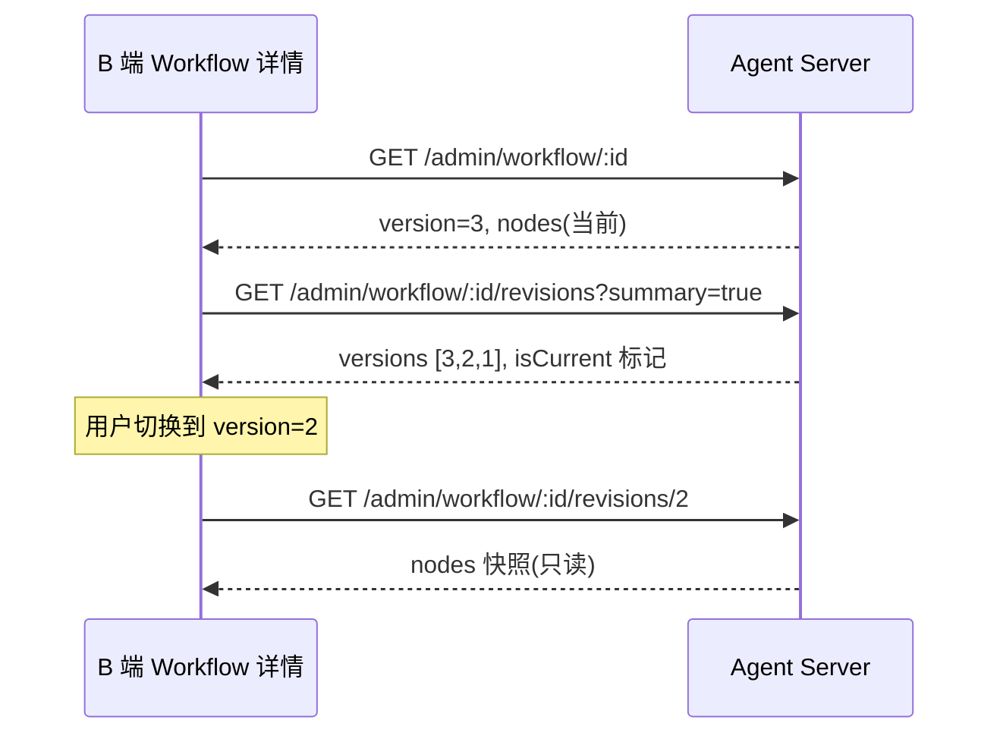

# B 端对接：Workflow 版本快照查看

> 受众：B 端管理台前端（Workflow 详情 / 版本切换器）。  
> 场景：选中一条 Workflow 后，列出可选版本号，切换版本查看历史 `nodes` 快照（只读）。

---

## 1. 数据模型

每次 Workflow 的 `nodes` 变更保存时：

- `Workflow.version` 递增（当前生效版本）
- 同步写入 `WorkflowRevision` 快照（`version` + `nodes` + `deliverable` + `constraints` + `changeNote`）

B 端查看版本时：

- **当前版本**：`GET /admin/workflow/:id` 返回的 `version` + `nodes`
- **历史版本**：从 `WorkflowRevision` 读取，不影响当前生效定义

---

## 2. API

### 2.1 选中 Workflow 后获取当前版本

```http
GET /admin/workflow/:id
Authorization: Bearer <admin_token>
```

响应 `data` 关键字段：

| 字段 | 说明 |
|------|------|
| `version` | 当前生效版本号 |
| `revisionCount` | 历史快照总数 |
| `nodes` | 当前版本的节点定义 |

### 2.2 获取版本号列表（推荐：版本下拉）

轻量接口，不含 `nodes`，适合渲染版本选择器：

```http
GET /admin/workflow/:id/revisions?summary=true&limit=100
```

响应 `data` 为数组，按 `version` **降序**：

```json
[
  {
    "id": 15,
    "workflowId": 5,
    "version": 3,
    "deliverable": "analysis",
    "changeNote": "调整 summarize objective",
    "createdAt": "2026-07-08T02:00:00.000Z",
    "isCurrent": true
  },
  {
    "id": 12,
    "workflowId": 5,
    "version": 2,
    "deliverable": "analysis",
    "changeNote": "新增 fetch_data",
    "createdAt": "2026-07-07T10:00:00.000Z",
    "isCurrent": false
  }
]
```

| 字段 | 说明 |
|------|------|
| `version` | 版本号（Skill / PageAction 的 `workflowVersion` pin 用这个值） |
| `isCurrent` | 是否等于 Workflow 当前 `version` |
| `changeNote` | 该次变更备注（PATCH 时 `changeNote` 写入） |

### 2.3 查看指定版本快照（版本切换）

```http
GET /admin/workflow/:id/revisions/:version
```

示例：

```http
GET /admin/workflow/5/revisions/2
```

响应 `data`：

```json
{
  "id": 12,
  "workflowId": 5,
  "version": 2,
  "deliverable": "analysis",
  "nodes": [ ... ],
  "constraints": [],
  "changeNote": "新增 fetch_data",
  "createdAt": "2026-07-07T10:00:00.000Z",
  "isCurrent": false
}
```

| 字段 | 说明 |
|------|------|
| `nodes` | 该版本完整节点快照（B 端只读展示） |
| `constraints` | 该版本约束快照 |
| `isCurrent` | 是否为当前生效版本 |

不存在时：

```json
{
  "code": "WORKFLOW_REVISION_NOT_FOUND",
  "message": "Workflow 5 revision version=99 not found"
}
```

### 2.4 获取完整历史（含 nodes，慎用）

默认返回每条 revision 的完整快照，数据量较大：

```http
GET /admin/workflow/:id/revisions?limit=20
```

B 端 **推荐** 用 `summary=true` 拉版本列表，再用 `GET .../revisions/:version` 按需加载单条快照。

---

## 3. 推荐 UI 流程



### 3.1 版本选择器

1. 进入 Workflow 详情，先请求 `GET /admin/workflow/:id` 展示当前版。
2. 并行或随后请求 `GET .../revisions?summary=true` 填充下拉。
3. 默认选中 `isCurrent: true` 的项；展示文案建议：`v{version}` + `changeNote`（若有）。
4. 用户切换版本时，请求 `GET .../revisions/:version`，用返回的 `nodes` 渲染只读编排视图。
5. 查看历史版本时 **不要** 误用 `PATCH /admin/workflow/:id` 覆盖当前定义；历史仅只读预览。

### 3.2 与 Skill / PageAction 的 workflowVersion 联动

Skill / PageAction 可 pin 历史版本：

```json
{
  "workflowId": 5,
  "workflowVersion": 2
}
```

B 端在绑定 Workflow 时，版本下拉数据源同样用：

```http
GET /admin/workflow/:workflowId/revisions?summary=true
```

未填 `workflowVersion` 表示始终跟随 Workflow 当前 `version`。

---

## 4. 错误码

| code | 场景 |
|------|------|
| `WORKFLOW_REVISION_NOT_FOUND` | 指定 `version` 无快照 |
| Workflow 404 | `workflowId` 不存在 |

---

## 5. 联调检查清单

- [ ] Workflow 详情页展示当前 `version` 与 `revisionCount`
- [ ] 版本下拉使用 `summary=true`，不一次性拉全量 `nodes`
- [ ] 切换版本调用 `GET /admin/workflow/:id/revisions/:version`
- [ ] 历史版本视图只读，保存仍走 `PATCH` 当前 Workflow（产生新版本）
- [ ] Skill / PageAction 绑定时，版本下拉与 Workflow 详情共用同一 revisions 接口
