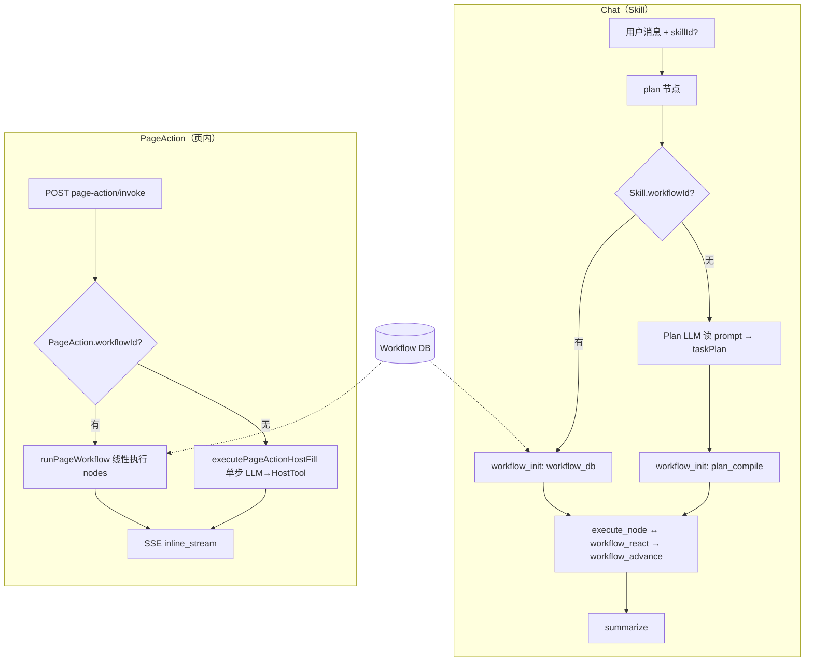

# B 端对接：Workflow 资产全流程指南

本文面向 B 端配置与集成同学，说明 V2 **Workflow 资产**的建模方式、**8 种动作节点**如何配置、以及 **Skill（Chat）** 与 **PageAction（页内 one-shot）** 如何绑定与运行。

> 动作节点类型权威定义见 [`v2/workflow-action-kinds.md`](../workflow-action-kinds.md)。  
> Admin API OpenSpec 见 [`v2/specs/admin-workflow-api/spec.md`](../specs/admin-workflow-api/spec.md)。  
> **前端编排器 / 管理台 UI** 见 [`frontend-workflow-config-guide.md`](./frontend-workflow-config-guide.md)。  
> **B 端运营 / 实施配置（Preset 场景向导）** 见 [`b-end-workflow-preset-admin-guide.md`](./b-end-workflow-preset-admin-guide.md)。

---

## 1. 架构总览

### 1.1 两条运行时步序来源

V2 里 **所有编排最终都落成 `workflowRun`（L1 业务态）**，但步序来源有两条，**`workflowId` 非必填**：

| 来源 | 触发条件 | 编译方式 | `compiledFrom` |
|------|----------|----------|----------------|
| **Workflow 资产（推荐固定流）** | `Skill.workflowId` 或 `PageAction.workflowId` 有值 | `workflow_init` / Page runner 从 DB 加载 `Workflow.nodes` | `workflow_db` |
| **动态 Plan（prompt 指引）** | Skill **无** `workflowId` | Plan 阶段用 `Skill.prompt` + Plan LLM 生成 `taskPlan`，`workflow_init` 再 `plan_compile` | `plan_llm` / `template` / `minimal` |

Legacy `Skill.config.workflow.steps` **已废弃**，不再作为运行时 SSOT。

### 1.2 入口与引擎路径



### 1.3 Skill vs PageAction 职责对照

| 维度 | Skill（Chat） | PageAction（页内） |
|------|---------------|-------------------|
| 入口 | Chat 消息 + 可选 `skillId` | `POST /admin/page-action/invoke`（C 端，需 JWT + `x-app-dsn`） |
| 会话 | 有 Session / AgentRun / GOA | 无 Session；每次 invoke 独立 `PageActionRun` |
| 主文案 | `Skill.prompt`（注入 ReAct `<active_skill>`） | `PageAction.systemPrompt` |
| Workflow 绑定 | `Skill.workflowId` / `workflowVersion` / `workflowOverrides` | 同名字段在 `PageAction` 表 |
| 无 Workflow 时 | Plan LLM + prompt 动态步序 | 回退 **单步** `executePageActionHostFill`（LLM 生成 → HostTool 流式填入） |
| 允许的动作 | `profile=chat_skill` 或 `shared`：8 种全量（含写确认链） | `profile=page_action` 或 `shared`：仅批次 A（#1–4） |
| HTTP 工具 | `SkillTool`（C 端白名单 + ReAct 范围） | `WorkflowTool`（节点 `fetch_data` 绑定） |
| Host 工具 | `SkillHostTool` | `PageAction.hostToolId`（主 HostTool）+ 可选 `WorkflowHostTool` |

---

## 2. Workflow 资产模型

### 2.1 表结构与核心字段

`Workflow` 是 **AppClient 级可复用资产**，可被多个 Skill / PageAction 引用。

| 字段 | 类型 | 说明 |
|------|------|------|
| `appClientId` | int | 租户隔离；引用方必须同属一个 AppClient |
| `workflowKey` | string | App 内唯一键，建议 `skill.{capability}` / `page.{actionKey}` |
| `name` | string | B 端展示名 |
| `description` | string? | 说明 |
| `goal` | text? | 整条流的业务目标（审计 / 部分执行器上下文） |
| `profile` | enum | **`chat_skill` \| `page_action` \| `shared`**（创建时必选） |
| `deliverable` | enum | **`answer` \| `analysis` \| `mutation`**（默认 `answer`） |
| `nodes` | JSON | `WorkflowNodeDef[]`，见 §3 |
| `version` | int | 当前版本；`nodes` 变更时递增 |
| `constraints` | JSON string[] | 能力约束标签（如 `page_context_entity`） |
| `isActive` | bool | `false` 时不可被新引用加载；有活跃引用时拒绝停用 |
| `sortOrder` | int | 列表排序 |

关联表：

| 表 | 作用 |
|----|------|
| `WorkflowTool` | HTTP Tool 白名单 + `isRequired`；节点 `input.toolId` 必须在此集合内 |
| `WorkflowHostTool` | Host Tool 白名单；`generate_and_push` 的 `hostToolId` 须在此 |
| `WorkflowRevision` | 每次 `nodes` 变更追加一条历史（`version`、`nodes`、`deliverable`、`changeNote`） |

### 2.2 `profile` 与入口兼容性

| `Workflow.profile` | 可被 Skill 引用 | 可被 PageAction 引用 | 保存时允许的 action |
|--------------------|:-------------:|:------------------:|---------------------|
| `chat_skill` | ✅ | ❌ | #1–8（已实现的动作） |
| `page_action` | ❌ | ✅ | 仅 #1–4（批次 A） |
| `shared` | ✅ | ✅ | 保存按并集校验；**Page 运行时仍只能执行 #1–4** |

保存 Skill / PageAction 时，服务端调用 `assertWorkflowReferenceCompatible`：`workflowId` 须存在、同 `appClientId`、`isActive=true`，且 `profile` 与入口匹配。

### 2.3 版本与覆盖

**引用方字段（Skill / PageAction 均有）：**

```json
{
  "workflowId": 15,
  "workflowVersion": 1,
  "workflowOverrides": {
    "answer": { "objective": "针对客服场景，用更短的中文作答" }
  }
}
```

| 字段 | 行为 |
|------|------|
| `workflowId` | 指向 Workflow 资产；`null` 表示不绑资产 |
| `workflowVersion` | 可选 pin 版本；省略则用 Workflow 表当前 `version` |
| `workflowOverrides` | 按节点 `id` 覆盖 `objective` 等，**不改 DB 定义**；加载时 merge |

---

## 3. 节点配置（`WorkflowNodeDef`）

### 3.1 节点通用结构

每条 Workflow 是 **线性、有序** 的节点数组（V2 不支持 branch/parallel）。

```typescript
type WorkflowNodeDef = {
  id: string;           // 本 Workflow 内唯一，建议 snake_case
  action: WorkflowActionKind;
  name: string;         // B 端展示名
  objective: string;    // 本步目标，注入 LLM / 审计 / Harness
  input: { ... };       // 随 action 变化，见下表
};
```

节点生命周期（`workflowRun.nodes[].status`）：`pending` → `running` → `succeeded` | `failed` | `skipped`。

### 3.2 八种 `action` 与 `input` 契约

| # | `action` | 中文 | 适用 profile | `input` 字段 | 必填绑定 |
|---|----------|------|-------------|-------------|----------|
| 1 | `load_page_context` | 加载页上下文 | A | `materialize?: boolean`（默认 true） | 无 |
| 2 | `fetch_data` | 获取数据 | A | **`input.toolId`（必填）**；`completeWhen?: 'first_success' \| 'fetch_all_pages'` | 节点直绑 Tool ID；`WorkflowTool` 表由保存时自动推导 |
| 3 | `generate_and_push` | 生成并推送 | A | **`input.hostToolId`（必填）**；`stream?: boolean` | 节点直绑 HostTool ID；`WorkflowHostTool` 表由保存时自动推导 |
| 4 | `summarize` | 说明总结 | A | `mode?: 'brief' \| 'detailed' \| 'draft' \| 'final'`（默认 final） | 无 |
| 5 | `compose_mutation` | 组装变更参数 | B（仅 chat） | `toolId: number` | `WorkflowTool` |
| 6 | `present_mutation` | 展示变更草稿 | B | `mode?: 'brief' \| 'detailed'` | 无（读上游 outputRef） |
| 7 | `write_data` | 提交变更 | B | `toolId: number`；`useComposedArgs?: boolean`（默认 true） | `WorkflowTool` |
| 8 | `await_user_confirm` | 等待用户确认 | B | `confirmKind?: 'mutation' \| 'generic'` | 无（暂停 Graph） |

**保存期校验要点：**

- 每个节点 `id` 非空且唯一；`action` 须在注册表中且 `implemented=true`。
- `fetch_data` / `compose_mutation` / `write_data`：节点 **`input.toolId` 必填**（B 端/前端直接在节点上绑 Tool ID）。
- `generate_and_push`：节点 **`input.hostToolId` 必填**（直接在节点上绑 HostTool ID）。
- 请求体里的 `tools` / `hostTools` **可选**：仅用于给已在 nodes 中出现的 ID 标记 `isRequired`；省略时服务端从 nodes 自动写入 `WorkflowTool` / `WorkflowHostTool`。
- `profile=page_action` 的 Workflow **不得**包含 #5–8。

### 3.3 典型 Flow 模板

**页内自动回填（PageAction，4 步）**

```text
load_page_context → fetch_data → generate_and_push → summarize
```

**Chat 只读问答（Skill，2 步）**

```text
fetch_data → summarize
```

**Chat 写操作确认链（Skill，6 步）**

```text
fetch_data → compose_mutation → present_mutation → await_user_confirm → write_data → summarize
```

**仅页内填表（PageAction，2 步）**

```text
load_page_context → generate_and_push
```

### 3.4 完整配置示例

#### 示例 A：订单查询 Skill Workflow（`profile=chat_skill`）

```json
{
  "appClientId": 2,
  "workflowKey": "skill.order.inquiry",
  "name": "订单查询",
  "profile": "chat_skill",
  "deliverable": "answer",
  "goal": "帮助用户查询并解释订单状态",
  "constraints": [],
  "nodes": [
    {
      "id": "fetch_order",
      "action": "fetch_data",
      "name": "拉取订单",
      "objective": "根据用户提供的订单号、手机号等标识查询订单详情",
      "input": { "toolId": 101, "completeWhen": "first_success" }
    },
    {
      "id": "answer",
      "action": "summarize",
      "name": "作答",
      "objective": "用简洁中文列出订单号、状态、金额、时间等关键字段",
      "input": { "mode": "final" }
    }
  ]
}
```

> `tools` / `hostTools` 数组可省略；上例会在保存时自动写入 `WorkflowTool { toolId: 101 }`。

#### 示例 B：页内评论自动回填（`profile=page_action`）

```json
{
  "appClientId": 2,
  "workflowKey": "page.review.autofill",
  "name": "评论自动回填",
  "profile": "page_action",
  "deliverable": "answer",
  "goal": "根据页内选中评论生成回复草稿并填入输入框",
  "nodes": [
    {
      "id": "load_ctx",
      "action": "load_page_context",
      "name": "加载页上下文",
      "objective": "读取当前页面选中实体与评论内容",
      "input": { "materialize": true }
    },
    {
      "id": "fetch_review",
      "action": "fetch_data",
      "name": "拉取评论详情",
      "objective": "必要时调用 HTTP 工具补全评论线程",
      "input": { "toolId": 205 }
    },
    {
      "id": "push_draft",
      "action": "generate_and_push",
      "name": "生成并推送草稿",
      "objective": "生成符合品牌语气的回复草稿并流式填入 Host 输入框",
      "input": { "hostToolId": 12, "stream": true }
    },
    {
      "id": "brief_done",
      "action": "summarize",
      "name": "完成说明",
      "objective": "用一句话告诉用户草稿已填入，可继续编辑后发送",
      "input": { "mode": "brief" }
    }
  ]
}
```

> 前端编排器只需在节点表单里选 **Tool #205**、**HostTool #12**；不必再维护单独的绑定列表。

#### 示例 C（原 A 续）：订单查询 JSON 完整版含可选 isRequired

```json
{
  "appClientId": 2,
  "workflowKey": "skill.order.inquiry",
  "name": "订单查询",
  "profile": "chat_skill",
  "deliverable": "answer",
  "goal": "帮助用户查询并解释订单状态",
  "constraints": [],
  "nodes": [
    {
      "id": "fetch_order",
      "action": "fetch_data",
      "name": "拉取订单",
      "objective": "根据用户提供的订单号、手机号等标识查询订单详情",
      "input": { "toolId": 101, "completeWhen": "first_success" }
    },
    {
      "id": "answer",
      "action": "summarize",
      "name": "作答",
      "objective": "用简洁中文列出订单号、状态、金额、时间等关键字段",
      "input": { "mode": "final" }
    }
  ],
  "tools": [{ "toolId": 101, "isRequired": true }]
}
```

#### 示例 D：`shared` Workflow（Skill 与 Page 共用只读前半段）

同一 Workflow 可被 Chat Skill 引用做「拉数+总结」，但 **PageAction 只能执行其中 `page_action` 允许的前几步**；若 nodes 含 `compose_mutation` 等，Page 入口保存时就会校验失败。

---

## 4. Workflow Admin API

全局前缀 **`/admin`**，需 B 端鉴权。

| 方法 | 路径 | 说明 |
|------|------|------|
| `POST` | `/admin/workflow` | 创建（`version=1` + 首条 `WorkflowRevision`） |
| `GET` | `/admin/workflow/by-app-client/:appClientId` | 分页；支持 `profile` / `isActive` / `keyword` |
| `GET` | `/admin/workflow/:id` | 详情：含 `workflowTools`、`workflowHostTools`、Skill/PageAction 引用计数 |
| `PATCH` | `/admin/workflow/:id` | 更新；**`nodes` 变更会 `version++` 并写 revision** |
| `GET` | `/admin/workflow/:id/revisions` | 版本历史（默认最近 20 条） |

**`PATCH` 注意：**

- 传 `tools` / `hostTools` 会 **全量替换** 绑定行。
- 仅改 `name` / `goal` 不递增 version。
- 将 `isActive` 设为 `false` 时，若仍有 `isActive=true` 的 Skill/PageAction 引用，**拒绝操作**。

---

## 5. Skill 对接（Chat）

### 5.1 Skill 配置面

| 字段 | 用途 |
|------|------|
| `prompt` | **始终有效**：注入 ReAct 工具决策（`<active_skill>`）；无 Workflow 时还是 Plan LLM 的主要指引 |
| `description` | 外层 Plan 选题、goal 推断 |
| `config` | 扩展 JSON；**不要再写 `config.workflow`** |
| `workflowId` | 可选；有则走固定 Workflow |
| `workflowVersion` / `workflowOverrides` | 见 §2.3 |
| `SkillTool` | C 端可运行白名单 + ReAct 工具范围（与 `WorkflowTool` 职责不同，见 FAQ） |
| `SkillHostTool` | Chat 场景 Host Tool 白名单 |

### 5.2 Admin API

| 方法 | 路径 | 说明 |
|------|------|------|
| `POST` | `/admin/agent/:agentId/app-client/:appClientId/skills` | 创建 Skill |
| `PATCH` | `/admin/skill/:skillId` | 更新（含 workflow 绑定） |
| `PUT` | `/admin/skill/:skillId/tools` | 全量替换 `SkillTool` |
| `GET` | `/admin/skill/:skillId` | 详情 |
| `GET` | `/admin/agent/:agentId/app-client/:appClientId/skills` | 按 Agent 分页 |

**创建 Skill 请求示例（绑 Workflow）：**

```json
{
  "name": "自动回填skill",
  "prompt": "你是评论回复助手。根据用户选中的评论生成得体、简洁的回复草稿……",
  "capabilityKey": "review.autofill",
  "description": "为选中评论生成回复建议",
  "workflowId": 1,
  "workflowVersion": 1,
  "tools": [{ "toolId": 205, "isRequired": true }]
}
```

**创建 Skill 请求示例（纯 prompt，无 Workflow）：**

```json
{
  "name": "评论分析skill",
  "prompt": "你是评论分析助手。根据绑定的工具拉取评论数据，从情感、主题、风险角度分析……",
  "description": "评论情感与主题分析",
  "tools": [{ "toolId": 201, "isRequired": true }]
}
```

### 5.3 运行时序（C 端带 `skillId`）

1. **外层 Plan**：`skillSelect=explicit` 时生成单步 `kind=skill` 外层帧（不跑外层 Plan LLM）。
2. **Skill 帧展开**（`plan` 节点内）：  
   - 有 `workflowId` → `tryBuildTaskPlanFromSkillWorkflow` 把 DB nodes 投影为 `taskPlan`（`source=workflow`）。  
   - 无 `workflowId` → `resolveTaskPlan`：Plan LLM 读 `prompt` + 工具角色 → 内层 `taskPlan`（`source=plan_llm/template`）。
3. **`workflow_init`**：  
   - 有 `workflowId` 且加载成功 → `workflow_db`。  
   - 无 `workflowId`（`no_workflow_binding`）→ **`plan_compile`**：将上一步 `taskPlan` 编译为 `workflowRun`。  
   - 有 `workflowId` 但资产加载失败 → `db_load_failed`（硬错误）。
4. **执行环**：`execute_node` →（可选）`workflow_react` → `workflow_advance` → 末步 `summarize`。
5. **ReAct 全程**：`activeSkillPrompt` = `Skill.prompt`，影响工具选择与作答风格。

### 5.4 何时用 Workflow vs 纯 prompt

| 场景 | 建议 |
|------|------|
| 步序固定、需 B 端可视化编排/版本管理 | 建 Workflow + `workflowId` |
| 步序随工具集灵活变化、主要靠 prompt 约束 | **不绑** `workflowId`，保留 `SkillTool` + 优质 `prompt` |
| 同能力 Chat + Page 都要用 | `profile=shared` Workflow，或分别建两条 profile 不同的资产 |
| 写操作 + 用户确认 | Workflow 必含 #5–8；`profile` 不能是 `page_action` |

---

## 6. PageAction 对接（页内 one-shot）

### 6.1 PageAction 配置面

| 字段 | 用途 |
|------|------|
| `actionKey` | App 内唯一，如 `demo-playground.fill_draft`；C 端 invoke 用 |
| `systemPrompt` | **运行时主真值**（等同 Page 场景的 system 指引） |
| `hostToolId` | 无 Workflow 时必填，且必须是已有 HostTool；绑 `workflowId` 时可省略 |
| `pageScope` | 与 `pageContext.page` 对齐；空表示不限页 |
| `allowCustomInstruction` | 是否允许用户 invoke 时传 `instruction` 补充说明 |
| `workflowId` | 可选；有则走 `runPageWorkflow` |
| `workflowVersion` / `workflowOverrides` | 同 Skill |
| `sourceSkillId` | 仅从 Skill 导入时的追溯，**运行时不读** |

### 6.2 Admin / C 端 API

| 方法 | 路径 | 端 | 说明 |
|------|------|-----|------|
| `POST` | `/admin/page-action` | B | 创建 |
| `PATCH` | `/admin/page-action/:id` | B | 更新 |
| `GET` | `/admin/page-action/:id` | B | 详情 |
| `GET` | `/admin/page-action/by-app-client/:appClientId` | B | 分页 |
| `POST` | `/page-action/invoke` | **C** | 执行（`text/event-stream`）；需用户 JWT + `x-app-dsn` |
| `GET` | `/admin/page-action/run/:id` | B | Run 详情（含 `workflowRun`、steps 时间线） |
| `GET` | `/admin/page-action/run/by-app-client/:appClientId` | B | Run 分页 |

**创建 PageAction 请求示例（绑 Workflow）：**

```json
{
  "appClientId": 2,
  "actionKey": "review.autofill",
  "name": "评论自动回填",
  "pageScope": "review-detail",
  "systemPrompt": "你是页面内嵌的回复助手。根据 pageContext 中选中评论生成回复草稿……",
  "hostTool": { "fillField": "text" },
  "workflowId": 2,
  "workflowVersion": 1
}
```

**C 端 invoke 请求示例：**

```json
{
  "actionKey": "review.autofill",
  "pageContext": {
    "page": "review-detail",
    "entityId": "cmt_12345",
    "selection": { "text": "这件商品质量很好" }
  },
  "instruction": "语气正式一点",
  "clientActionId": "ui-btn-autofill-001"
}
```

### 6.3 运行时序

1. 解析 `actionKey` → 加载 `PageAction`（须 `isActive`）。
2. 解析 / 校验 `hostTool`、`pageContext`。
3. **有 `workflowId` 且加载成功**：
   - `runPageWorkflow` 按 nodes **线性**执行；
   - 每步通过 Page executor + Harness sensor；
   - SSE 推送 `page_workflow` 节点生命周期；
   - 落库 `PageActionRun.workflowId` / `workflowVersion` / `workflowRun`。
4. **无 `workflowId`**：
   - 走 **`executePageActionHostFill`**：单次 LLM 调用 + HostTool 流式填入（Legacy 单步路径）；
   - **无** `workflowRun` 快照。
5. **有 `workflowId` 但 Workflow 加载失败**：SSE 返回 `page_action` failed，不回退 Legacy 单步路径。
6. Run 详情 B 端展示：`steps` JSON 时间线应与 `workflowRun.nodes` 对齐（有 Workflow 时）。

### 6.4 PageAction 绑定 Workflow 的配置清单

1. Workflow 须存在、同 `appClientId` 且 `isActive=true`。
2. 无 Workflow 的 PageAction 必须绑定已有 `hostToolId`；不再支持内联 `hostTool` 自动创建。
3. 绑 Workflow 后 `hostToolId` 可省略；分析类 Workflow 可不含 `generate_and_push`。
4. `generate_and_push` 执行期优先使用节点 `input.hostToolId`，必要时可用 PageAction.hostToolId 兜底。
5. `systemPrompt` 写「角色与风格」；**分步目标**写在各节点 `objective`。
6. 用户补充说明走 invoke `instruction`，运行时会作为 `objectivePrefix` 传入 Page runner。

---

## 7. Skill 与 PageAction 协同策略

### 7.1 能否共用一条 Workflow？

| 方式 | 做法 | 注意 |
|------|------|------|
| **shared Workflow** | 同一 `workflowId` 绑到 Skill + PageAction | Page 只能跑前 4 种 action；Chat 可跑全量 |
| **分拆资产** | `skill.xxx` + `page.xxx` 两条 Workflow | 步序可不同，维护更清晰 |
| **从 Skill 导入 PageAction** | 创建 PageAction 时设 `sourceSkillId`（追溯） | 须另拷 `systemPrompt`；无 Workflow 时单独选择已有 `hostToolId` |

### 7.2 工具绑定关系（Skill）

| 绑定层 | 表 | 作用 |
|--------|-----|------|
| Workflow 节点 | `nodes[].input.toolId` / `hostToolId` | **workflow-only 时的 SSOT**；执行与 C 端权限校验 |
| 可选叠加层 | `SkillTool` / `SkillHostTool` | 收窄 ReAct scopedTools；**非 workflow-only 时须覆盖节点引用** |

**workflow-only（推荐）：** 只绑 `workflowId`，不维护 SkillTool；C 端按 Workflow 节点 ∩ 用户 Agent 权限判断是否可运行。

**叠加层：** 显式配置 SkillTool 时，保存期校验须覆盖 Workflow 节点引用。详见 [skill-workflow-binding-validation.md](./skill-workflow-binding-validation.md)。

### 7.3 `deliverable` 语义

| 值 | 含义 | 典型场景 |
|----|------|----------|
| `answer` | 面向用户的解释/作答 | 查询、页内回填说明 |
| `analysis` | 分析型输出 | 评论分析、列表洞察 |
| `mutation` | 含写操作 | Chat 写链；Page 一般不单独标 mutation |

---

## 8. Legacy `config.workflow` 迁移

### 8.1 旧形态（已废弃）

```json
{
  "deliverable": "answer",
  "workflow": {
    "deliverable": "answer",
    "steps": [
      { "id": "fetch", "phase": "gather", "kind": "tool", "objective": "拉取数据", "toolRole": "read-detail" },
      { "id": "answer", "phase": "answer", "kind": "summarize", "objective": "总结作答" }
    ]
  }
}
```

**kind → action 映射：**

| Legacy `kind` | Workflow `action` |
|---------------|-----------------|
| `tool` | `fetch_data` |
| `host_tool` | `generate_and_push` |
| `summarize` | `summarize`（`mode: final`） |
| `reason` | `summarize`（`mode: draft`） |
| `skill` | 跳过（嵌套帧不写入线性 Workflow） |

### 8.2 迁移脚本

```bash
# 默认 dry-run
npm run db:migrate:skill-config-workflow

# 指定范围
APP_CLIENT_ID=2 SKILL_ID=42 npm run db:migrate:skill-config-workflow

# 正式执行 + 删除 config.workflow
DRY_RUN=0 STRIP_LEGACY_CONFIG_WORKFLOW=1 npm run db:migrate:skill-config-workflow
```

脚本行为：扫描 `workflowId IS NULL` 且含 `config.workflow.steps` 的 Skill → 创建 `Workflow` + 绑定 + 可选 strip。已绑定者跳过。输出 JSON 报告。

### 8.3 新 Skill 绿路径

**固定步序：**

1. `POST /admin/workflow` 创建资产（§3.4）。
2. `POST .../skills` 创建 Skill，`workflowId` + `tools`。
3. C 端发消息带 `skillId`。

**纯 prompt：**

1. 只创建 Skill（`prompt` + `SkillTool`），**不传** `workflowId`。
2. C 端发消息带 `skillId`；引擎自动 Plan LLM → `plan_compile`。

**新 PageAction：**

1. `POST /admin/workflow`（`profile=page_action`）。
2. `POST /admin/page-action` 绑 `workflowId` + `hostTool`。
3. C 端 `POST /admin/page-action/invoke`。

---

## 9. 运行时可观测性

| 对象 | 字段 | B 端查看方式 |
|------|------|-------------|
| AgentRun | `steps` 含 `workflow_init` / `execute_node` / … | Chat Run 详情 |
| AgentRun / GOA | `workflowRun` JSON | Session 续跑、写确认恢复 |
| PageActionRun | `workflowId`, `workflowVersion`, `workflowRun`, `steps` | `GET /admin/page-action/run/:id` |
| 调试日志 | `logWorkflowDebug` 事件 | 服务端日志：`init_db_load` / `init_plan_compile` / `page_workflow_start` 等 |

**`workflowRun` 关键字段：**

```json
{
  "workflowId": 1,
  "version": 1,
  "currentNodeId": "fetch_order",
  "status": "running",
  "compiledFrom": "workflow_db",
  "nodes": [
    { "nodeId": "fetch_order", "action": "fetch_data", "status": "running" }
  ]
}
```

---

## 10. 常见问题

**Q：`workflowId` 必填吗？**  
不必填。Skill 可无 Workflow（prompt + Plan LLM）；PageAction 可无 Workflow（单步 HostFill 回退）。

**Q：SkillTool 和 WorkflowTool 都要配吗？**  
不必。workflow-only 只绑 `workflowId` 即可。若配置 SkillTool 作为叠加层，须覆盖 Workflow 节点 toolId。

**Q：`workflowVersion` 什么时候 pin？**  
Workflow 发版后若不想 Skill 立刻跟新版本，在 Skill 上 pin 旧 `workflowVersion`；省略则始终用当前版。

**Q：PageAction 为什么需要 hostToolId？**  
无 Workflow 时：流式填入目标，必须绑定已有 HostTool。绑 Workflow 时：可省略；执行 push 节点时优先从 `generate_and_push.input.hostToolId` 推导，缺失时可用 PageAction.hostToolId 兜底。

**Q：能否在 PageAction 跑写确认链？**  
不能。`profile=page_action` 禁止 #5–8；写确认链仅 Chat（`chat_skill` / `shared` 的 Skill 入口）。

**Q：迁移脚本可重复跑吗？**  
可以。已有 `workflowId` 的 Skill 会 `skipped_has_workflow`。

**Q：校验失败怎么办？**  
workflow-only：检查用户 Agent 是否具备 Workflow 节点引用的 tool / host 权限。叠加层：为 Skill 补 `SkillTool` / `SkillHostTool` 覆盖节点引用。

---

## 11. 相关代码索引

| 用途 | 路径 |
|------|------|
| 动作节点注册表 | `src/core/workflow/workflow-action-registry.ts` |
| 节点 input 类型 | `src/core/workflow/workflow-node-input.types.ts` |
| 保存期校验 | `src/core/workflow/validate-workflow.util.ts` |
| 加载 + overrides | `src/core/workflow/load-workflow-definition.util.ts` |
| Chat workflow_init | `src/core/agent-engine/.../nodes/workflow-init.node.ts` |
| Skill 帧展开 / Plan | `src/core/agent-engine/.../skill/skill-frame-expand.util.ts` |
| Page 线性 runner | `src/core/page-action/page-workflow.runner.ts` |
| Legacy 迁移 | `src/core/workflow/legacy/migrate-skill-config-workflow.util.ts` |
| 迁移 CLI | `prisma/scripts/migrate-skill-config-workflow.ts` |
| Workflow 模块 | `src/modules/workflow/` |
| Skill 模块 | `src/modules/skill/` |
| PageAction 模块 | `src/modules/page-action/` |
