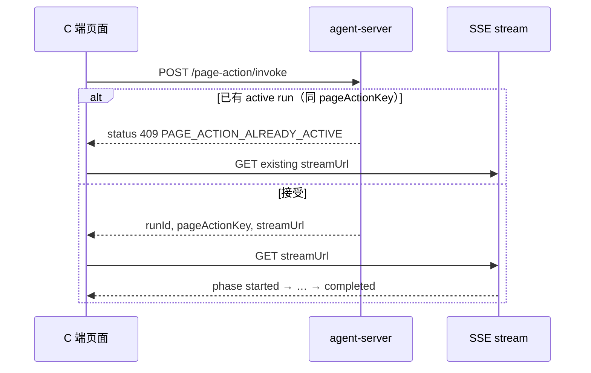

# C 端 PageAction 对接文档

> **受众**：C 端宿主前端、列表/详情页嵌入 PageAction 按钮的业务方。  
> **目标**：正确调用 `invoke`、订阅 SSE、处理重复提交拦截（`pageActionKey`）、展示任务状态。  
> **相关文档**：[c-end-page-action-approval-interaction.md](./c-end-page-action-approval-interaction.md)（审批实体对照展示）、[c-end-auto-agent-integration.md](./c-end-auto-agent-integration.md)（Chat）、[outbound-network-guide.md](./outbound-network-guide.md)（断连/失败提示）。

---

## 1. 核心结论

| 项 | 说明 |
|----|------|
| 执行入口 | `POST /page-action/invoke`（**无** `/admin` 前缀） |
| 执行模式 | 立即返回 `runId` + `streamUrl`；LLM / Workflow 在后台跑 |
| 进度订阅 | `GET /page-action/runs/:id/stream`（SSE） |
| 去重键 | 服务端根据 `actionKey` + `pageContext` 锚点生成 **`pageActionKey`**（sha256 hex） |
| 重复拦截 | 同用户、同 PageAction、同 `pageActionKey`，且已有 `running` / `awaiting_approval` → **409** |
| 前端不必自算 hash | 使用响应 / 任务列表下发的 `pageActionKey` 做按钮态即可 |
| **Loading 范围** | **任务中心 / PageAction 进度 ≠ Chat 对话框 loading**（见 §1.1） |

### 1.1 Loading 显示范围（重要）

**规则：外层 Chat 对话框的 loading，只跟 Chat 会话有关；任务中心有 PageAction 在执行时，不要挡住整个对话框。**

| 场景 | 是否驱动 Chat 对话框 loading | 进度展示位置 |
|------|------------------------------|--------------|
| 用户发 Chat 消息 | **是** | 对话框内（SSE `message` loading blocks、`complete` 关闭） |
| `GET /chat/:sessionId/run-state` 有 `activeRunId` | **是** | 同上 |
| PageAction `invoke` / `running` | **否** | 任务中心、`GET /automation/tasks?status=active`、可选 PageAction 流面板 |
| PageAction `awaiting_approval` | **否** | 任务中心 / 审批入口 |

**原因**：PageAction 走独立通道（`POST /page-action/invoke` + `GET /page-action/runs/:id/stream`），**不会**写入 Chat 的 `session run-state`，与 `activeRunId` 无关。

**前端建议**

```text
chatDialogLoading =
  chatRunState.activeRunId != null
  || chatSseHasLoadingBlock
  // 不要用 automation 列表里 taskStatus === 'running' 来设这个
```

任务进行中：任务中心角标 / 列表项状态 / 行内按钮禁用（`pageActionKey`）即可。

---

## 2. 鉴权与响应约定

```http
Authorization: Bearer <user_jwt>
x-app-dsn: <dsn>
Content-Type: application/json
```

### 2.1 JSON 包络

成功与业务错误均可能 **HTTP 200**，请读外层 `status` 与 `data`：

```json
{
  "status": 200,
  "message": "success",
  "data": { }
}
```

冲突（重复执行）示例：

```json
{
  "status": 409,
  "message": "An active PageAction run already exists for the same page context",
  "data": {
    "code": "PAGE_ACTION_ALREADY_ACTIVE",
    "message": "An active PageAction run already exists for the same page context",
    "pageActionKey": "8f3a…",
    "existingRunId": 42,
    "existingStatus": "running",
    "approvalRequestId": null,
    "streamUrl": "/page-action/runs/42/stream"
  }
}
```

**前端判断**：`response.status === 409`（包络层）且 `data.code === 'PAGE_ACTION_ALREADY_ACTIVE'`。

---

## 3. 提交 PageAction

### 3.1 请求

```http
POST /page-action/invoke
Authorization: Bearer <user_jwt>
x-app-dsn: <dsn>
```

```json
{
  "actionKey": "review.autofill",
  "pageContext": {
    "page": "review-detail",
    "routePath": "/reviews/43635",
    "routeParams": { "reviewId": "43635" },
    "entity": { "type": "review", "id": "43635" },
    "metadata": {
      "review": {
        "content": "（当前表单或正文快照，用于服务端读取）"
      }
    }
  },
  "instruction": "请根据当前内容生成审批意见",
  "context": { "source": "list_row_action" },
  "idempotencyKey": "btn-click-uuid-optional",
  "clientActionId": "analytics-trace-id-optional"
}
```

| 字段 | 必填 | 说明 |
|------|------|------|
| `actionKey` | 是 | B 端注册的 PageAction 标识 |
| `pageContext` | 建议 | 页面上下文；参与 `pageActionKey` 与服务端 Tool 参数推导 |
| `instruction` | 否 | 仅当 PageAction 开启 `allowCustomInstruction` 时生效；**非空时会纳入 `pageActionKey`** |
| `context` | 否 | 结构化 JSON；非空时纳入 `pageActionKey` |
| `idempotencyKey` | 否 | **防连点重试**：相同 key 直接返回历史 run（任意终态），不重新执行 |
| `clientActionId` | 否 | 埋点 ID；不参与去重 |

### 3.2 成功响应（202 语义，包络 status 一般为 200）

```json
{
  "status": 200,
  "message": "success",
  "data": {
    "runId": 101,
    "generation": 101,
    "clientActionId": "analytics-trace-id-optional",
    "pageActionKey": "8f3a1c2e…64位hex",
    "streamUrl": "/page-action/runs/101/stream",
    "status": "running"
  }
}
```

拿到 `streamUrl` 后尽快订阅 SSE（见 §5）。

---

## 4. 去重：`pageActionKey` 与 `idempotencyKey`

### 4.1 两层机制

```
第 1 层 pageActionKey  — 业务语义去重（同页同行同操作不重复跑）
第 2 层 idempotencyKey — 网络重试去重（同一点击 UUID 返回同一 run）
```

| 机制 | 作用域 | 拦截状态 | 典型场景 |
|------|--------|----------|----------|
| `pageActionKey` | 同 `userId` + 同 `pageActionId` + 同锚点 | `running`、`awaiting_approval` | 用户连点两行中同一行、审批未结束再次提交 |
| `idempotencyKey` | 同 `appClientId` + 同 `pageActionId` + 同 key | 返回**任意**已有 run | 请求超时后安全重试 |

**检查顺序**：先按 `pageActionKey` 拦 active run（409），再匹配 `idempotencyKey`。因此即使 idempotency 曾对应已完成的 run，只要同上下文仍有进行中的任务，仍会 409。

`completed` / `failed` / `cancelled` 之后，**相同 `pageActionKey` 可以再次 invoke**。

### 4.2 `pageActionKey` 如何产生（服务端）

前端**不需要**实现 hash 算法。规则如下：

1. 对 invoke 请求里**已归一化**的 `pageContext` **整包**做稳定 JSON 序列化（对象键递归排序，与字段顺序无关）。
2. 与 `actionKey`、可选的 `instruction` / `context` 组成 payload，`v: 2`，再 sha256。

```typescript
payload = {
  v: 2,
  actionKey: "review.autofill",
  pageContext: { /* 前端传入的完整对象，键排序后 */ },
  instruction?: string,
  context?: object,
}
pageActionKey = sha256(stableStringify(payload))
```

**无字段白名单**：`pageContext` 里有什么字段就参与 hash（`entity`、`metadata`、`routeParams` 等全部计入）。

**前端注意**

- 只传与业务相关的字段；**不要**把 `Date.now()`、滚动位置、随机 id 等易变 UI 状态塞进 `pageContext`，否则每次 hash 都不同、去重失效。
- 列表多行：每行的 `pageContext` 应能区分（通常 `entity.id` 或 `metadata` 正文不同即可）。
- invoke 前若走与 Chat 相同的 `pageContext` 归一化（服务端 `resolvePageActionInvokePageContext`），以**最终提交给 invoke 的对象**为准。

### 4.3 列表页 / 多行场景建议

每一行 invoke 时 `pageContext` 应能区分行：

```json
{
  "entity": { "type": "review", "id": "43635" },
  "metadata": {
    "review": { "content": "…该行正文…" }
  }
}
```

同一用户在不同行点击同一 `actionKey` → `pageActionKey` 不同 → 可并行执行。  
同一行在 run 未结束前再次点击 → `PAGE_ACTION_ALREADY_ACTIVE`。

### 4.4 收到 409 时前端怎么做

1. **不要**再发起新的 invoke。  
2. 读 `data.existingRunId`、`data.streamUrl`、`data.existingStatus`。  
3. UI：禁用按钮或展示「处理中 / 待审批」。  
4. 引导用户打开已有流：`GET {streamUrl}`，或跳转任务详情。  
5. 若 `existingStatus === 'awaiting_approval'` 且 `approvalRequestId` 非空，可跳转审批详情（按产品路由）。

```typescript
async function invokePageAction(body: InvokePageActionBody) {
  const res = await api.post('/page-action/invoke', body);
  if (res.status === 409 && res.data?.code === 'PAGE_ACTION_ALREADY_ACTIVE') {
    return {
      kind: 'already_active' as const,
      runId: res.data.existingRunId,
      streamUrl: res.data.streamUrl,
      pageActionKey: res.data.pageActionKey,
      status: res.data.existingStatus,
      approvalRequestId: res.data.approvalRequestId,
    };
  }
  return { kind: 'accepted' as const, ...res.data };
}
```

### 4.5 按钮禁用（推荐）

维护内存 Map：`pageActionKey → { runId, status }`。

- invoke 成功：写入 Map。  
- 订阅 SSE，`phase` 为 `completed` / `failed` / `cancelled` 时移除。  
- 页面加载时拉任务列表（§6），对 `status ∈ { running, awaiting_approval }` 的项写入 Map。  
- 按钮 `disabled = map.has(pageActionKey)`。

---

## 5. 订阅执行流（SSE）

```http
GET /page-action/runs/:runId/stream
Authorization: Bearer <user_jwt>
x-app-dsn: <dsn>
Accept: text/event-stream
```

`streamUrl` 为相对路径，拼到 API 根即可。

### 5.1 生命周期 phase（`page_action` 事件）

| phase | 含义 |
|-------|------|
| `started` | 开始执行 |
| `stream` | 总结/分析 prose 增量（`text` 字段为 delta；仅 summarize 路径） |
| `awaiting_approval` | 已挂起，等待审批 |
| `completed` | 成功结束（含完整 `text` / `fillText`） |
| `failed` | 失败（见 `errorCode` / `errorMessage`） |
| `cancelled` | 已取消 |

HostTool 结构化写入（SEO、打标等）走 **`host_action`** 事件（`tool.flush` 定稿），不走 `phase=stream`。迟订阅重放时，总结类 run 会先重放若干 `stream` 再 `completed`。

Workflow 场景下还有节点级字段（`nodeId`、`action`、`nodeStatus` 等），见 [frontend-workflow-config-guide.md §8](./frontend-workflow-config-guide.md#8-c-端-pageaction-invoke)。

### 5.2 常见 `errorCode`（Workflow 加载失败）

| errorCode | 用户提示建议 |
|-----------|----------------|
| `WORKFLOW_LOAD_ASSET_MISSING` | 功能暂不可用，请联系管理员 |
| `WORKFLOW_LOAD_REVISION_MISSING` | 同上 |
| `WORKFLOW_LOAD_EMPTY_NODES` | 同上 |
| `WORKFLOW_LOAD_SCOPE_INCOMPATIBLE` | 同上 |

出站超时/断网类 SSE 文案见 [outbound-network-guide.md](./outbound-network-guide.md)。

---

## 6. 任务列表（同步按钮态）

### 6.1 列表

```http
GET /page-action/runs?status=active&actionKey=review.autofill
```

等价于：

```http
GET /automation/tasks?triggerSource=page_action&status=active
```

`status=active` 表示 `running` + `awaiting_approval`。

列表项含 `pageActionKey`（历史 run 可能为 `null`）：

```json
{
  "status": 200,
  "data": {
    "items": [
      {
        "ref": { "kind": "page_action_run", "id": 42 },
        "triggerSource": "page_action",
        "taskStatus": "awaiting_approval",
        "title": "审批意见填充",
        "subtitle": "review-detail · review 43635",
        "pageActionKey": "8f3a1c2e…",
        "workflowKey": "review.autofill",
        "approval": { "id": 7, "status": "pending" },
        "createdAt": "2026-07-07T09:00:00.000Z",
        "finishedAt": null
      }
    ],
    "total": 1
  }
}
```

### 6.2 详情

```http
GET /automation/tasks/page_action_run/:id
```

含 `streamUrl`、`timeline`、`workflowRun` 等。

---

## 7. 审批实体对照

`GET /approval/inbox`、`GET /approval/:id` 返回 `entityReference`（参照）与 `writeDraft`（拟提交）。**如何展示**见 [c-end-page-action-approval-interaction.md](./c-end-page-action-approval-interaction.md)。

---

## 8. 端到端时序



---

## 9. TypeScript 类型（可复制）

```typescript
export type AgentChatPageContext = {
  page?: string;
  routePath?: string;
  routeParams?: Record<string, unknown>;
  flowId?: number;
  programName?: string;
  entity?: { type?: string; id?: string; [key: string]: unknown };
  metadata?: Record<string, unknown>;
};

export type InvokePageActionBody = {
  actionKey: string;
  pageContext?: AgentChatPageContext;
  instruction?: string;
  context?: Record<string, unknown>;
  idempotencyKey?: string;
  clientActionId?: string;
};

export type PageActionInvokeAccepted = {
  runId: number;
  generation: number;
  clientActionId: string | null;
  pageActionKey: string;
  streamUrl: string;
  status: 'running';
};

export type PageActionAlreadyActive = {
  code: 'PAGE_ACTION_ALREADY_ACTIVE';
  message: string;
  pageActionKey: string;
  existingRunId: number;
  existingStatus: 'running' | 'awaiting_approval';
  approvalRequestId: number | null;
  streamUrl: string;
};

export type AutomationTaskListItem = {
  ref: { kind: 'page_action_run'; id: number };
  taskStatus:
    | 'running'
    | 'awaiting_approval'
    | 'completed'
    | 'failed'
    | 'cancelled';
  pageActionKey: string | null;
  approval: { id: number; status: string } | null;
  // …其余字段见 automation API
};
```

---

## 10. 对接清单

- [ ] invoke 传稳定 `pageContext`（至少 `entity.id` 或带 `content` 的 `metadata`）
- [ ] **Chat 对话框 loading 仅绑 Chat run-state / Chat SSE，不因任务中心有 running 任务而全屏 loading**
- [ ] 处理包络层 `status === 409` + `PAGE_ACTION_ALREADY_ACTIVE`
- [ ] 409 时跳转/订阅 `streamUrl`，不重复 POST
- [ ] 用 `pageActionKey` 禁用进行中按钮
- [ ] 页面进入时 `GET …/runs?status=active` 恢复按钮态
- [ ] 可选：`idempotencyKey` 用于请求重试
- [ ] SSE 处理 `failed` / `awaiting_approval` phase

---

## 11. 常见问题

**Q：前端要自己算 `pageActionKey` 吗？**  
不需要。以 invoke 响应和任务列表为准。

**Q：同一页两个不同 PageAction 按钮会互相拦吗？**  
不会。`pageActionKey` 含 `actionKey`，且按 `pageActionId` 查重。

**Q：审批通过后能再次点同一行吗？**  
可以。终态 run 不再占用 active 槽位。

**Q：`instruction` 改了还算重复吗？**  
算不同 `pageActionKey`（instruction 非空时会纳入 hash）。若 PageAction 不允许自定义 instruction，请勿传该字段。

**Q：`idempotencyKey` 和 `pageActionKey` 冲突吗？**  
不冲突。先匹配 `idempotencyKey` 返回历史 run；否则再按 `pageActionKey` 拦 active run。

**Q：空 `pageContext` 会怎样？**  
`pageActionKey`  mainly 由 `actionKey`（+ 可选 instruction/context）决定，**不同页面可能被判为同一意图**。详情/列表页务必传完整、稳定的 `pageContext`。

**Q：为什么整包 hash 而不是服务端挑字段？**  
整包 hash 与前端所见一致，无隐式白名单；代价是 `pageContext` 里不能夹带易变字段，否则去重失效。

---

## 12. API 索引

| 方法 | 路径 | 说明 |
|------|------|------|
| POST | `/page-action/invoke` | 提交执行 |
| GET | `/page-action/runs/:id/stream` | SSE |
| GET | `/page-action/runs` | 任务列表（PageAction 别名） |
| GET | `/automation/tasks` | 任务列表 |
| GET | `/approval/inbox` | 审批收件箱（含 `entityReference`） |
| GET | `/approval/:id` | 审批详情 |
| POST | `/approval/:id/confirm` | 通过 |
| GET | `/automation/tasks/page_action_run/:id` | 任务详情 |

---

## 13. 实现参考（服务端）

| 模块 | 路径 |
|------|------|
| `pageActionKey` 计算 | `src/core/page-action/page-action-key.util.ts` |
| invoke 拦截 | `src/modules/page-action/c-end/page-action-c-end.service.ts` |
| pageContext 协议 | `src/core/host-bridge/page-context.types.ts` |
