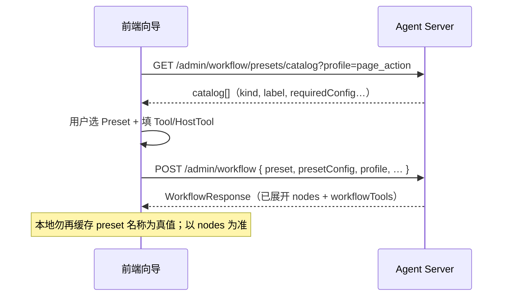
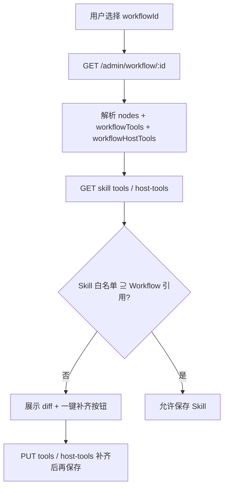

# B 端 Workflow / Preset / Skill / PageAction 前端对接规格

> **受众**：B 端管理台前端（Workflow 向导、Skill 配置、PageAction 配置）。  
> **目的**：与后端 V2 契约对齐，避免常见实现错误。  
> **运营向说明**：[b-end-workflow-preset-admin-guide.md](./b-end-workflow-preset-admin-guide.md)  
> **变更摘要**：[frontend-workflow-config-guide.md](./frontend-workflow-config-guide.md)

---

## 1. 先建立正确心智模型

系统有 **三层**，不要混为一层 UI：

```mermaid
flowchart TB
  subgraph L1["① Workflow 资产（怎么跑）"]
    P[场景 Preset 向导<br/>或原子 nodes 编辑器]
    N[nodes[] 落库]
    P -->|保存时展开| N
  end
  subgraph L2["② 入口绑定（谁跑）"]
    S[Skill · Chat]
    PA[PageAction · 页内]
  end
  subgraph L3["③ 运行白名单"]
    ST[SkillTool / SkillHostTool]
    HT[PageAction.hostToolId]
  end
  N --> S
  N --> PA
  N --> ST
  N --> HT
```

| 概念 | 数量 | 前端怎么处理 |
|------|------|--------------|
| **Preset 场景** | 5 种（代码内置） | 创建向导「选场景」下拉，**不能**让用户自定义 Preset 类型 |
| **原子 action** | 8 种 | 高级模式节点编辑器；Preset 展开后就是这些 action |
| **一条 Workflow 的步数** | 2～6 步不等 | 列表/详情展示 `nodes.length`，不是固定 5 步 |

**DB 不保存 Preset 名称**。创建时用 `preset` + `presetConfig`，保存后 GET 详情只有 `nodes[]`。前端编辑页应区分：

- **Preset 模式（新建）**：表单状态 = `{ preset, presetConfig }`
- **节点模式（编辑已有）**：表单状态 = `{ nodes[] }`；若用户要「按 Preset 重建」，单独弹窗收集 `preset` + **完整** `presetConfig` 再 PATCH

---

## 2. API 基础约定（极易踩坑）

### 2.1 路径前缀

| 类型 | 前缀 | 示例 |
|------|------|------|
| B 端管理 API | **`/admin`** | `POST /admin/workflow` |
| C 端 PageAction 执行 | **无** `/admin` | `POST /page-action/invoke` |

全局前缀在 `main.ts` 设为 `admin`；C 端 invoke 在 exclude 列表中。

### 2.2 响应包络（JSON）

**成功**（非 SSE）：

```json
{
  "status": 200,
  "message": "success",
  "data": { }
}
```

**业务失败**（如 400 校验）：HTTP 状态码仍可能是 **200**，错误在 `data` 里：

```json
{
  "status": 400,
  "message": "Workflow preset validation failed",
  "data": {
    "code": "WORKFLOW_PRESET_INVALID",
    "message": "Workflow preset validation failed",
    "issues": [
      {
        "path": "presetConfig.hostToolId",
        "code": "missing_required",
        "message": "hostToolId is required for preset page_auto_fill"
      }
    ]
  }
}
```

**前端必须**：解析 `response.data.code` 与 `response.data.issues[]`，**不能**只看 HTTP status 或外层 `message`。

### 2.3 鉴权

B 端：`Authorization: Bearer <admin_token>`

C 端 invoke：`Authorization: Bearer <user_jwt>` + `X-App-Dsn: <dsn>`

### 2.4 分页列表

`GET` 列表统一返回：

```typescript
type PaginatedResult<T> = {
  items: T[];
  total: number;
  page: number;
  pageSize: number;
  totalPages: number;
};
```

包在 `{ data: PaginatedResult<T> }` 里。

---

## 3. Workflow 页：推荐 UI 结构

### 3.1 双模式 Tab

| Tab | 适用 | 提交字段 |
|-----|------|----------|
| **场景向导**（默认） | 新建、整链重建 | `preset` + `presetConfig` |
| **原子节点**（高级） | 微调 objective / 顺序 | `nodes[]` |

**互斥规则（服务端强制）**：

- `POST` / `PATCH`：**不可**同时传 `preset` 与 `nodes`
- `PATCH` 用 Preset 重建时：`presetConfig` 必须带齐该 Preset 的 **requiredConfig**（不能空对象）

### 3.2 场景向导流程



**Step 1 — 选 profile**

创建 Workflow 时先定 `profile`：

| profile | 用途 | Preset 目录差异 |
|---------|------|-----------------|
| `page_action` | PageAction 专用 | 无 `fetch_and_answer` / `mutation_submit` |
| `chat_skill` | Skill 专用 | 含 mutation 类 Preset |
| `shared` | 两者可用 | 全部 5 种 |

**Step 2 — 拉 Preset 目录**

```
GET /admin/workflow/presets/catalog?profile={profile}
```

响应项（`WorkflowPresetCatalogEntry`）：

```typescript
type WorkflowPresetCatalogEntry = {
  kind: WorkflowPresetKind;
  label: string;           // 展示用中文名
  description: string;
  profiles: WorkflowProfile[];
  requiredConfig: string[];  // 表单必填字段名
  optionalConfig: string[];
  expandedActions: string[]; // 如 "fetch_data?", "generate_and_push"
};
```

**Step 3 — 动态表单**

根据 `requiredConfig` / `optionalConfig` 渲染控件：

| presetConfig 字段 | 控件 | 数据源 API |
|-------------------|------|------------|
| `readToolId` | HTTP Tool 下拉 | `GET /admin/tool/by-app-client/:appClientId` |
| `writeToolId` | HTTP Tool 下拉（写接口） | 同上，建议筛 `isMutation` / L2+ |
| `hostToolId` | HostTool 下拉 | `GET /admin/host-tool/by-app-client/:appClientId` |
| `objectives.*` | 多行文本 | 见 §3.4 |
| `fetchCompleteWhen` | 枚举 | `first_success` \| `fetch_all_pages` |
| `pushStream` | 开关 | 默认 true |
| `summarizeMode` | 枚举 | `brief` \| `detailed` \| `final` |
| `presentMode` | 枚举 | `brief` \| `detailed` |
| `confirmKind` | 枚举 | `mutation` \| `generic` |
| `materializePageContext` | 开关 | 默认 true |

**Step 4 — 提交创建**

```typescript
type CreateWorkflowBody = {
  appClientId: number;
  workflowKey: string;   // 唯一，如 page.review.autofill
  name: string;
  profile: 'page_action' | 'chat_skill' | 'shared';
  deliverable?: 'answer' | 'analysis' | 'mutation'; // mutation_submit 建议 mutation
  preset: WorkflowPresetKind;
  presetConfig: WorkflowPresetConfig;
  // 不要传 nodes / tools / hostTools（除非高级 isRequired）
};
```

### 3.3 Preset 与展开节点对照

| preset | requiredConfig | 展开 action 链 | 展开后的固定 node.id（workflowOverrides 用） |
|--------|----------------|----------------|-----------------------------------------------|
| `page_auto_fill` | `hostToolId` | load → fetch? → push → summarize | `load_page`, `fetch_data`, `generate_push`, `summarize` |
| `page_context_push` | `hostToolId` | load → push → summarize | `load_page`, `generate_push`, `summarize` |
| `fetch_push_summarize` | `readToolId`, `hostToolId` | fetch → push → summarize | `fetch_data`, `generate_push`, `summarize` |
| `fetch_and_answer` | `readToolId` | fetch → summarize | `fetch_data`, `summarize` |
| `mutation_submit` | `writeToolId` | fetch? → compose → present → await → write → summarize | `fetch_before_write`, `compose_mutation`, `present_mutation`, `await_confirm`, `write_data`, `summarize` |

> `mutation_submit` **已内置** `await_user_confirm`，前端**不要**引导用户再手加确认节点。

### 3.4 objectives 键与表单项

```typescript
type WorkflowPresetObjectiveConfig = {
  loadPage?: string;   // load_page_context
  fetch?: string;      // fetch_data
  push?: string;       // generate_and_push
  compose?: string;    // compose_mutation
  present?: string;    // present_mutation
  write?: string;      // write_data
  summarize?: string;  // summarize
};
```

UI 建议：Preset 选定后，只展示该 Preset `expandedActions` 对应的 objective 输入框，不必展示 8 个全量。

### 3.5 创建成功响应

`GET /admin/workflow/:id` / `POST` 返回 `WorkflowResponse`：

```typescript
type WorkflowResponse = {
  id: number;
  appClientId: number;
  workflowKey: string;
  name: string;
  profile: string;
  deliverable: string;
  version: number;
  nodes: WorkflowNodeDef[];           // ★ 已展开，编辑真值
  workflowTools: { toolId: number; isRequired: boolean; tool: Tool }[];
  workflowHostTools: { hostToolId: number; isRequired: boolean; hostTool: HostTool }[];
  skillRefCount: number;
  pageActionRefCount: number;
  revisionCount: number;
  isActive: boolean;
  // 无 preset 字段
};
```

**前端展示「绑定摘要」**：优先读 `workflowTools` / `workflowHostTools`，或从 `nodes[].input.toolId` / `hostToolId` 推导，**不要**再展示独立的「Workflow 级 Tool 列表」作为主配置。

### 3.6 编辑 / 更新

| 操作 | PATCH body | 说明 |
|------|------------|------|
| 改名称、goal、isActive | `{ name, goal, isActive }` | 不递增 version |
| 微调单步 objective | `{ nodes: [...] }` | nodes 变更 → **version++**，写 revision |
| Preset 整链重建 | `{ preset, presetConfig }` | 全量替换 nodes，version++ |
| 错误示例 | `{ preset, nodes }` | → `WORKFLOW_PRESET_NODES_CONFLICT` |

**编辑页初始化**：

1. `GET /admin/workflow/:id` 加载 `nodes`
2. 原子编辑器直接绑 `nodes`
3. 若要做「从 Preset 重建」，打开独立对话框，重新走 catalog + presetConfig，**不要**试图从 nodes 反推 preset（服务端不支持）

### 3.7 原子节点编辑器（高级）

仅当用户切到「高级 / 原子节点」时使用。

**节点 SSOT**：Tool / HostTool **写在** `nodes[].input` 上：

```typescript
type WorkflowNodeDef = {
  id: string;
  action: WorkflowActionKind;
  name: string;
  objective: string;
  input: Record<string, unknown>;
};
```

| action | input 必填 | profile 限制 |
|--------|------------|--------------|
| `load_page_context` | — | 全部 |
| `fetch_data` | **`toolId`** | 全部 |
| `generate_and_push` | **`hostToolId`** | 全部 |
| `summarize` | — | 全部 |
| `compose_mutation` | **`toolId`** | chat / shared only |
| `present_mutation` | — | chat / shared only |
| `await_user_confirm` | — | chat / shared only |
| `write_data` | **`toolId`** | chat / shared only |

**已废弃（保存会失败）**：

- `fetch_data.input.definitionKey`（必须 numeric `toolId`）
- 独立的 `tools[]` / `hostTools[]` 作为主绑定入口
- `tools[]` 里出现 nodes 未引用的 toolId → `orphan_tool_binding`

`tools[]` / `hostTools[]` **仅可选**：为 nodes 里已出现的 id 标记 `isRequired: true`。

---

## 4. Skill 配置页对接

### 4.1 字段

| 字段 | API | 说明 |
|------|-----|------|
| `workflowId` | `POST/PATCH .../skills` | 可选 |
| `workflowVersion` | 同上 | 可选 pin 历史 revision |
| `workflowOverrides` | 同上 | `{ [nodeId]: { objective?: string } }` |
| SkillTool | `PUT /admin/skill/:skillId/tools` | **全量替换** |
| SkillHostTool | `PUT /admin/skill/:skillId/host-tools` | **全量替换** |

### 4.2 选 Workflow 后的 UI 逻辑（必做）



从 Workflow 收集所需 ID：

```typescript
function collectRequiredBindings(workflow: WorkflowResponse) {
  const toolIds = new Set<number>();
  const hostToolIds = new Set<number>();
  for (const node of workflow.nodes as WorkflowNodeDef[]) {
    const input = node.input as Record<string, unknown>;
    if (typeof input.toolId === 'number') toolIds.add(input.toolId);
    if (typeof input.hostToolId === 'number') hostToolIds.add(input.hostToolId);
  }
  return { toolIds: [...toolIds], hostToolIds: [...hostToolIds] };
}
```

也可直接用响应里的 `workflowTools[].toolId` / `workflowHostTools[].hostToolId`（与 nodes 一致）。

### 4.3 保存顺序建议

1. 先确保 Workflow 已创建且 `isActive`
2. `PUT /admin/skill/:id/tools` 补齐 HTTP Tool
3. `PUT /admin/skill/:id/host-tools` 补齐 HostTool（若 Workflow 有 push 节点）
4. `PATCH /admin/skill/:id` 设置 `workflowId`

任一步可能返回 `SKILL_WORKFLOW_BINDING_INCOMPATIBLE`：

```json
{
  "code": "SKILL_WORKFLOW_BINDING_INCOMPATIBLE",
  "workflowId": 12,
  "issues": [
    {
      "path": "skillTools",
      "code": "workflow_tool_not_in_skill",
      "message": "WorkflowTool toolId=101 must be bound on Skill (SkillTool)"
    }
  ]
}
```

| issues[].code | 前端处理 |
|---------------|----------|
| `workflow_tool_not_in_skill` | 提示添加 SkillTool |
| `workflow_host_tool_not_in_skill` | 提示添加 SkillHostTool |
| `node_tool_not_in_skill` | 同上 |
| `node_host_tool_not_in_skill` | 同上 |

### 4.4 SkillTool / HostTool 请求体

```typescript
// PUT /admin/skill/:skillId/tools
{ tools: [{ toolId: number, isRequired?: boolean }] }

// PUT /admin/skill/:skillId/host-tools
{ hostTools: [{ hostToolId: number, isRequired?: boolean }] }
```

Tool 须先绑定到 Agent（`AgentTool`）；HostTool 须先绑定到 Agent（`AgentHostTool`）。

### 4.5 mutation Skill 注意

- Workflow 用 `mutation_submit` Preset 时，`deliverable` 建议 `mutation`
- 写确认在运行时由 `await_user_confirm` 节点处理；**Chat C 端**需处理 `confirmation_required` SSE（见 Chat 文档）
- Skill 页**不需要**单独配置确认节点

---

## 5. PageAction 配置页对接

### 5.1 字段

| 字段 | 说明 |
|------|------|
| `actionKey` | C 端 invoke 用 |
| `hostToolId` | 流式填入目标 |
| `systemPrompt` | 必填 |
| `pageScope` | 与 C 端 `pageContext.page` 一致 |
| `workflowId` | 推荐必配（多步 Workflow） |
| `workflowVersion` / `workflowOverrides` | 同 Skill |

### 5.2 选 Workflow 后的 UI 逻辑（必做）

1. `GET /admin/workflow/:id`
2. 校验 `profile` ∈ `{ page_action, shared }`
3. 找 `action === 'generate_and_push'` 的节点，读 `input.hostToolId`
4. **自动填充并锁定** PageAction 表单的 `hostToolId` 为该值

```typescript
function findPushHostToolId(nodes: WorkflowNodeDef[]): number | null {
  const push = nodes.find((n) => n.action === 'generate_and_push');
  const id = push?.input?.hostToolId;
  return typeof id === 'number' ? id : null;
}
```

若无 push 节点 → **禁止保存**，提示换 Workflow 或改用 `page_auto_fill` 等 Preset。

### 5.3 推荐创建顺序（PageAction 全自动回填）

```text
1. POST /admin/workflow  (preset: page_auto_fill, presetConfig.hostToolId + readToolId?)
2. 记下 workflow.id 与 generate_push 节点的 hostToolId
3. POST /admin/page-action
   {
     appClientId, actionKey, name, systemPrompt, pageScope,
     workflowId: <step1.id>,
     hostToolId: <与 preset hostToolId 相同>
   }
```

### 5.4 PageAction 错误码

```json
{
  "code": "PAGE_ACTION_WORKFLOW_BINDING_INCOMPATIBLE",
  "workflowId": 2,
  "issues": [
    {
      "path": "hostToolId",
      "code": "page_action_host_tool_not_in_workflow_nodes",
      "message": "PageAction.hostToolId=3 must match ..."
    }
  ]
}
```

| code | 含义 |
|------|------|
| `missing_generate_and_push` | Workflow 无 push 节点 |
| `page_action_host_tool_not_in_workflow_nodes` | hostToolId 与 push 节点不一致 |

### 5.5 hostToolId 自动创建（可选）

创建 PageAction 时可省略 `hostToolId`，传内联 `hostTool` 由服务端创建。  
**若已绑 Workflow**，仍建议显式使用 Workflow push 节点的 `hostToolId`，避免后续校验失败。

---

## 6. Workflow 变更对 ** 对下游的阻断 **

PATCH Workflow 的 `nodes` 或 Preset 重建时，若破坏已绑 Skill / PageAction，**整单 PATCH 失败**：

| code | 含义 | UI |
|------|------|-----|
| `WORKFLOW_CHANGE_BREAKS_SKILL_REFERENCES` | 某 Skill 的 Tool 白名单不够 | 展示 `skillId` + issues，跳转 Skill 页 |
| `WORKFLOW_CHANGE_BREAKS_PAGE_ACTION_REFERENCES` | PageAction hostToolId 对不上 | 展示 `pageActionId`，跳转 PageAction 页 |

---

## 7. 常见前端实现错误（对照修复）

| # | 错误实现 | 正确做法 |
|---|----------|----------|
| 1 | 创建 Workflow 时主界面维护 `tools[]` 列表 | Tool 绑在 `nodes[].input.toolId` 或 Preset 的 `presetConfig.readToolId` |
| 2 | `fetch_data` 表单仍提供 `definitionKey` | 只提交 numeric `toolId` |
| 3 | `POST` 同时传 `preset` + `nodes` | 二选一 |
| 4 | `PATCH` Preset 重建时不传 `presetConfig` | 必须传完整 requiredConfig |
| 5 | 编辑页用本地缓存的 `preset` 当真值 | GET 详情以 `nodes[]` 为准；DB 无 preset 字段 |
| 6 | Skill 只绑 `workflowId`，不补 SkillTool | 选 Workflow 后 diff 并 PUT tools |
| 7 | PageAction `hostToolId` 与 Workflow push 不一致 | 选 Workflow 后自动同步 hostToolId |
| 8 | 错误处理只看 HTTP 4xx | 解析 `{ status, data: { code, issues } }` |
| 9 | B 端请求 C 端路径加了 `/admin` | invoke 用 `/page-action/invoke` |
| 10 | `mutation_submit` 后又手加 `await_user_confirm` | Preset 已含确认链，禁止重复 |
| 11 | `page_action` profile 展示 mutation 类 Preset | catalog 按 profile 过滤 |
| 12 | PATCH Workflow 时附带旧 `tools[]` 导致 orphan | 不传 tools/hostTools，或仅含 nodes 内 id |

---

## 8. 完整 TypeScript 类型（建议复制到前端 repo）

```typescript
export type WorkflowProfile = 'chat_skill' | 'page_action' | 'shared';

export type WorkflowPresetKind =
  | 'page_auto_fill'
  | 'page_context_push'
  | 'fetch_push_summarize'
  | 'fetch_and_answer'
  | 'mutation_submit';

export type WorkflowActionKind =
  | 'load_page_context'
  | 'fetch_data'
  | 'generate_and_push'
  | 'summarize'
  | 'compose_mutation'
  | 'present_mutation'
  | 'write_data'
  | 'await_user_confirm';

export type WorkflowPresetConfig = {
  readToolId?: number;
  writeToolId?: number;
  hostToolId?: number;
  fetchCompleteWhen?: 'first_success' | 'fetch_all_pages';
  pushStream?: boolean;
  summarizeMode?: 'brief' | 'detailed' | 'final';
  presentMode?: 'brief' | 'detailed';
  confirmKind?: 'mutation' | 'generic';
  materializePageContext?: boolean;
  objectives?: {
    loadPage?: string;
    fetch?: string;
    push?: string;
    compose?: string;
    present?: string;
    write?: string;
    summarize?: string;
  };
};

export type WorkflowNodeDef = {
  id: string;
  action: WorkflowActionKind;
  name: string;
  objective: string;
  input: Record<string, unknown>;
};

export type ValidationIssue = {
  path: string;
  code: string;
  message: string;
};

export type ApiEnvelope<T> = {
  status: number;
  message: string;
  data: T;
};

export type ApiBusinessError = {
  code: string;
  message: string;
  issues?: ValidationIssue[];
  workflowId?: number;
  skillId?: number;
  pageActionId?: number;
};

/** 统一解析业务错误 */
export function parseApiError(envelope: ApiEnvelope<unknown>): ApiBusinessError | null {
  if (envelope.status >= 400 && envelope.data && typeof envelope.data === 'object') {
    const d = envelope.data as ApiBusinessError;
    if (typeof d.code === 'string') return d;
  }
  return null;
}
```

---

## 9. API 索引（B 端）

| 方法 | 路径 | 用途 |
|------|------|------|
| GET | `/admin/workflow/presets/catalog?profile=` | Preset 目录 |
| POST | `/admin/workflow` | 创建（preset 或 nodes） |
| PATCH | `/admin/workflow/:id` | 更新 |
| GET | `/admin/workflow/:id` | 详情 |
| GET | `/admin/workflow/by-app-client/:appClientId` | 列表 |
| GET | `/admin/workflow/:id/revisions` | 版本历史 |
| GET | `/admin/tool/by-app-client/:appClientId` | Tool 下拉 |
| GET | `/admin/host-tool/by-app-client/:appClientId` | HostTool 下拉 |
| POST | `/admin/app-client/:appClientId/skills` | 创建 Skill |
| PATCH | `/admin/skill/:skillId` | 更新 Skill（含 workflowId） |
| PUT | `/admin/skill/:skillId/tools` | SkillTool 全量 |
| PUT | `/admin/skill/:skillId/host-tools` | SkillHostTool 全量 |
| POST | `/admin/page-action` | 创建 PageAction |
| PATCH | `/admin/page-action/:id` | 更新 PageAction |

---

## 10. 端到端示例：评论自动回填

### 10.1 创建 Workflow

```http
POST /admin/workflow
Content-Type: application/json

{
  "appClientId": 2,
  "workflowKey": "page.review.autofill",
  "name": "评论自动回填",
  "profile": "page_action",
  "preset": "page_auto_fill",
  "presetConfig": {
    "hostToolId": 12,
    "readToolId": 205,
    "objectives": {
      "push": "根据评论详情生成回复草稿并填入表单",
      "summarize": "告知用户草稿已填入"
    }
  }
}
```

### 10.2 创建 PageAction

```http
POST /admin/page-action

{
  "appClientId": 2,
  "actionKey": "review.autofill",
  "name": "评论自动回填",
  "systemPrompt": "你是客服助手，根据页内评论上下文生成回复草稿。",
  "pageScope": "review.detail",
  "workflowId": 88,
  "hostToolId": 12
}
```

### 10.3 C 端 invoke

```http
POST /page-action/invoke
Authorization: Bearer <user_jwt>
X-App-Dsn: <dsn>

{
  "actionKey": "review.autofill",
  "pageContext": { "page": "review.detail", "..." : "..." }
}
```

响应为 **SSE**（不被 `{ data, status }` 包裹）。配置了 `workflowId` 且加载失败时：

```json
{ "phase": "failed", "errorCode": "WORKFLOW_LOAD_ASSET_MISSING", "errorMessage": "..." }
```

**勿假设**会回退到无 Workflow 的单步模式。

---

## 11. 前端自测清单

### Workflow 向导

- [ ] `profile` 切换后 Preset 下拉重新请求 catalog
- [ ] requiredConfig 未填时提交，展示 `WORKFLOW_PRESET_INVALID.issues`
- [ ] 创建成功后详情页 `nodes.length` > 0
- [ ] 高级编辑 PATCH nodes 后 `version` 递增

### Skill

- [ ] 选 Workflow 后展示所需 Tool / HostTool 清单
- [ ] SkillTool 不齐时保存被拦，一键补齐后可保存
- [ ] `mutation_submit` Workflow 的 read/write tool 均在 SkillTool

### PageAction

- [ ] 选 Workflow 后 `hostToolId` 自动等于 push 节点
- [ ] 换 Workflow 时 hostToolId 联动更新
- [ ] `page_action` Workflow 不含 mutation 节点

### 错误解析

- [ ] 400 业务错误从 `data.code` 读取
- [ ] `issues[]` 映射到表单字段（`path` → 表单项）

---

## 12. 相关文档

| 文档 | 内容 |
|------|------|
| [workflow-action-kinds.md](../workflow-action-kinds.md) | 8 种原子 action 权威定义 |
| [b-end-workflow-preset-admin-guide.md](./b-end-workflow-preset-admin-guide.md) | 运营配置步骤 |
| [frontend-workflow-config-guide.md](./frontend-workflow-config-guide.md) | 迁移摘要与 C 端 SSE |
