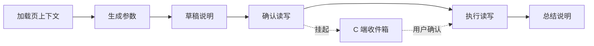

# Preset `page_context_mutation_submit` · B 端配置指南

> **Preset 标识**：`page_context_mutation_submit`  
> **展示名**：页内写确认  
> **受众**：B 端运营、实施、管理台开发  
> **总览**：[b-end-workflow-preset-admin-guide.md](./b-end-workflow-preset-admin-guide.md)  
> **C 端审批**：[approval-inbox-client-integration.md](../../docs/approval-inbox-client-integration.md)

---

## 1. 这个 Preset 解决什么问题？

在 **Chat 会话**里，用户已经处在某个业务页面（带 `pageContext`），需要：

1. 读取当前页上下文  
2. 根据上下文 **生成写接口参数**（不立刻提交）  
3. 向用户 **展示草稿说明**  
4. **用户确认后** 才执行 HTTP 写操作  
5. 用一句话 **总结结果**

与相近 Preset 的选型：

| 我要做什么 | 选哪个 Preset |
|------------|---------------|
| 页内一键：拉上下文 → Host 填框（**不写 HTTP**） | `page_auto_fill` + **PageAction** |
| Chat：先 HTTP 拉数再写（**无页上下文步骤**） | `mutation_submit` |
| Chat：**先加载页上下文**，再写确认链 | **`page_context_mutation_submit`**（本文） |

**入口**：仅 **Skill + Chat**（`profile=chat_skill` 或 `shared`）。  
**不能**用于 `profile=page_action` 的 PageAction 保存（含 `present_mutation` 写确认链）。

---

## 2. 展开后的执行链

保存时服务端展开为以下原子节点（B 端无需手拖）：

```text
load_page_context
  → [fetch_data]          ← 仅当 presetConfig.readToolId 有值
  → compose_mutation      （展示名：生成参数）
  → present_mutation      （展示名：草稿说明）
  → await_user_confirm    （展示名：确认读写）→ 自动创建 ApprovalRequest
  → write_data            （展示名：执行读写）
  → summarize             （展示名：总结说明）
```



到 **确认读写**（`await_user_confirm`）时 workflow **挂起**；用户在 **C 端**确认后才会执行 **执行读写**（`write_data`）。B 端无审批收件箱，仅在 Chat Run 调试里看挂起步。

---

## 3. 配置前准备

| 资产 | 要求 |
|------|------|
| HTTP **写 Tool** | `writeToolId` 对应接口已注册、`isActive=true` |
| HTTP 读 Tool（可选） | 页上下文不够、需再拉详情时配置 `readToolId` |
| **RoleTool** | 使用 Skill 的 C 端用户角色须拥有 **写 Tool** 的 RoleTool |
| **pageContext** | C 端发消息须带 `pageContext.page`（与业务页 `pageScope` 一致） |

---

## 4. 分步配置（推荐顺序）

### 4.1 创建 Workflow

```http
POST /admin/workflow
Content-Type: application/json
```

```json
{
  "appClientId": 2,
  "workflowKey": "skill.page.review.submit",
  "name": "评论页写确认",
  "profile": "chat_skill",
  "deliverable": "mutation",
  "preset": "page_context_mutation_submit",
  "presetConfig": {
    "writeToolId": 102,
    "objectives": {
      "loadPage": "加载当前评论详情页的实体与表单上下文",
      "compose": "根据页上下文生成回复提交的写参数，禁止在此步调用写接口",
      "present": "向用户逐条说明即将提交的字段与变更内容",
      "write": "在用户确认后执行写接口",
      "summarize": "用一句话说明提交结果"
    }
  }
}
```

**需要额外 HTTP 拉数时**（在页上下文之外再查接口）：

```json
{
  "presetConfig": {
    "writeToolId": 102,
    "readToolId": 101,
    "fetchCompleteWhen": "first_success",
    "objectives": {
      "fetch": "根据页内实体 ID 拉取最新评论详情",
      "compose": "结合页上下文与拉取结果组装写参数"
    }
  }
}
```

**校验 Preset 目录**（管理台创建向导可据此渲染表单）：

```http
GET /admin/workflow/presets/catalog?profile=chat_skill
```

在返回列表中查找 `kind: "page_context_mutation_submit"`，字段含 `requiredConfig`、`optionalConfig`、`expandedActions`。

**查看展开结果**：

```http
GET /admin/workflow/:id
```

确认 `nodes[]` 顺序与 §2 一致；`write_data.input.toolId` 等于 `writeToolId`。

### 4.2 创建 Skill 并绑定 Workflow

```http
POST /admin/app-client/:appClientId/skills
```

```json
{
  "name": "评论页提交回复",
  "capabilityKey": "review.reply.submit",
  "description": "在当前评论详情页根据上下文生成并确认后提交回复",
  "prompt": "你是评论助手。用户已在评论详情页发起操作，请严格按 Workflow 步序执行…",
  "riskLevel": "L2",
  "isActive": true,
  "workflowId": 15,
  "tools": [
    { "toolId": 102, "isRequired": true }
  ]
}
```

若配置了 `readToolId`，`tools` 中须 **同时包含** 读、写 Tool id。

```http
PUT /admin/skill/:skillId/tools
```

```json
{
  "tools": [
    { "toolId": 101, "isRequired": false },
    { "toolId": 102, "isRequired": true }
  ]
}
```

| 规则 | 说明 |
|------|------|
| `workflowId` | 必填，否则不会走 DB Workflow |
| SkillTool ⊇ Workflow 节点 toolId | 缺一会保存/运行校验失败 |
| `deliverable` | Workflow 侧建议 `mutation`；Skill 写操作风险建议 L2+ |

### 4.3 配置角色写权限

为 C 端用户所在角色勾选 **`writeToolId` 对应 HTTP Tool** 的 RoleTool。

缺权限时 Chat 会在 `workflow_init` 阶段 `trigger_permission_denied`，**不会产生审批记录**。

### 4.4 C 端联调要点

| 项 | 要求 |
|----|------|
| 发消息 | 带 `skillId` |
| `pageContext` | 含 `page`，与 Host 页 / 业务约定一致 |
| 确认 | SSE `confirmation_required` 或 `GET /approval/inbox` |
| 确认后 | 监听 SSE 直至 assistant 总结完成（chat 为异步续跑） |

---

## 5. `presetConfig` 字段

| 字段 | 必填 | 类型 | 说明 |
|------|------|------|------|
| `writeToolId` | **是** | number | `compose_mutation` / `write_data` 绑定的写 Tool |
| `readToolId` | 否 | number | 有值时在 `load_page_context` 后插入 `fetch_data` |
| `fetchCompleteWhen` | 否 | enum | `first_success`（默认）\| `fetch_all_pages` |
| `presentMode` | 否 | enum | 草稿展示：`brief`（默认）\| `detailed` |
| `confirmKind` | 否 | enum | `mutation`（默认）\| `generic` |
| `summarizeMode` | 否 | enum | `brief` \| `detailed` \| `final`（默认） |
| `materializePageContext` | 否 | boolean | 是否物化页上下文，默认 `true` |
| `objectives` | 否 | object | 覆盖各步 LLM objective，见下表 |

**`objectives` 键（本 Preset 相关）**

| 键 | 对应节点 |
|----|----------|
| `loadPage` | load_page_context |
| `fetch` | fetch_data（仅配置了 readToolId 时） |
| `compose` | compose_mutation / 生成参数 |
| `present` | present_mutation / 草稿说明 |
| `write` | write_data / 执行读写 |
| `summarize` | summarize / 总结说明 |

---

## 6. 与 `mutation_submit` 的差异

| 维度 | `mutation_submit` | `page_context_mutation_submit` |
|------|-------------------|--------------------------------|
| 第一步 | 可选 `fetch_data` | **固定** `load_page_context` |
| 典型场景 | 用户口述订单号等，先 HTTP 拉数 | 用户已在详情页，上下文在 `pageContext` |
| 节点展示名 | 组装变更参数 / 展示变更草稿 | 生成参数 / 草稿说明 / 确认读写 |
| profile | chat_skill / shared | 同左 |
| 审批机制 | 相同（`await_user_confirm`） | 相同 |

---

## 7. 运营提示（管理台 UI 文案建议）

**Workflow 向导选中本 Preset 时：**

> 适用于用户在 **业务页面内** 通过 Chat 发起写操作。执行到「确认读写」将挂起，用户在 C 端确认后才会调用写接口。请确保 C 端请求携带 `pageContext`。

**Skill 绑定区：**

> 使用本 Workflow 时，请为角色配置写 Tool 的 RoleTool；C 端须传 `skillId` 与 `pageContext.page`。

**勿引导：**

- 不要再手加 `await_user_confirm`（Preset 已内置，重复会导致双确认）
- 不要用 PageAction 入口跑本 Preset（`page_action` profile 无法保存）

---

## 8. 常见问题

| 现象 | 原因 | 处理 |
|------|------|------|
| Workflow 保存失败 `preset_profile_incompatible` | `profile=page_action` | 改为 `chat_skill` 或 `shared` |
| Chat 无 workflow、`workflow_init_skipped` | 未绑 `workflowId` 或未传 `skillId` | 检查 Skill 与 C 端请求 |
| `trigger_permission_denied` | 角色无写 Tool RoleTool | 角色页补权限 |
| 未到审批、gate blocked | `present_mutation` 无可展示预览 | 检查 compose 是否产出参数；objectives 是否写清 |
| C 端无待办 | 未跑到 `await_user_confirm` | 看 AgentRun steps / 服务端日志 |
| 确认后未写入 | 用户拒绝或 confirm 失败 | 查 `approval_rejected` / SSE |

---

## 9. 上线检查清单

```text
□ POST /admin/workflow 使用 preset=page_context_mutation_submit 成功
□ GET /admin/workflow/:id 节点链含 load_page_context … summarize
□ Skill 已绑 workflowId，SkillTool 覆盖 writeToolId（及可选 readToolId）
□ 角色 RoleTool 含写 Tool
□ C 端联调：skillId + pageContext → 出现 confirmation_required 或收件箱 pending
□ 用户确认后 write_data 执行成功，会话有总结回复
```

---

## 10. 相关文档

| 文档 | 内容 |
|------|------|
| [b-end-workflow-preset-admin-guide.md](./b-end-workflow-preset-admin-guide.md) | 全部 Preset 总览 |
| [frontend-workflow-config-guide.md](./frontend-workflow-config-guide.md) | 前端表单与 API 类型 |
| [approval-gate-b-end-integration.md](../../docs/approval-gate-b-end-integration.md) | B 端观测审批挂起 |
| [approval-inbox-client-integration.md](../../docs/approval-inbox-client-integration.md) | C 端收件箱对接 |
| [app-default-capability-sharing-admin-frontend.md](../../docs/app-default-capability-sharing-admin-frontend.md) | Skill App 级创建 |
